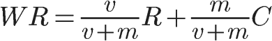
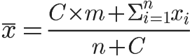

# 贝叶斯平均(Bayesian average)

##IMDB的问题

如果考虑了置信空间，很多冷门的项目评分将被大幅拉低，导致参与人少的冷门内容无法与热门内容竞争，优质的冷门们内容无法获得出头机会。

热门电影与冷门电影的平均得分，是否真的可比？举例来说，一部好莱坞大片有10000个观众投票，一部小成本的文艺片只有100个观众投票。这两者的投票结果，怎么比较？如果使用"威尔逊区间"，后者的得分将被大幅拉低，这样处理是否公平，能不能反映它们真正的质量？

Intuitively, however, you probably want items without many ratings to be near the average item, so you want to wiggle your estimated rating of the item toward the mean rating over all items (i.e., you want to push your estimated rating toward a prior). This is exactly what a Bayesian approach does.

##原理

IMDB给出了它的计算方法。

> 　　
>
>   - WR， 加权得分（weighted rating）。
>   - R，该电影的用户投票的平均得分（Rating）。
>   - v，该电影的投票人数（votes）。
>   - m，排名前250名的电影的最低投票数（现在为3000）。
>   - C， 所有电影的平均得分（现在为6.9）。

仔细研究这个公式，你会发现，IMDB为每部电影增加了3000张选票，并且这些选票的评分都为6.9。这样做的原因是，假设所有电影都至少有3000张选票，那么就都具备了进入前250名的评选条件；然后假设这3000张选票的评分是所有电影的平均得分（即假设这部电影具有平均水准）；最后，用现有的观众投票进行修正，长期来看，v/(v+m)这部分的权重将越来越大，得分将慢慢接近真实情况。（现在已经更改为25000）

这样做拉近了不同电影之间投票人数的差异，使得投票人数较少的电影也有可能排名前列。

把这个公式写成更一般的形式：

> 　　
>
>   - C，投票人数扩展的规模，是一个自行设定的常数，与整个网站的总体用户人数有关，可以等于每个项目的平均投票数。
>   - n，该项目的现有投票人数。
>   - x，该项目的每张选票的值。
>   - m，总体平均分，即整个网站所有选票的算术平均值。

这种算法被称为["贝叶斯平均"](http://en.wikipedia.org/wiki/Bayesian_average)（Bayesian average）。因为某种程度上，它借鉴了["贝叶斯推断"](http://www.ruanyifeng.com/blog/2011/08/bayesian_inference_part_one.html)（Bayesian inference）的思想：既然不知道投票结果，那就先估计一个值，然后不断用新的信息修正，使得它越来越接近正确的值。

<u>**在这个公式中，m（总体平均分）是"先验概率"，每一次新的投票都是一个调整因子，使总体平均分不断向该项目的真实投票结果靠近。投票人数越多，该项目的"贝叶斯平均"就越接近算术平均，对排名的影响就越小。**</u>

因此，这种方法可以给一些投票人数较少的项目，以相对公平的排名。

<u>**这段话讲清了变化：Note that when v is very large, i.e., when we have a lot of ratings for the current item, then w is very close to 1, so our estimated rating is very close to R and we pay little attention to the prior C. When v is small, however, w is very close to 0, so the estimated rating places a lot of weight on the prior C.**</u>

<u>**因为是假设基于正态分布，再对均值进行调整的：This estimate can, in fact, be given a Bayesian interpretation as the posterior estimate of the item's mean rating when individual ratings comes from a *normal* distribution centered around that mean.Ratings for an item don't necessarily follow a unimodal Gaussian shape. For example, maybe your item is very polarizing, so people tend to either give it a very high rating or give it a very low rating.**</u>

这里的w就是指上式中R的系数。

##缺点
"贝叶斯平均"也有缺点，主要问题是它假设用户的投票是正态分布。比如，电影A有10个观众评分，5个为五星，5个为一星；电影B也有10个观众评分，都给了三星。这两部电影的平均得分（无论是算术平均，还是贝叶斯平均）都是三星，但是电影A可能比电影B更值得看。

解决这个问题的思路是，假定每个用户的投票都是独立事件，每次投票只有n个选项可以选择，那么这就服从["多项分布"](http://en.wikipedia.org/wiki/Multinomial_distribution)（Multinomial distribution），就可以结合贝叶斯定理，估计该分布的期望值。

##改进
**<u>在概率markdown和附录中的文章中有具体讲述到底怎么证明下面成立的（因为对于多项分布而言狄利克雷分布与其是共轭先验的），我们只需要用这个即可：</u>**

**Theorem:** Given a Dirichlet distribution with parameters $(n_1, \dots, n_k)$ and a new observation of outcome $i$, the updated Dirichlet distribution has parameters $(n_1, \dots, n_{i-1}, n_i + 1, n_{i+1}, \dots, n_k)$. That is, you just update the $i$-th entry by adding $1$ to it.

**关键是设置先验分布：下面思路很好，对不知名作者就多设0；而对五星用户，就多设置顶级高。**
**此方法比上面方法好在，可以看出多个选项，上面贝叶斯平均只有upvote这一项。**
**我们可以根据歌词的完备性，然后设置不同分数。**

The initial values $(n_0, \dots, n_5)$ for star ratings should be picked so that they represent the average rating distribution among all prior books, since this is used as the default voting distribution for a new, unknown book. If you have more information about whether a book is likely to be popular, you can use a different prior. For example, if JK Rowling wrote a Harry Potter Romance novel that was part of the canon, you could pretty much guarantee it would be popular, and set $n_5$ high compared to $n_0$. Of course, if it were actually popular you could just wait for the good ratings to stream in, so tinkering with these values on a per-book basis might not help much. On the other hand, most books by unknown authors are bad, and $n_0$ should be close to zero. 

下面提到如何采用各个分值的权重：

The utilities parameter allows you to weight rating outcomes appropriately. So if you are in a Lyft-like scenario, you might specify utilities like [-10, -5, -3, -2, 1] to denote that a 4-star rating has the same negative impact as two 5-star ratings would positively contribute. On the other hand, for books the gap between 4-star and 5-star is much less than the gap between 3-star and 4-star. The utilities simply allow you to calibrate how the votes should be valued in comparison to each other, instead of using their literal star counts.

```python
'''
  score: [int], [int], [float] -&gt; float
 
  Return the expected value of the rating for an item with known
  ratings specified by `ratings`, prior belief specified by
  `rating_prior`, and a utility function specified by `rating_utility`,
  assuming the ratings are a multinomial distribution and the prior
  belief is a Dirichlet distribution.
'''
def score(self, ratings, rating_prior, rating_utility):
    ratings = [r + p for (r, p) in zip(ratings, rating_prior)]
    score = sum(r * u for (r, u) in zip(ratings, rating_utility))
    return score / sum(ratings)
```

#References

- [stackexchange回答](https://stats.stackexchange.com/questions/15979/how-to-find-confidence-intervals-for-ratings)
- [How to rank products based on user input(在onenote中有备份)](http://zqdevres.qiniucdn.com/data/20120329091034/index.html)
- [Bayesian Ranking for Rated Items](https://jeremykun.com/2017/03/13/bayesian-ranking-for-rated-items/)