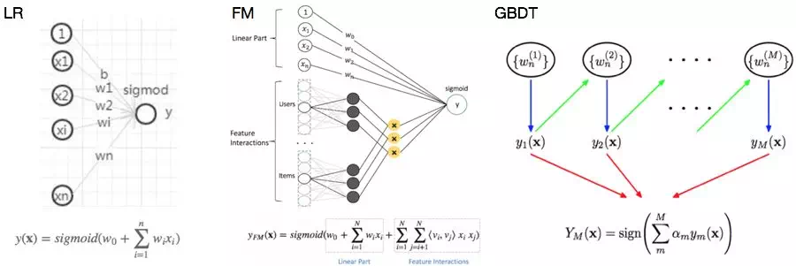
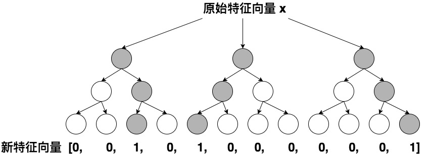

# Learning to Rank

Learning to Rank主要有3种算法：

1. Pointwise: Subset Ranking, McRank, Prank, OC SVM
2. Pairwise: Ranking SVM, RankBoost, RankNet, GBRank, IR SVM, Lambda Rank, LambdaMart
3. Listwise: ListNet, ListMLE, AdaRank, SVM MAP, Soft Rank

## 推荐文章

小米的工作，提示了一个文本相关性的工作，第二个就是在点击模型中融合？可能要具体查一下怎么做的<https://www.infoq.cn/article/1pcW2hMQt6wsFxaN*srw?utm_source=rss&utm_medium=article> 

里面有l2r的资源：看一下是否能够整理出学习路线：<https://github.com/chihming/competitive-recsys> 

介绍系统层面：
https://www.jiqizhixin.com/articles/2018-12-21-11
讲到深度学习用于l2r**（J继续寻找该代码）**
https://www.jiqizhixin.com/articles/2019-01-18-20
专门介绍lambamart，其中mart就是gbdt：
https://liam.page/2016/07/10/a-not-so-simple-introduction-to-lambdamart/
图文讲解lambdamart
http://blog.jqian.net/post/lambdamart.html

讲到ftlr也是基于梯度下降的在线学习

https://www.zhihu.com/question/28025036/answer/107297334

里面提到用ranklib而非es的ltr插件进行排序更好，因为不依赖es的版本。

https://hackernoon.com/learning-to-rank-for-job-search-d1dc44d7070

A Deep Look into Neural Ranking Models for Information Retrieval
https://arxiv.org/pdf/1903.06902.pdf
这是一篇综述类文章，可以好好看下。了解下最新进展。

linkedin的个性化搜索

<https://www.infoq.cn/article/Qz1o7-WmVWkj5uPIsGVa?utm_source=rss&utm_medium=article> 


## 推荐书籍


## 推荐代码

<https://www.infoq.cn/article/iDt28zXQuKqBfG*wCWfc?utm_source=rss&utm_medium=article> 

讲deepctr的里面各种算法代码都有

https://paperswithcode.com/paper/lifelong-sequential-modeling-with 关于淘宝，有代码

https://github.com/jattenberg/RankLib 基于java

https://github.com/codelibs/ranklib 基于java，下面项目的clone

大名鼎鼎的Ranklib库https://sourceforge.net/p/lemur/wiki/RankLib/
https://sourceforge.net/p/lemur/wiki/RankLib%20How%20to%20use/ 这是新页面
https://people.cs.umass.edu/~vdang/ranklib.html 这是老页面无法访问了

有讲到怎么下载数据集进行几种算法测试。

对ranklib用法的详解
https://github.com/cixuuz/LTR.project

基于tensorflow实现的l2r
https://github.com/ChenglongChen/tensorflow-LTR

讲用户行为和点击率的

<https://paperswithcode.com/paper/practice-on-long-sequential-user-behavior> 

讲bert中搜索的

<https://github.com/AdeDZY/SIGIR19-BERT-IR> 

## ctr

<https://www.infoq.cn/article/RxVVzJEl-2IfNkTY4XRs?utm_source=rss&utm_medium=article> 阿里中ctr的应用

https://github.com/guoday/ctrNet-tool（实现了ctr的算法FM, FFM, NFFM ）

Jctr与learning to rank似乎不同。比如FFM方法不会应用在搜索排序中。

此文讲得很好：https://www.infoq.cn/article/wEdZsdQZ2pIKjs_x3JGJ?utm_source=rss&utm_medium=article

将几个之间的关系都讲清楚了。

<https://www.infoq.cn/article/0vXxt3_WwTHyNOo7Lrca?utm_source=rss&utm_medium=article> 

用实例代码讲解了deepfm在ctr中的应用

## 个性化排序实战

个性化排序实战

## 要求

\1. 团队介绍：腾讯内容与平台事业群（PCG）——大搜索团队，亿级日活搜索业务，负责复杂场景下的搜索排序和相关性； 
\2. 业务场景包括：综合搜索（QQ浏览器搜索直达、手机QQ搜索、QQ看点搜索、天天快报搜索）; 垂类搜索（资讯垂搜、短视频垂搜、问答垂搜、医疗垂搜、长视频垂搜、图片垂搜等）；
\3. 负责搜索语义向量召回，term召回，离线召回，query强意图召回，泛意图召回，场景化召回等召回策略和粗排模型的建设，提升搜索质量；负责召回相关性和语义向量的持续优化；

【要求】 1. 有搜索引擎、推荐系统或广告系统相关算法工作经验； 2. 熟悉机器学习/数据挖掘/信息检索/深度学习/神经网络的算法原理； 3. 熟悉LR/FFM/GBDT/DNN等排序算法以及Wide&Deep/DSSM等深度模型，有TensorFlow开发经验者优先； 4. 熟悉自然语言处理的常见算法原理，有文本相似度计算或语义相似度计算经验者优先； 5. 熟悉C++、python、scala、Java等编程语言（一项或多项）； 6. 熟悉MPI、MapReduce、Spark等并行计算框架。


## 整理

###一种新的观点：提出新的适用于ir的深度学习模型：PACRR与deepfm之流是不同的！目前看来应该说那些推荐的都是适用于排序的，不是用于匹配的，应该匹配的就是这些提出的模型。 

###<https://paperswithcode.com/paper/190407094> 

<https://zhuanlan.zhihu.com/p/38296950> 

<https://zhuanlan.zhihu.com/p/45849695> 

### CTR，LTR，推荐的关系

ctr即点击率，在推荐系统中，通常是按照ctr来对召回的内容子集进行排序，然后再结合策略进行内容的分发。<https://zhuanlan.zhihu.com/p/32689178> 

ctr与ltr是两码事，前者可以作为后者的一个特征
基本弄懂了，ctr是一个指标名称，其指标常用于推荐任务，作为其中的一个特征（<https://blog.51cto.com/13679539/2107239> ）或是直接作为推荐的指标（<https://zhuanlan.zhihu.com/p/32689178> ），而ltr是一个任务名称，是针对搜索的任务，ctr可以作为一个特征传入，
而ltr与ctr的区别往往在于前者会考虑排序位置信息。L2R（Learning to Rank，也可做LTR）任务，形式上与CTR预估类似，但不同的是输入信息中需要包含具体的商品排序特征（Ranking Features）。CTR预估会作为Ranking Feature在线上生效。LTR会影响Ranking Feature的排序过程，因此影响更大。https://blog.51cto.com/13679539/2107239> 

### 大致流程（搜索排序还是推荐排序）

在整个机器排序框架中，整个在线排序模块分为 3 层。

第一层称为一排（也称为粗排），主要是根据用户 Query 从索引库中召回所有相关商品，然后依据文本相关性和类目相关性得分，完成第 1 轮商品筛选，形成上层排序模型的候选商品集；

第二层称为二排（也称为精排），主要是以一排的候选商品集为基础，应用 LTR 模型或者人工排序模型，完成基于排序特征的重新排序；

第三层称为三排，主要是根据各种商业需求对二排的排序结果进行调整，如类目打散、商品推广等；

<https://www.infoq.cn/article/yhd-11-11-mlr-ec-search> 

### l2r方法分类（线性模型，交叉模型 J我认为就是所谓的fm，树模型j我认为lambdamart也算，深度模型）J其实这里说的不对，传统l2r方法是不包含这些深度学习方法的，但是现在有趋势是不断开始使用了wide & deep到l2r中了，实现pairwise/listwise的排序算法 ：<https://zhuanlan.zhihu.com/p/53110408> 

主要分类如下：

- 根据样本生成方法和Loss Function的不同，L2R可以分为Pointwise、Pairwise、Listwise。
- 按照模型结构划分，可以分为线性排序模型、树模型、深度学习模型，它们之间的组合（GBDT+LR，Deep&Wide等）。

<https://www.jiqizhixin.com/articles/2019-01-18-20> 

### pairwise训练样本（三种方法混合生成样本）似乎lamdamart也是基于pairwise进行数据标注的：

J似乎lamdamart也是基于pairwise进行数据标注的：<https://blog.csdn.net/huagong_adu/article/details/40710305> 


大多数论文上都会提到几种pairwise的方法，

​    1.Click> Skip Above

​    2.LastClick > Skip Above

​    3.Click> Earlier Click

​    4.LastClick > Skip Previous

​    5.Click> No-Click Next

​    Click>SkipAbove是指，在搜索结果页点击的商品，好于在点这个商品之前浏览过的商品，即排序排在这个商品前面的并且未被点击的商品。前4个方法都是类似的思想，不过对于像淘宝这样相对成熟的排序系统来说，这些方法并不适用，因为这样选出的pair样本与排序的分数恰好相反，原始的排序顺序，将各个特征分数较高的排在前面，而通过Click > SkipAbove选出的pair集合，都是表述分数低的比分数高的好，可以说都是反例，这样会导致模型训练结果所有的特征权重都为负。

所以我们选择pair的方法是通过用户的点击与购买反馈来生产表示商品好坏的pair对。

**使用点击反馈来形成pair**

​    统计同query下，每个商品的点击率，将点击率平滑后，将点击率相差一定以上的商品形成pair。

**使用无点击的数据来形成pair**

​    在样本中加入一部分通过原始排序来生成的pair，这样的目的是使排序的参数变化不至于太剧烈，形成一些意想不到的badcase。

​    

​    这部分的样本根据展示日志中原始商品的排序，第1个商品好于第20个商品，第2个商品好于第21个商品，以此类推。

**那这部分训练集到底代表了什么样的信息呢？这部分训练集代表了用户在有偏的条件下，还极端的选择了后面的样例，可以肯定后面的样例一定有吸引用户的特征，只不过全部用这类样例来训练模型的话就会过拟了**，so我们只需要对原始的排序模型进行采样并合并所有的样例，参见[Learning to rank在淘宝的应用](http://club.alibabatech.org/article_detail.htm?articleId=54)，再实施学习算法，基本就能simulate线上的情况， 

<https://luminarytian.github.io/2016/%E9%80%BB%E8%BE%91%E5%9B%9E%E5%BD%92%E5%92%8Clearning-to-rank%E7%AE%97%E6%B3%95%E4%BB%A5%E5%8F%8A%E7%9B%B8%E5%85%B3%E5%AE%9E%E8%B7%B5/> 


Learning to rank在淘宝的应用

<https://mp.weixin.qq.com/mp/appmsg/show?__biz=MjM5MTY3ODcxNA==&appmsgid=10000062&itemidx=1&sign=e00d2e1f1fd917b1457c6e47421a4336&scene=20&xtrack=1&uin=MTcwOTYyNDY2MA%3D%3D&key=c55f77d6ac845d334f02598df6f4ecf26c3b3997975c989a5166c9abc5af96486ceb76f84a66a8c9fb5e48a8a1eab064735d7b9624c0867dde754e1183951a6b093013d51738b09dac8c0f327d2eb516&ascene=1&devicetype=Windows+7&version=62060739&lang=zh_CN&pass_ticket=EngB48mcD8xDHpo2QLfAzMRWm10btoeqOyABAeVcCEyUGzDOQ8sWFJW5qwAUWfGm> 

<http://kubicode.me/2016/02/15/Machine%20Learning/Learning-To-Rank-Base-Knowledge/> 

### 传统方法讲解

####Pointwise Approach

```
Pointwise的处理对象是单独的一篇文档，将文档转换为特征向量之后，机器学习模型根据从训练数据中学习到的分类或者回归函数对文档打分，打分的结果就是搜索的结果.
```

其实就是将文档排序转为了文档的回归、分类和有序分类问题

####Pairwise Approach

```
对于搜索任务来说，系统接收到用户查询后，返回相关文档列表，所以问题的关键是确定文档之间的先后相对顺序关系，
而Pairwise则将重点转向对文档关系是否合理的判断.
```

####Listwise Approach

```
与Pointwise和Pairwise不同，Listwise是将一个查询对应的所有搜索结果列表作为一个训练实例，因此也称为文档列方法.
```

<http://kubicode.me/2016/02/15/Machine%20Learning/Learning-To-Rank-Base-Knowledge/> 

- LR可以视作单层单节点的线性网络结构。**模型优点是可解释性强**。通常而言，良好的解释性是工业界应用实践比较注重的一个指标，它意味着更好的可控性，同时也能指导工程师去分析问题优化模型。**但是LR需要依赖大量的人工特征挖掘投入，有限的特征组合自然无法提供较强的表达能力**。
- FM可以看做是在LR的基础上增加了一部分二阶交叉项。引入自动的交叉特征有助于减少人工挖掘的投入，同时增加模型的非线性，捕捉更多信息。FM能够自动学习两两特征间的关系，但更高量级的特征交叉仍然无法满足。
- GBDT是一个Boosting的模型，通过组合多个弱模型逐步拟合残差得到一个强模型。树模型具有天然的优势，能够很好的挖掘组合高阶统计特征，兼具较优的可解释性。GBDT的主要缺陷是依赖连续型的统计特征，对于高维度稀疏特征、时间序列特征不能很好的处理。 



<http://kubicode.me/2016/02/15/Machine%20Learning/Learning-To-Rank-Base-Knowledge/> 

#### LR和POLY2：J这就是特征稀疏的缺点，数据不足，导致无法充分训练，见fm的例子：牺牲参数数量，弥补特征稀疏！ 

由于在处理互联网数据时，经常采用 one-hot 的方法处理 id 类数据，致使特征向量极度稀疏，POLY2 进行**无选择的特征交叉使原本就非常稀疏的特征向量更加稀疏，使得大部分交叉特征的权重缺乏有效的数据进行训练，无法收敛。**

J这就是特征稀疏的缺点，数据不足，导致无法充分训练 

<https://www.infoq.cn/article/wEdZsdQZ2pIKjs_x3JGJ?utm_source=rss&utm_medium=article> 

#### FM：Factorization Machines  因式分解机（从n的平方项的参数个数，降低到n*k的参数个数，每个特征有一个k维的隐向量）

从 FM 的目标函数的二阶部分中我们可以看到，相比 POLY2，主要区别是用两个向量的内积（wj1 · wj2）取代了单一的权重 wh(j1, j2)。具体来说，FM 为每个特征学习了一个隐权重向量（latent vector），在特征交叉时，使用两个特征隐向量的内积作为交叉特征的权重。 

通过引入特征隐向量的方式，直接把原先 n2 级别的权重参数数量减低到了 nk（k 为隐向量维度，n>>k）。在训练过程中，又可以通过转换目标函数形式的方法，使 FM 的训练复杂度减低到 nk 级别。相比 POLY2 极大降低训练开销。

**隐向量的引入还使得 FM 比 POLY2 能够更好的解决数据稀疏性的问题。举例来说，我们有两个特征，分别是 channel 和 brand，一个训练样本的 feature 组合是 (ESPN, Adidas)，在 POLY2 中，只有当 ESPN 和 Adidas 同时出现在一个训练样本中时，模型才能学到这个组合特征对应的权重。而在 FM 中，ESPN 的隐向量也可以通过 (ESPN, Gucci) 这个样本学到，Adidas 的隐向量也可以通过 (NBC, Adidas) 学到，这大大降低了模型对于数据稀疏性的要求。甚至对于一个从未出现过的特征组合 (NBC, Gucci)，由于模型之前已经分别学习过 NBC 和 Gucci 的隐向量，FM 也具备了计算该特征组合权重的能力，这是 POLY2 无法实现的**。也许 FM 相比 POLY2 丢失了某些信息的记忆能力，但是泛化能力大大提高，这对于互联网的数据特点是非常重要的。

#### FFM：Field-aware Factorization Machines(每个特征对应的不是一个隐向量，而是对应着不同域的一组隐向量,参数为n\*k\*f)  

其与 FM 目标函数的区别就在于隐向量由原来的 wj1 变成了 wj1,f2，这就意味着每个特征对应的不是一个隐向量，而是对应着不同域的一组隐向量，当 xj1 特征与 xj2 特征进行交叉时，xj1 特征会从 xj1 的一组隐向量中挑出与特征 xj2 的域 f2 对应的隐向量 wj1,f2 进行交叉。同理 xj2 也会用与 xj1 的域 f1 对应的隐向量进行交叉。 

FFM 模型学习每个特征在 f 个域上的 k 维隐向量，交叉特征的权重由特征在对方特征域上的隐向量内积得到，权重数量共 n*k*f 个。

**比如天气与地点，天气与性别，关联的程度是不一样的，都使用同样的向量去与不同的特征做内积，会带来明显的信息损失**。 

我们再用图示方法回顾一下从 POLY2 到 FM，再到 FFM 进行特征交叉方法的不同。


POLY2 模型直接学习每个交叉特征的权重，权重数量共 n2 个。


FM 模型学习每个特征的 k 维隐向量，交叉特征由相应特征隐向量的内积得到，权重数量共 n*k 个。


FFM 模型引入了特征域这一概念，在做特征交叉时，每个特征选择与对方域对应的隐向量做内积运算得到交叉特征的权重。参数数量共 n*k*f 个。

####GBDT+LR(不局限于二阶，进行高纬特征组合和筛选，理解为输入原始特征向量后，J是全部都到一个节点，然后用子节点进行判断，深度就代表特征交叉维度，此外提及到GBDT+LR的解决方案。即先使用GBDT对一些稠密的特征进行特征选择，得到的叶子节点，再拼接离散化特征放进去LR进行训练。 )

FFM 模型采用引入特征域的方式增强了模型的表达能力，但无论如何，FFM 只能够做二阶的特征交叉，如果要继续提高特征交叉的维度，不可避免的会发生组合爆炸和计算复杂度过高的情况。那么有没有其他的方法可以有效的处理高维特征组合和筛选的问题？2014 年，Facebook 提出了基于 GBDT+LR 组合模型的解决方案。 

简而言之，Facebook 提出了一种利用 GBDT 自动进行特征筛选和组合，进而生成新的离散特征向量，再把该特征向量当作 LR 模型输入，预估 CTR 的模型结构。 

用 GBDT 构建特征工程，和利用 LR 预估 CTR 两步是独立训练的。 

利用训练集训练好 GBDT 模型之后，就可以利用该模型完成从原始特征向量到新的离散型特征向量的转化。具体过程是这样的，**一个训练样本在输入 GBDT 的某一子树后，会根据每个节点的规则最终落入某一叶子节点，那么我们把该叶子节点置为 1，其他叶子节点置为 0，所有叶子节点组成的向量即形成了该棵树的特征向量，把 GBDT 所有子树的特征向量连接起来，即形成了后续 LR 输入的特征向量**。



GBDT 生成特征向量的过程

举例来说，如上图所示，GBDT 由三颗子树构成，每个子树有 4 个叶子节点，一个训练样本进来后，先后落入“子树 1”的第 3 个叶节点中，那么特征向量就是 [0,0,1,0]，“子树 2”的第 1 个叶节点，特征向量为 [1,0,0,0]，“子树 3”的第 4 个叶节点，特征向量为 [0,0,0,1]，最后连接所有特征向量，形成最终的特征向量 [0,0,1,0,1,0,0,0,0,0,0,1]。

由于决策树的结构特点，事实上，**决策树的深度就决定了特征交叉的维度**。如果决策树的深度为 4，通过三次节点分裂，最终的叶节点实际上是进行了 3 阶特征组合后的结果，如此强的特征组合能力显然是 FM 系的模型不具备的。但由于 GBDT 容易产生过拟合，以及 GBDT 这种特征转换方式实际上丢失了大量特征的数值信息，因此我们不能简单说 GBDT 由于特征交叉的能力更强，效果就比 FFM 好，在模型的选择和调试上，永远都是多种因素综合作用的结果。

<https://www.infoq.cn/article/Q8Cv-4vq6jD8974w9MxJ?utm_source=rss&utm_medium=article> 

**LR,FM,FFM适合处理离散化特征：其中之一就是更稳定。**

特征离散化后，模型会更稳定，比如如果对用户年龄离散化，20-30作为一个区间，不会因为一个用户年龄长了一岁就变成一个完全不同的人。当然处于区间相邻处的样本会刚好相反，所以怎么划分区间是门学问； 

<https://www.zhihu.com/question/31989952> 

**而GBDT适合处理连续化特征：**

**优点：**我们可以把树的生成过程理解成**自动进行多维度的特征组合**的过程，从根结点到叶子节点上的整个路径(多个特征值判断)，才能最终决定一棵树的预测值。另外，对于**连续型特征**的处理，GBDT 可以拆分出一个临界阈值，比如大于 0.027 走左子树，小于等于 0.027（或者 default 值）走右子树，这样很好的规避了人工离散化的问题。

**缺点：**对于**海量的 id 类特征**，GBDT 由于树的深度和棵树限制（防止过拟合），不能有效的存储；另外海量特征在也会存在性能瓶颈，经笔者测试，当 GBDT 的 one hot 特征大于 10 万维时，就必须做分布式的训练才能保证不爆内存。所以 GBDT 通常配合少量的反馈 CTR 特征来表达，这样虽然具有一定的范化能力，但是同时会有**信息损失**，对于头部资源不能有效的表达。

<https://cloud.tencent.com/developer/article/1005416> 

### 指标

###计算框架：但其实没有解决数据标注的问题

一个计算框架

<https://github.com/SeaseLtd/rated-ranking-evaluator?1559101213357> 

####MAP

Mean Average Precision 


<http://kubicode.me/2016/02/15/Machine%20Learning/Learning-To-Rank-Base-Knowledge/> 

#### NDCG

**概念**

　　NDCG，Normalized Discounted cumulative gain 直接翻译为归一化折损累计增益，可能有些晦涩，没关系下面重点来解释一下这个评价指标。这个指标通常是用来衡量和评价搜索结果算法（注意这里维基百科中提到了还有推荐算法，但是我个人觉得不太适合推荐算法，后面我会给我出我的解释）。DCG的两个思想：

　　1、高关联度的结果比一般关联度的结果更影响最终的指标得分；

　　2、有高关联度的结果出现在更靠前的位置的时候，指标会越高；

 

**累计增益（CG）**

　　CG，cumulative gain，是DCG的前身，只考虑到了相关性的关联程度，没有考虑到位置的因素。它是一个搜素结果相关性分数的总和。指定位置p上的CG为：


　　reli 代表i这个位置上的相关度。

　　举例：假设搜索“篮球”结果，最理想的结果是：B1、B2、 B3。而出现的结果是 B3、B1、B2的话，CG的值是没有变化的，因此需要下面的DCG。

 

**折损累计增益（DCG）**

　　DCG， Discounted 的CG，就是在每一个CG的结果上处以一个折损值，为什么要这么做呢？目的就是为了让排名越靠前的结果越能影响最后的结果。假设排序越往后，价值越低。到第i个位置的时候，它的价值是 1/log2(i+1)，那么第i个结果产生的效益就是 reli * 1/log2(i+1)，所以：


　　当然还有一种比较常用的公式，用来增加相关度影响比重的DCG计算方式是：


　　百科中写到后一种更多用于工业。当然相关性值为二进制时，即 reli在{0,1}，二者结果是一样的。当然CG相关性不止是两个，可以是实数的形式。

 

**归一化折损累计增益（NDCG）**

　　NDCG， Normalized 的DCG，由于搜索结果随着检索词的不同，返回的数量是不一致的，而DCG是一个累加的值，没法针对两个不同的搜索结果进行比较，因此需要归一化处理，这里是处以IDCG。


　　IDCG为理想情况下最大的DCG值。


　　其中 |REL| 表示，结果按照相关性从大到小的顺序排序，取前p个结果组成的集合。也就是按照最优的方式对结果进行排序。

 

 **实际的例子**

　　假设搜索回来的5个结果，其相关性分数分别是 3、2、3、0、1、2

　　那么 CG = 3+2+3+0+1+2

　　可以看到只是对相关的分数进行了一个关联的打分，并没有召回的所在位置对排序结果评分对影响。而我们看DCG：

| i    | reli | log2(i+1) | reli /log2(i+1) |
| ---- | ---- | --------- | --------------- |
| 1    | 3    | 1         | 3               |
| 2    | 2    | 1.58      | 1.26            |
| 3    | 3    | 2         | 1.5             |
| 4    | 0    | 2.32      | 0               |
| 5    | 1    | 2.58      | 0.38            |
| 6    | 2    | 2.8       | 0.71            |

　　所以 DCG  = 3+1.26+1.5+0+0.38+0.71 = 6.86

　　接下来我们归一化，归一化需要先结算 IDCG，假如我们实际召回了8个物品，除了上面的6个，还有两个结果，假设第7个相关性为3，第8个相关性为0。那么在理想情况下的相关性分数排序应该是：3、3、3、2、2、1、0、0。计算IDCG@6:

| i    | reli | log2(i+1) | reli /log2(i+1) |
| ---- | ---- | --------- | --------------- |
| 1    | 3    | 1         | 3               |
| 2    | 3    | 1.58      | 1.89            |
| 3    | 3    | 2         | 1.5             |
| 4    | 2    | 2.32      | 0.86            |
| 5    | 2    | 2.58      | 0.77            |
| 6    | 1    | 2.8       | 0.35            |

　　所以IDCG = 3+1.89+1.5+0.86+0.77+0.35 = 8.37

　　so 最终 NDCG@6 = 6.86/8.37 = 81.96%

<https://www.cnblogs.com/by-dream/p/9403984.html> 

#### MRR

MRR(Mean Reciprocal Rank)：是把标准答案在被评价系统给出结果中的排序取倒数作为它的准确度，再对所有的问题取平均。相对简单，举个例子：有3个query如下图所示：

![img](data:image/png;base64,iVBORw0KGgoAAAANSUhEUgAAAe0AAABiCAIAAADyRxwVAAAABmJLR0QA/wD/AP+gvaeTAAAACXBIWXMAAA7EAAAOxAGVKw4bAAAJ2ElEQVR4nO2du3LbOhCG6TOecafnikeFyjxFMulSpE6Rt0gbdiw00XO5c5VTcEzDuBF3LKjvKzIWBGJ/7AIrEFSEh3meJwAAGJbHaZo+ffrUW8Z0u90kyIBMiKMoGoeD6Hfhdrv911sDAABkQR4HABgb8jgAwNiQxwEAxoY8DgAwNuRxAICxedRen06n9Y+Xl5fmYmSxuWKjuE9UE4d0uObDQ/ZxCEoN5sD8UHzurA1KGD9d5uyu2z+sx1VnmZG4NzaXvby8VPLJ1rLJ6XQaPQTbcJIw/VYO4NU0Sg3mwFAWnztyRlEXJbsW3/P46XR6fn5eLyCVQybaAkrOPAQ4Hvq+iom6pDeX99a7jLXw+fn579+/5rU/f/788eOHeZVYrDc1rtsrcyfB70CPucl2O3mMnYrwYeMpd7UzeaMwBd+kF7frr7/bWWv7fj2uTmXKCLeYOXdclT1eLRI1f/0oovQku33/Oada29qoeeu0vlylbO9u13758kVdpu0KEIIZeLPj1p0EjwNdhlzLWIE7FQlEDRtPeWwUYm8OStnVjLrqq58um9Hd9j16druWJsPsV745T++swfJ4tUjUPPVjidKT7PYC31dx7TluuzSaiN+/f8t5ahGCK5Bmx7eap9OpRrat3b4EzGHjL/dveed7KdxuwehYjfrbD9z6Nwfz2pT1clffp495J8pciNp6UfOj2vW4pYiesm63f1/lz58/4RIPmU1CsHZcm2yVjNZrfzh6OUFa9HPMbdmhSM4KYYihW9stBdt/X4+/vLxs6/nPnz9Pkb4OXw58/fo1tvHueO6t1I5vf2fei7mo3X5BzLvXqmpd7be0KyH6If11bSxEiQnvY4La2lFzoUVzqpmmyrr9YZ5n9acmtRsua7mrRW3rx9qOqwMCf/FS69r2Mq3jVge6vKpdEuhYCWhxDBlOu70L9GpI+WTzqotYu0X0e0Zdgh+2cIQPZhPrQFW/rbBZTDAX61WX5hqjJWHOmkTlhF1bLrfreVwzUDxTuD6FBOZxSIA4mtRe2Xk48O+Pd/SqNG63m/17hzW8I3kTAKAS6n06SacUeFVj//vjpcDdcIcw7GuAVzX4nSwAgLEhjwMAjA15HABgbMjjAABj8zDPc28NAACQzuM0TZfLpbeMaVkWCTIgE+IoisbhIPpdWJaFfRUAgLEhjwMAjA15HABgbMjjAABjQx4HABgb8jgAdODp6am3hONAHu8Moxma8fRGS4uu8tfXV/VlY2EHIz2PC3G6VYYQbSouSepobqBBoGdWxAo7DGvqXGnj7UAr7YUdD9bjAHdByxWD36K2GG8v7Hjovz+ufh5u/t0K15Lt5fpHjTAky/Bos16+LQHSepHjLq1apnVry6YGU4annXwyh5P1csih3pzNRKywIfiQx9XPSXV2qYXr7Y9WXpYcGS5t1svXfYbk7mS6y8ywsdatjWjlmobJmCqudvLJ9I/1csik9uTdxWW6u7ChcZ4HtHmzxgwPp6AM67WlBk1fd1k/ycKv3fbN602hBP+ot0rMbQAPQee6qYvWynoqymiWC7q7S9sy2kVbvNcVF+Mf1mgHg1BWwvmc03oj3J4aMvzpI+1LHaV0JltPfmihLcYrffYk+EfdRmdfJR+xPhQrbCA+rMfVCaPeCGvbr+tbmU8IPeTLMAvNNteX5nZtM53JmVc15BLg0eDZJU+QsavQKs+lTRNQQ9XdYg1HVbQp5tkZJ9CZ6PsqnkcQ4eX55MswC62PGc2XUau/HJ27YzrNuqfc+lbVmVPcP5BDY5eGmyPWmQTtj98PtR/3SbYOUBUGdj3I4x/oO9QY6ACQAP+fEwBgbMjjAABjQx4HABgb8jgAwNg8zPPcWwMAAKTzOE3T5XLpLWNalkWCDMiEOIqicTiIfheWZWFfBQBgbMjjAABjQx4HABgb8jgAwNiQxwEAxoY8DgAd4GfHC3LYPG4dJUKGTtphEfcJjirI0xstLbrKtR+aZ1LkoOdxIa7MlxH1y9chFBxnmQdOColRCJXiCAk8vZ1q3ex8pUAr7YUdj8OuxwGgL67PYE7pLM777497jhkzT13a6ph/mC2on7G78cuUYa3mKgxEO4fM1bIp7Hw+X69X9a0oV3iUtImR35P+LlSKIyQj1o1ihQ3Eex53naFnPcFyO+nRdQCmOo2tycJFpozJljFdhYFYE5/ao62CJmxN4rvaEpQ0iJG1zfBoVooj5NN3Oeyxzjo9max9lRCnv7rP9i2F2Nifz+fu2nJiZD59qhrN7r66B8TmSrHChqDFuW6upRnIwRojz7Niojki3aPmEtBd2OhUf85pvZEXgrbY7EhfJbsx0ja7PTVBLGJzpVhhA6Gvx7VnTZOxqbr+sZZ4ak4fN1W1y3fJkWF9wuZ57BYlyarKJex6vbq05SsxZVg1JMfI2qa1ZiWp+SEDDW2LrI0568OVvsKOh2VfxfRjSElszV2SZUQVRi0qM835yzOV1IhRkWiWjSMk096fgRYJdD4t9sdlImeVJ0cJQD0Y4fW43zwuZ1TJUQIAI8L/5wQAGBvyOADA2JDHAQDGhjwOADA2D/M899YAAADpPE7TdLlcesuYlmWRIAMyIY6iaBwOot+FZVnYVwEAGBvyOADA2JDHAQDGhjwOADA25HEAgLEhjwMAjE1oHpdzaICcwx+KEN4X/wkPBcmUVPVCyKSx5wl0G0J/71DOb/LJUVKEqLM1ci4PJ1NS1QshB5L4UWFfBeBeaPzxyad1M97X49ajF/2He6mndpmHqFkPM9sN7Vb5169f379/Vy90tbOWn8/n6/Ua2AVtpbAr1VU/hEzHai1Ymw0XU1VSQROxw8nvIo9OgAPwvh5fB7r1X9dBXOuBe2pl9d2VrU7sIU/fvn1TD3V0KdneXZP4rp5JyQv+cvN8yLRckOlYT83MbY3ikgqaiBpOaqEataiBBzAuWfsqITPk1XY8cQ3O53PUR8WqyprNratvV/0aCEw9QnrtGk5Pb+zWBDgeH/L4tpzxnGydgLZQCqk/Kfm0xiQ0F93aW1q+9tQPNFfDsTk0kNRyOHmixtM2ODzVn3Na90b7on1CuL7Pp96hW+ubK/fuCJRUlt3hpO2GeWoCHAb9e4froNfuWNU/1FymrZe1CbO1k/BE7vXjky5NiVXM9Xq16rFKsqrS6pv7LbG9MHuU5lhPTbNyR0llTYQPp1fv41OPvHuj8U2htHvQA2P5/rjmdGsMPPM2sOYu4U15TESJj60fu9BLdmxUYUdJZU1YyxsMvAPT2CeEoBmh/w8INAQ+QBMoCQAaQB5PRGC6FCgJABrA/+cEABgb8jgAwNiQxwEAxoY8DgAwNg/zPPfWAAAA6Tz8+/evtwYAAEjnf5HJsT0QYijPAAAAAElFTkSuQmCC)(黑体为返回结果中最匹配的一项)

可计算这个系统的MRR值为：(1/3 + 1/2 + 1)/3 = 11/18=0.61。

<https://www.cnblogs.com/eyeszjwang/articles/2368087.html> 

#### ERR
 Expected reciprocal rank

ERR表示使用者的需求被滿足時停止的位置的倒數的期望
一種考慮是，一個文件是否被使用者點選和排在它前面的文件有很大的關係，比如排在前面的文件都是不相關文件，那麼它被點選的概率就高，如果排它前面的文件都是非常相關的文件，那麼它被點選的概率就很低。Cascade Models假設使用者從排名由高到底依次檢視文件，一旦文件滿足了使用者的需求，則停止檢視後續的文件。用RiRi表示使用者只看在位置ii上的文件後就不在需要檢視其它文件的概率，顯然文件的相關度越高


###进展

在工业界内，推荐算法有更多的应用，例如微软提出了DSSM（deep structured semantic models），一种Pair Wise Ranking方法。Google提出了神经网络（a wide and deep network）来做推荐和排序。近期，大家可能更多使用RNN/CNN或者Attention的技术来做推荐。因为用户在某一个平台上，会存在一个天然的行为序列，这个性质使得RNN/CNN或者Attention具有更佳的可用性。 

### 代码

<https://coladrill.github.io/2018/06/21/2018%E8%85%BE%E8%AE%AF%E5%B9%BF%E5%91%8A%E7%AE%97%E6%B3%95%E5%A4%A7%E8%B5%9B%E7%BB%8F%E5%8E%86/> 

### 目标：深度学习用于排序：

tensorflow的tf ranking 实现，实现lambdamart和wide deep

<https://zhuanlan.zhihu.com/p/52447211> 

<https://tech.meituan.com/2018/06/21/deep-learning-doc.html> 

<https://www.infoq.cn/article/vKoKh_ZDXcWRh8fLSsRp?utm_source=rss&utm_medium=article> 

新推出的开源代码

<https://paperswithcode.com/paper/unbiased-lambdamart-an-unbiased-pairwise> 


## 待看资源
计算搜索相关性
https://github.com/mitre/quaerite

# Reference

<https://blog.51cto.com/13679539/2107239> 

<http://www.10tiao.com/html/198/201701/2653121395/1.html> 

