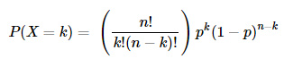
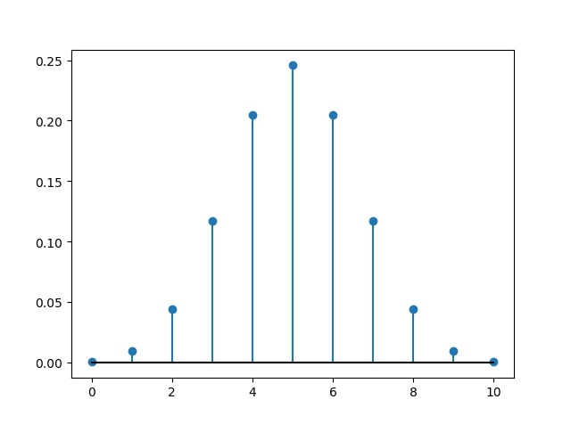
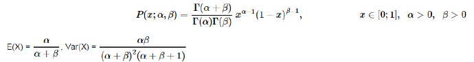
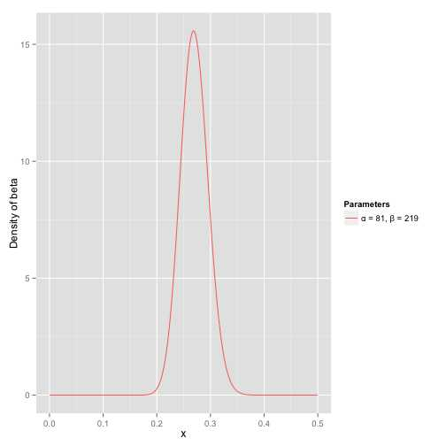
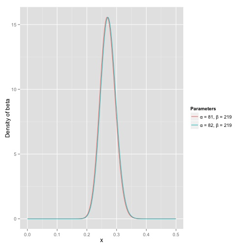
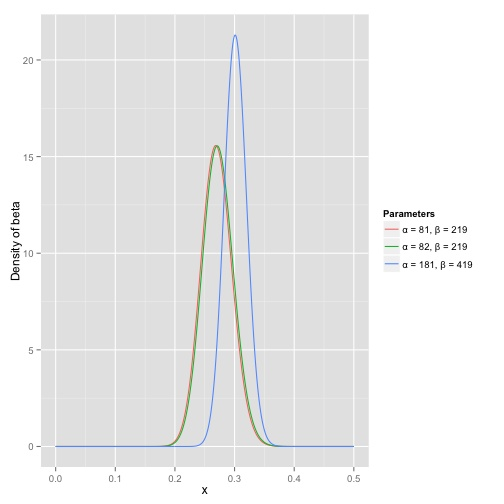
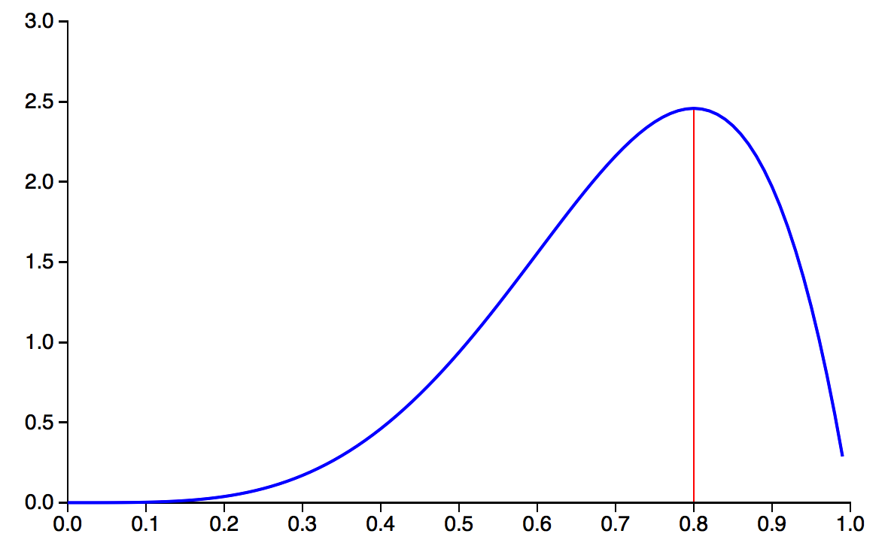
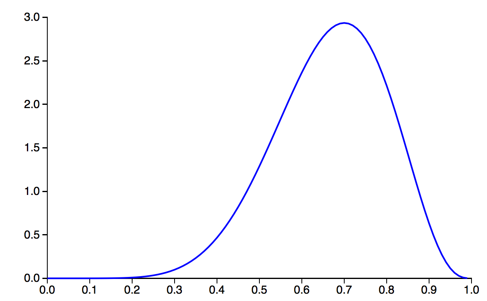

# 概率分布

## 概述

随机变量是一个变量，它取值于一组可能的值（**离散**或**连续**的），并服从某种**随机性**。随机变量的每个可能取值的都与一个概率相关联。随机变量的所有可能取值和与之相关联的概率就被称为[概率分布（probability distributrion）](http://en.wikipedia.org/wiki/Probability_distribution)。

概率分布有两种类型：离散（discrete）概率分布和连续（continuous）概率分布。

离散概率分布也称为[概率质量函数（probability mass function）](http://en.wikipedia.org/wiki/Probability_mass_function)。离散概率分布的例子有伯努利分布（Bernoulli distribution）、二项分布（binomial distribution）、泊松分布（Poisson distribution）和几何分布（geometric distribution）等。

连续概率分布也称为[概率密度函数（probability density function）](http://en.wikipedia.org/wiki/Probability_density_function)，它们是具有连续取值（例如一条实线上的值）的函数。正态分布（normal distribution）、指数分布（exponential distribution）和β分布（beta distribution）等都属于连续概率分布。


## 二项分布(binomial distribution)

###1.公式
服从二项分布的随机变量X表示在n个独立的是/非试验中成功的次数，其中每次试验的成功概率为p，**靠记忆记住期望和方差**：$$E(X) = np, Var(X) = np(1−p)$$。下面括号中就是排列组合的公式。


###2.实例
掷硬币

###3.代码

```python
import matplotlib.pyplot as plt
import numpy as np
from scipy import stats
n = 10
k = np.arange(n+1)
pcoin = stats.binom.pmf(k, n, 0.5)
#pmf: 概率质量函数
#k : array_like Quantiles. 样本分位数
#pcoin：array([ 0.00097656,  0.00976563,  0.04394531,  0.1171875 ,  0.20507813,0.24609375,  0.20507813,  0.1171875 ,  0.04394531,  0.00976563,0.00097656])
plt.stem(k, pcoin, basefmt="k-") #分布茎叶图
plt.show()
```


## beta分布(beta distribution)
###1.原理
β分布是一个取值在 [0, 1] 之间的连续分布，它由两个形态参数α和β的取值所刻画。β分布的形状取决于α和β的值。贝叶斯分析中大量使用了β分布。下面左侧部分就是B函数，其是一个标准化函数，它只是为了使得这个分布的概率密度积分等于1才加上的。


###2.实例
**beta分布可以看作一个概率的概率分布**，当你不知道一个东西的具体概率是多少时，它可以给出了所有概率出现的可能性大小。

举一个简单的例子，熟悉棒球运动的都知道有一个指标就是棒球击球率(batting average)，就是用一个运动员击中的球数除以击球的总数，我们一般认为0.266是正常水平的击球率，而如果击球率高达0.3就被认为是非常优秀的。

现在有一个棒球运动员，我们希望能够预测他在这一赛季中的棒球击球率是多少。你可能就会直接计算棒球击球率，用击中的数除以击球数，但是如果这个棒球运动员只打了一次，而且还命中了，那么他就击球率就是100%了，这显然是不合理的，因为根据棒球的历史信息，我们知道这个击球率应该是0.215到0.36之间才对啊。

对于这个问题，我们可以用一个二项分布表示（一系列成功或失败），一个最好的方法来表示这些经验（在统计中称为先验信息）就是用beta分布，这表示在我们没有看到这个运动员打球之前，我们就有了一个大概的范围。**beta分布的定义域是(0,1)这就跟概率的范围是一样的**。

接下来我们将这些先验信息转换为beta分布的参数，我们知道一个击球率应该是平均0.27左右，而他的范围是0.21到0.35，那么根据这个信息，我们可以取α=81,β=219


之所以取这两个参数是因为：

- beta分布的均值是$$\frac{\alpha}{\alpha+\beta}=\frac{81}{81+219}=0.27$$
- 从图中可以看到这个分布主要落在了(0.2,0.35)间，这是从经验中得出的合理的范围。

在这个例子里，我们的x轴就表示各个击球率的取值，x对应的y值就是这个击球率所对应的概率。也就是说beta分布可以看作一个概率的概率分布。

那么有了先验信息后，现在我们考虑一个运动员只打一次球，那么他现在的数据就是”1中;1击”。这时候我们就可以更新我们的分布了，让这个曲线做一些移动去适应我们的新信息。beta分布在数学上就给我们提供了这一性质，他与二项分布是共轭先验（Conjugate prior）。**Beta分布是二项分布的参数p的共轭先验，也就是说，二项分布的参数p的共轭先验是一个Beta分布，其中，Beta分布中的两个参数a,b可以看作两个二项分布的参数p的先验知识。在二项分布的参数的先验分布的基础上，加上观测数据，就可以得到二项分布的参数p的后验概率分布也符合Beta分布。**所谓共轭先验就是先验分布是beta分布，而后验分布同样是beta分布。结果很简单： 

$$\mbox{Beta}(\alpha_0+\mbox{hits}, \beta_0+\mbox{misses})$$

其中α0和β0是一开始的参数，在这里是81和219。所以在这一例子里，α增加了1(击中了一次)。β没有增加(没有漏球)。这就是我们的新的beta分布Beta(81+1,219)，我们跟原来的比较一下：


可以看到这个分布其实没多大变化，这是因为只打了1次球并不能说明什么问题。但是如果我们得到了更多的数据，假设一共打了300次，其中击中了100次，200次没击中，那么这一新分布就是： 



注意到这个曲线变得更加尖，并且平移到了一个右边的位置，表示比平均水平要高。

一个有趣的事情是，根据这个新的beta分布，我们可以得出他的数学期望为：$$\frac{\alpha}{\alpha+\beta}=\frac{82+100}{82+100+219+200}=.303$$，这一结果要比直接的估计要小$$\frac{100}{100+200}=.333$$ 。你可能已经意识到，我们事实上就是在这个运动员在击球之前可以理解为他已经成功了81次，失败了219次这样一个先验信息。

因此，对于一个我们不知道概率是什么，而又有一些合理的猜测时，beta分布能很好的作为一个表示概率的概率分布。

###3.代码

```python
import matplotlib.pyplot as plt
import numpy as np
from scipy import stats
a = 81
b = 219
k = np.linspace(0, 1, 100) #样本分位数
pbeta = stats.beta.pdf(k, a, b) #a是alpha，b是beta
plt.plot(p, pbeta,label='before')
pbeta2 = stats.beta.pdf(k, a+100, b+200) #a是alpha，b是beta
#pdf：概率密度函数
plt.plot(p, pbeta2,label='after')
plt.legend() #show legend
plt.show()
```

直接从beta分布中取数（在0与1之间）
```python
np.random.beta(a,b,size=30) #Draw samples from a Beta distribution. a is alpha , b is beta
```

##多项分布(multinomial distribution)

###1.原理
多项分布是对二项分布的扩展，二项分布是单变量分布，而多项分布是多变量分布。二项分布的典型例子是抛硬币，每次试验有正反两种对立的可能，多项分布的例子是扔骰子，每次试验有多种可能，进行多次试验，多项分布描述的是每种可能发生次数的联合概率分布。 如下：从袋中拿n个球，这些球都是由不同颜色组成，p为每一种颜色的概率都是，x表示每一种颜色拿到的数目，下面的概率质量函数就表示为如下形式。

Suppose one does an experiment of extracting n balls of k different colours from a bag, replacing the extracted ball after each draw. Balls from the same colour are equivalent. Denote the variable which is the number of extracted balls of colour i (i = 1, ..., k) as $$X_i$$, and denote as $$p_i$$ the probability that a given extraction will be in colour i. The probability mass function of this multinomial distribution is:

$${\displaystyle {\begin{aligned}f(x_{1},\ldots ,x_{k};n,p_{1},\ldots ,p_{k})&{}=\Pr(X_{1}=x_{1}{\text{ and }}\dots {\text{ and }}X_{k}=x_{k})\\&{}={\begin{cases}{\displaystyle {n! \over x_{1}!\cdots x_{k}!}p_{1}^{x_{1}}\times \cdots \times p_{k}^{x_{k}}},\quad &{\text{when }}\sum _{i=1}^{k}x_{i}=n\\\\0&{\text{otherwise,}}\end{cases}}\end{aligned}}}$$

for non-negative integers $$x_1, ..., x_k$$.

The expected number of times the outcome i was observed over n trials is
$$\operatorname{E}(X_i) = n p_i.\,$$
The covariance matrix is as follows. Each diagonal entry is the variance of a binomially distributed random variable, and is therefore
$$\operatorname{var}(X_i)=np_i(1-p_i).\,$$
The off-diagonal entries are the covariances:
$$\operatorname{cov}(X_i,X_j)=-np_i p_j\,$$
for i, j distinct.

###2.实例
扔骰子

### 3.代码
多项分布，无法画图。当分类为2时，多项分布就等于二项分布。The multinomial distribution for k=2 is identical to the corresponding binomial distribution (tiny numerical differences notwithstanding)。

```python
from scipy.stats import multinomial
rv = multinomial(8, [0.3, 0.2, 0.5]) #n : Number of trials
#p : Probability of a trial falling into each category; should sum to 1
rv.pmf([1, 3, 4]) #it means to calculate probability for specific number.
multinomial.rvs(8, [0.3, 0.2, 0.5]) #Draw random samples from a multinomial distribution. array([2,1,5])
```

##狄利克雷分布(dirichlet distribution)
###1.原理
Dirichlet的概率是（多项）分布的概率的概率，所以Dirichlet就是（多项）分布的分布。

维度K ≥ 2的狄利克雷分布在参数$$α_1, ..., α_K > 0$$上、基于欧几里得空间$$R^{K-1}$$里的勒贝格测度有个概率密度函数，定义为：
$${\displaystyle f(x_{1},\dots ,x_{K};\alpha _{1},\dots ,\alpha _{K})={\frac {1}{\mathrm {B} (\alpha )}}\prod _{i=1}^{K}x_{i}^{\alpha _{i}-1}}$$

$$x_1, ..., x_{K–1} > 0$$并且$$x_1 + ... + x_{K–1} < 1，x_K = 1 – x_1 – ... – x_{K–1}$$. 在(K − 1)维的单纯形开集上密度为0。

###2.代码
狄利克雷分布无法画图

```python
import numpy as np
from scipy import stats
alpha = np.array([1.0, 2.0, 3.0]) #alpha : The concentration parameters. The number of entries determines the dimensionality of the distribution. 个数决定分布的维度，也就是最多几类。
x = np.random.dirichlet(alpha, size=7) #给定多项分布结果，求出几组概率。
stats.dirichlet.rvs(alpha,size=7)  #给定多项分布结果，求出几组概率。
```


##共轭先验
###1.关于之前似然函数的纠正
在之前总结的machine leaning中，对于先验和后验，可以将参数$$\theta$$看成是类似事件。
但是**<u>对于似然函数，必须明确是一个关于统计模型参数的函数</u>**。**<u>在参数集合 θ 上的似然，就是在给定这些参数值的基础上，观察到的结果的概率 L(θ)=P(x|θ) 。也就是说，似然是关于参数的函数</u>**，在参数给定的条件下，对于观察到的 x 的值的条件分布。而其本身是一个分布，但是我们当设置某个$$\theta$$时就可以看做一个值。

###2.先验概率（Prior probability）

在贝叶斯统计中，先验概率分布，即关于某个变量 X 的概率分布，是在获得某些信息或者依据前，对 X 之不确定性所进行的猜测。这是对不确定性（而不是随机性）赋予一个量化的数值的表征，这个量化数值可以是一个参数，或者是一个潜在的变量。

先验概率仅仅依赖于主观上的经验估计，也就是事先根据已有的知识的推断。例如， X 可以是投一枚硬币，正面朝上的概率，显然在我们未获得任何其他信息的条件下，我们会认为 P(X)=0.5；再比如上面例子中的，P(G)=0.4。

在应用贝叶斯理论时，通常将先验概率乘以似然函数（Likelihood Function）再归一化后，得到后验概率分布，后验概率分布即在已知给定的数据后，对不确定性的条件分布。

###3.似然函数（Likelihood function）

似然函数（也称作似然），是一个关于统计模型参数的函数。也就是这个函数中自变量是统计模型的参数。对于观测结果 x ，在参数集合 θ 上的似然，就是在给定这些参数值的基础上，观察到的结果的概率 L(θ)=P(x|θ) 。也就是说，似然是关于参数的函数，在参数给定的条件下，对于观察到的 x 的值的条件分布。

似然函数在统计推断中发挥重要的作用，因为它是关于统计参数的函数，所以可以用来对一组统计参数进行评估，也就是说在一组统计方案的参数中，可以用似然函数做筛选。

你会发现，“似然”也是一种“概率”。但不同点就在于，观察值 x 与参数 θ 的不同的角色。概率是用于描述一个函数，这个函数是在给定参数值的情况下的关于观察值的函数。例如，已知一个硬币是均匀的（在抛落中，正反面的概率相等），那连续10次正面朝上的概率是多少？这是个概率。

而似然是用于在给定一个观察值时，关于描述参数的函数。例如，如果一个硬币在10次抛落中正面均朝上，那硬币是均匀的（在抛落中，正反面的概率相等）概率是多少？这里用了概率这个词，但是实质上是“可能性”，也就是似然了。

###4.后验概率（Posterior probability）

后验概率是关于随机事件或者不确定性断言的条件概率，是在相关证据或者背景给定并纳入考虑之后的条件概率。后验概率分布就是未知量作为随机变量的概率分布，并且是在基于实验或者调查所获得的信息上的条件分布。“后验”在这里意思是，考虑相关事件已经被检视并且能够得到一些信息。

后验概率是关于参数 θ 在给定的证据信息 X 下的概率，即 P(θ|X) 。若对比后验概率和似然函数，似然函数是在给定参数下的证据信息 X 的概率分布，即 P(X|θ) 。二者有如下关系：

- 我们用 P(θ) 表示概率分布函数，用 P(X|θ) 表示观测值 X 的似然函数。后验概率定义为$$\displaystyle P(θ|X)=\frac{P(X|θ)P(θ)}{P(X)}$$，注意这也是贝叶斯定理所揭示的内容。
- 鉴于分母是一个常数，上式可以表达成如下比例关系（而且这也是我们更多采用的形式）：Posterior probability∝Likelihood×Prior probability

###5.共轭分布(意义在于)

我们还是从一个例子讲起。假如你有一个硬币，它有可能是不均匀的，所以投这个硬币有 θ 的概率抛出Head，有 (1−θ) 的概率抛出Tail。如果抛了五次这个硬币，有三次是Head，有两次是Tail，这个 θ 最有可能是多少呢？如果你必须给出一个确定的值，并且你完全根据目前观测的结果来估计 θ，那么显然你会得出结论$$\displaystyle \theta = \frac{3}{5}$$。

但上面这种点估计的方法显然有漏洞，这种漏洞主要体现在实验次数比较少的时候，所得出的点估计结果可能有较大偏差。大数定理也告诉我们，在重复实验中，随着实验次数的增加，事件发生的频率才趋于一个稳定值。一个比较极端的例子是，如果你抛出五次硬币，全部都是Head。那么按照之前的逻辑，你将估计 θ 的值等于 1。也就是说，你估计这枚硬币不管怎么投，都朝上！但是按正常思维推理，我们显然不太会相信世界上有这么厉害的硬币，显然硬币还是有一定可能抛出Tail的。就算观测到再多次的Head，抛出Tail的概率还是不可能为0。

前面介绍的贝叶斯定理或许可以帮助我们。在贝叶斯学派看来，参数 θ 不再是一个固定的值了，而是满足一定的概率分布！回想一下前面介绍的先验概率和后验概率。在估计 θ 时，我们心中可能有一个根据经验的估计，即先验概率，P(θ)。而给定一系列实验观察结果 X 的条件下，我们可以得到后验概率为$$P(\theta|X)=\frac{P(X|\theta)P(\theta)}{P(X)}$$

在上面的贝叶斯公式中，P(θ)就是个概率分布。这个概率分布可以是任何概率分布，比如高斯分布，或者刚刚提过的 Beta 分布。下图是Beta(5,2)的概率分布图。如果我们将这个概率分布作为P(θ)，那么我们在还未抛硬币前，便认为θ很可能接近于0.8，而不大可能是个很小的值或是一个很大的值。换言之，我们在抛硬币前，便估计这枚硬币更可能有0.8的概率抛出正面。 

 

虽然P(θ)可以是任何种类的概率分布，但是如果使用Beta 分布，会让之后的计算更加方便。我们接着继续看便知道这是为什么了。况且，通过调节 Beta 分布中的a和b，你可以让这个概率分布变成各种你想要的形状！Beta 分布已经很足够表达我们事先对θ的估计了。

<u>现在我们已经估计好了 P(θ) 为一个 Beta 分布，那么 P(X|θ) 是多少呢？其实就是个二项（Binomial）分布。继续以前面抛5次硬币抛出3次Head的观察结果为例，X=抛5次硬币3次结果为Head的事件， 则$$P(X|\theta)=C_2^5\theta^3(1-\theta)^2$$。</u>

<u>贝叶斯公式中分母上的 P(X) 是个Normalizer，或者叫做边缘概率。在 θ 是离散的情况下，P(X) 就是 θ 为不同值的时候，P(X|θ) 的求和。例如，假设我们事先估计硬币抛出正面的概率只可能是0.5或者0.8，那么 P(X)=P(X|θ=0.5)+P(X|θ=0.8)，计算时分别将 θ=0.5 和 θ=0.8 代入到前面的二项分布公式中。而如果我们采用 Beta 分布，θ的概率分布在[0,1]之间是连续的，所以要用积分，即</u> 

<u>$$</u>P(X)=\int_0^1P(X|\theta)P(\theta)d\theta$$

下面的证明就告诉我们：

**P(θ) 是个 Beta 分布，那么在观测到“X=抛5次硬币中出现3个head”的事件后，P(θ|X) 依旧是个 Beta 分布！**

只是这个概率分布的形状因为观测的事件而发生了变化。 

$$\begin{align}P(\theta|X) &= \frac{P(X|\theta)P(\theta)}{P(X)}=\frac{P(X|\theta)P(\theta)}{\int_0^1P(X|\theta)P(\theta)d\theta}\\&=\frac{C_2^5\theta^3(1-\theta)^2\frac{1}{\mathbf{B}(a,b)}\theta^{a-1}(1-\theta)^{b-1}}{\int_0^1C_2^5\theta^3(1-\theta)^2\frac{1}{\mathbf{B}(a,b)}\theta^{a-1}(1-\theta)^{b-1} d\theta}\\&=\frac{\theta^{(a+3-1)}(1-\theta)^{(b+2-1)}}{\int_0^1 \theta^{(a+3-1)}(1-\theta)^{(b+2-1)} d\theta}\\&=\frac{\theta^{(a+3-1)}(1-\theta)^{(b+2-1)}}{\mathbf{B}(a+3,b+2)}\\&=Beta(\theta | a+3, b+2)\end{align}$$

因为观测前后，对 θ 估计的概率分布均为 Beta 分布，这就是为什么使用 Beta 分布方便我们计算的原因了。当我们得知 P(θ|X)=Beta(θ|a+3,b+2)后，我们就只要根据 Beta 分布的特性，得出 θ 最有可能等于多少了。（即 θ 等于多少时，观测后得到的 Beta 分布有最大的概率密度）。

例如下图，仔细观察新得到的 Beta 分布，和上一图中的概率分布对比，发现峰值从0.8左右的位置移向了0.7左右的位置。这是因为新观测到的数据中，5次有3次是head（60%），这让我们觉得，θ 没有0.8那么高。但由于我们之前觉得 θ 有0.8那么高，我们觉得抛出head的概率肯定又要比60%高一些！这就是Bayesian方法和普通的统计方法不同的地方。我们结合自己的先验概率和观测结果来给出预测。 

 

<u>如果我们投的不是硬币，而是一个多面体（比如骰子），那么我们就要使用 Dirichlet 分布了。使用Dirichlet 分布之目的，也是为了让观测后得到的posterior probability依旧是 Dirichlet 分布。</u>

到此为止，我们终于可以引出“共轭性”的概念了！后验概率分布（正比于先验和似然函数的乘积）拥有与先验分布相同的函数形式。这个性质被叫做共轭性（Conjugacy）。共轭先验（conjugate prior）有着很重要的作用。它使得后验概率分布的函数形式与先验概率相同，因此使得贝叶斯分析得到了极大的简化。例如，二项分布的参数之共轭先验就是我们前面介绍的 Beta 分布。多项式分布的参数之共轭先验则是 Dirichlet 分布，高斯分布的均值之共轭先验是另一个高斯分布。

**注意：如果先验分布和似然函数可以使得先验分布和后验分布有相同的形式，那么就称先验分布与似然函数是共轭的。比如beta分布与二项分布。**

总的来说，对于给定的概率分布 P(X|θ)，我们可以寻求一个与该似然函数 ，即P(X|θ)， 共轭的先验分布 P(θ)，如此一来后验分布 P(θ|X) 就会同先验分布具有相同的函数形式。而且对于任何指数族成员来说，都存在有一个共轭先验。


##References
* [如何通俗理解beta分布](https://www.zhihu.com/question/30269898/answer/123261564)
* [先验概率、后验概率以及共轭先验](http://blog.csdn.net/baimafujinji/article/details/51374202)