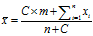
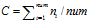
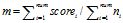

# 基于用户投票的排名算法

##研究

本次只研究威尔逊以及贝叶斯平均的方法。

##结论
要么采用正负票+威尔逊+用户权重（之前得到的正负票差数），要么采用贝叶斯+设置不同用户初始先验

##例子-设置权重

###威尔逊区间-世纪佳缘
根据经验，某个老会员被其它会员进行click或msg，都说明其它会员对这个老会员有一定好感，2种情形都可认为是"投赞成票"，而如果老会员仅仅是被系统推荐rec，说明其它会员不感兴趣，则可以认为是"投反对票"，由此，可以将问题转化为一个"二项分布"的统计问题。**

这里，我们给定三种事件rec，click和msg以不同的权重（分别为1，1.5，2），则对于某个老会员，
赞成票数为：
Ups = msg_weight * msg_times + click_weight * click_times
反对票数为：
Downs = rec_weight * rec_times
那么投票的赞成率p = ups / (ups + downs)，于是就可以使用威尔逊区间法给出排序。

###贝叶斯平均-世纪佳缘
把这个公式写成更一般的形式：

其中，

- C，投票人数扩展的规模，是一个自行设定的常数，与整个网站的总体用户人数有关，可以等于每个项目的平均投票数
- n，该项目的现有投票人数
- x，该项目的每张选票的值
- m，总体平均分，即整个网站所有选票的算术平均值

这种算法被称为"贝叶斯平均"（Bayesian average）。因为某种程度上，它借鉴了"贝叶斯推断"（Bayesian inference）的思想：既然不知道投票结果，那就先估计一个值，然后不断用新的信息修正，使得它越来越接近正确的值。

每个老会员可以被看作一个项目，所有新注册用户对某个老会员进行rec，click，msg可以看作不同评分（分别为1，1.5，2）的投票，每一次事件相当于一次投票。这样进行抽象后，就很容易利用贝叶斯平均法来解决我们这里的会员推荐问题。

假定总的老会员数量为num，那么对于某个老会员i：

投票人数ni = msg_times + click_times + rec_times

投票得分scorei = msg_weight * msg_times + click_weight * click_times + rec_weight * rec_times

每个老会员的平均投票数

每次投票的平均得分

##总结

| 解决目标   | 解决方法                          |
| ------ | ----------------------------- |
| 展现优秀内容 | 赞同票比例正反馈、投票趋势正反馈              |
| 展现热门内容 | 投票数数量、浏览数量、收藏数量、回答数量正反馈       |
| 展现新内容  | 时间副反馈（牛顿冷却定律）                 |
| 抑制马太效应 | 增加影响维度、对投票数使用对数算法、时间副反馈       |
| 可信与公平  | 威尔逊得分区间、贝叶斯平均                 |
| 激励后进   | 时间副反馈、抑制马太效应、贝叶斯平均、个性化推送、分类榜单 |
| 过滤欺骗   | 用户权重、增加影响维度、随机更新榜单            |

## Reference

- [基于用户投票的排名算法整理](http://tianshu.xyz/blog/124/)
- [推荐系统入门实践：世纪佳缘会员推荐（完整版）（数据已备份百度网盘）](http://www.cnblogs.com/supersteven/archive/2012/09/01/2666565.html)