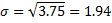

#二项分布样本的威尔逊置信区间下界

##1.原理

###1)假设
**J注意我一直弄混，其实二项分布是多个实验下1的次数的分布，而不是就0和1。**

在概率论和统计学中，二项分布（英语：Binomial distribution）是n个独立的是/非试验中成功的次数的离散概率分布，其中每次试验的成功概率为p。这样的单次成功/失败试验又称为伯努利试验。

投票问题满足二项分布，因为有如下假设：
```
（1）每个用户的投票都是独立事件。
（2）用户只有两个选择，要么投赞成票，要么投反对票。
（3）如果投票总人数为n，其中赞成票为k，那么赞成票的比例p就等于k/n。
```

###2)思路
p越大，就代表这个项目的好评比例越高，越应该排在前面。但是，p的可信性，取决于有多少人投票，如果样本太小，p就不可信。好在我们已经知道，p是"二项分布"中某个事件的发生概率，因此我们可以计算出p的置信区间。所谓"置信区间"，就是说，以某个概率而言，p会落在的那个区间。比如，某个产品的好评率是80%，但是这个值不一定可信。根据统计学，我们只能说，有95%的把握可以断定，好评率在75%到85%之间，即置信区间是[75%, 85%]。
```
　　第一步，计算每个项目的"好评率"（即赞成票的比例）。
　　第二步，计算每个"好评率"的置信区间（以95%的概率）。
　　第三步，根据置信区间的下限值，进行排名。这个值越大，排名就越高。
```
这样做的原理是，置信区间的宽窄与样本的数量有关。比如，A有8张赞成票，2张反对票；B有80张赞成票，20张反对票。这两个项目的赞成票比例都是80%，但是B的置信区间（假定[75%, 85%]）会比A的置信区间（假定[70%, 90%]）窄得多，因此B的置信区间的下限值（75%）会比A（70%）大，所以B应该排在A前面。

**在统计学中，一个概率样本的置信区间（Confidence interval），又称置信区间，是对这个样本的某个总体参数的区间估计。**
置信区间的实质，就是进行可信度的修正，弥补样本量过小的影响。如果样本多，就说明比较可信，不需要很大的修正，所以置信区间会比较窄，下限值会比较大；如果样本少，就说明不一定可信，必须进行较大的修正，所以置信区间会比较宽，下限值会比较小。

###3)威尔逊区间
二项分布的置信区间有多种计算公式，最常见的是"正态区间"（Normal approximation interval），教科书里几乎都是这种方法。但是，它只适用于样本较多的情况（np > 5 且 n(1 − p) > 5），对于小样本，它的准确性很差。
1927年，美国数学家 Edwin Bidwell Wilson提出了一个修正公式，被称为"威尔逊区间"，很好地解决了小样本的准确性问题。

###4)缺点
马太效应：排行榜前列总是那些票数最多的项目，新项目或者冷门项目，很难有出头机会，排名可能会长期靠后。

##2.实现

###1)利用威尔逊区间来处理thumb-up and thumb-down:
Wilson_Score：


```python
def wilson_score(pos, total, p_z=1.96):
    """
    威尔逊得分计算函数
    参考：https://en.wikipedia.org/wiki/Binomial_proportion_confidence_interval
    :param pos: 正例数
    :param total: 总数
    :param p_z: 正太分布的分位数
    :return: 威尔逊得分
    """
    pos_rat = pos * 1. / total * 1.  # 正例比率
    score = (pos_rat + (np.square(p_z) / (2. * total))
             - ((p_z / (2. * total)) * np.sqrt(4. * total * (1. - pos_rat) * pos_rat + np.square(p_z)))) / \
            (1. + np.square(p_z) / total)
    return score
```

分位数表：

算法性质：

- 性质1：得分S的范围是[0,1)，效果：已经归一化，适合排序
- 性质2：当正例数u为0时，p为0，得分S为0；效果：没有好评，分数最低；
- 性质3：当负例数v为0时，p为1，退化为1/(1 + z^2 / n)，得分S永远小于1；效果：分数具有永久可比性；
- 性质4：当p不变时，n越大，分子减少速度小于分母减少速度，得分S越多，反之亦然；效果：好评率p相同，实例总数n越多，得分S越多；
- 性质5：当n趋于无穷大时，退化为p，得分S由p决定；效果：当评论总数n越多时，好评率p带给得分S的提升越明显；
- 性质6：当分位数z越大时，总数n越重要，好评率p越不重要，反之亦然；效果：z越大，评论总数n越重要，区分度低；z越小，好评率p越重要；

###2)利用威尔逊区间来处理star rating:
J从网上例子看来，除非迫不得已，否则不用威尔逊区间来解决star rating，因为本身就是二项分布的置信区间计算公式。

####1.将star rating处理为thumb-up and thumb-down：
比如：
```php
function fiveStarRating($one, $two, $three, $four, $five) {
    $positive = $two * 0.25 + $three * 0.5 + $four * 0.75 + $five;
    $negative = $one + $two * 0.75 + $three * 0.5 + $four * 0.25;
```
比如：
```python
def test_of_values():
    """
    五星评价的转换处理，百分制类似
    """
    max = 5.  # 五星评价的最大值
    min = 1.  # 五星评价的最小值
    values = np.array([1., 2., 3., 4., 5.])  # 示例
    total = values.size  # 总数
    mean = np.mean(values)  # 均值
    pos = ((mean - min) * total) / (max - min) # 转换成pos值  
    return pos, total

pos, total = test_of_values2()
print ("pos: %s, total: %s" % (pos, total))
print ('score: %s' % wilson_score(pos, total, p_z=1.96))

###Get average, subtract the minimum vote (1 for a 5 star rating system), multiply that by the total number of votes, divide that by the range interval (max - min, so a 1-5 star rating would have an interval of 4), and use that final result for the number of "upvotes".

###So, if we posit an example of 10 votes, half 1's and half 5's, then that's basically equivalent to 5 upvotes and 5 downvotes. The average in such a spread would be 3 stars. Using their math: (3 -1) * 10 / 4 = 5 upvotes, which means 5 downvotes.

###If we now posit an example of 10 votes, half 3's and half 5's, average is 4. Using their math: (4 - 1) * 10 / 4 = 7.5 upvotes, which would mean 2.5 downvotes.

###Basically, 1 star in their system is a full downvote, 5 stars is a full upvote. Any other rating is partially a downvote and partially an upvote, only instead of counting all the votes up individually, they rely on figuring out the final spread based on the average rating. This works fine if your average value is accurate, but causes there to be variance if your average is actually a rounded value. So, make sure you use enough significant digits on your average number for it to be accurate. None of this rounding to 2 digits stuff.
```

####2.直接使用正态分布替换伯努利分布，但我认为这种没有数学依据
Wilson_Norm:


平均值：n表示这组数据个数，x1、x2、x3……xn表示这组数据具体数值

方差：


##3.实践
###1)知乎赞同票与反对票：
####1.优点：
一方面：
左图的整体曲面形状，与通常理解中赞同票、反对票和回答质量的对应关系是相符的。固定反对票，赞同票越多得分越高；固定赞同票，反对越多得分越低；固定赞同与反对的比例，总票数越高得分越高。
总投票数较少时，回答如果获得投票，得分会快速增加，总票数越大增加速度越慢。体现为垂直 y 轴的平面截得的曲线斜率对 x 恒正且单调下降。同时，赞同数较高的回答，开始获得反对票时，得分会快速下降，总反对数越大下降速度越慢。垂直 x 轴的平面截得的曲线斜率对 y 恒负且单调上升。
另一方面：
函数曲面连续光滑，使得这个算法可以很好的处理浮点数投票，支持知乎已有的用户话题权重机制。二者有机结合，让回答排序更符合真实的内容质量。

####2.缺点：
算法在 x = 0 时函数取值收敛为 0，无法对赞同为 0 但有不同反对票数的回答进行排序。我们的处理方式是默认所有回答者对自己的回答投了一票赞同。这样不仅解决了这个问题，还能让回答者的权重参与到排序的计算中。
**J因为对于0赞同数而言，始终score为0，无论反对票数量，都没有区别。**

####3.加入用户权重，加权赞同票和反对票（本身也是权重），从而克服威尔逊区间的缺点：
用户在某个问题下的权重，是根据他过去在相关话题下的回答得到的赞同、反对和没有帮助票数计算的。用户过去回答的得票，体现了其他用户在相关领域下对他能力的认可程度。高权重用户的投票，会对排序有更大的影响，他们的回答也会具有一定的排序优势。

用户只会在他作出高质量回答的领域内（根据问题添加的话题区分）具有较高的权重。知乎并不计算用户的全局权重。提高自己在某个领域下的权重只有一个方法，在这个领域下书写高质量的回答。

需要注意，匿名回答会参与权重计算；被关闭的问题下的回答不参与权重计算；回答被折叠，会对回答者在相关话题下的权重有一定负面影响。如果用户有严重违反社区规范的行为（如刷票、营销等），权重也会被降低。

估计以下几个factor权重会高，按顺序排列就是：字数，篇幅长度大小，人的权威度，赞量，踩量，评论量。

以下为一个例子：

公式：

其中，
 是帖子的好评率
U是帖子作者的用户权重
t是时间因素

可以看到，帖子得分是一个与好评率、作者权重、时间相关的加权平均数，**在评分系统中，将作者的因素考虑进去，相信更优秀的作者，更有机会产生好的内容，同时也有助于用户产生内容的激励措施。**

而在[reddit](https://www.reddit.com/r/Enhancement/comments/1f5oqq/what_is_vote_weight/)中，对于vote weight，就是指某人得到的赞同票和反对票之差（其实这里也可以使用威尔逊）。

**然后再不断调整系数，对比实际中的排序来观察！！！** 这里面并没有涉及到高深的数学公式，所以暂时不深究下去了。

具体搜索“user weight” ：

##4.补充

###1)实际运用中当 n 很大时一般都用正态分布来近似计算二项分布

[**Theorem 1**](http://www.real-statistics.com/binomial-and-related-distributions/relationship-binomial-and-normal-distributions/binomial-and-normal-distributions-advanced/): If *x* is a random variable with distribution *B*(*n, p*), then for sufficiently large *n*, the following random variable has a standard normal distribution:


where


Proof: [Click here](http://www.real-statistics.com/binomial-and-normal-distributions-advanced/) for a proof of Theorem 1, which requires knowledge of calculus.

**Corollary 1**: Provided *n* is large enough, *N*(*μ,σ*) is a good approximation for *B*(*n, p*) where *μ = np* and *σ2 = np* (1 – *p*).

**Observation**: The normal distribution is generally considered to be a pretty good approximation for the binomial distribution when *np* ≥ 5 and *n*(1 – *p*) ≥ 5.  For values of *p*close to .5, the number 5 on the right side of these inequalities may be reduced somewhat, while for more extreme values of *p *(especially for* p *< .1 or* p *> .9) the value 5 may need to be increased.

**Example 1**: What is the normal distribution approximation for the binomial distribution where *n* = 20 and *p* = .25 (i.e. the binomial distribution displayed in Figure 1 of Binomial Distribution)?

As in Corollary 1, define the following parameters:




Since *np* = 5 ≥ 5 and *n*(1 – *p*) = 15 ≥ 5, based on Corollary 1 we can conclude that *B*(20,.25) ~ *N*(5,1.94).

We now show the graph of both pdf’s to see visibly how close these distributions are:


# References

* [基于用户投票的排名算法（五）：威尔逊区间](http://www.ruanyifeng.com/blog/2012/03/ranking_algorithm_wilson_score_interval.html)
* [威尔逊得分 Wilson Score 排序算法](http://www.jianshu.com/p/4d2b45918958)
* [基于ruby的威尔逊区间实现](https://github.com/instacart/wilson_score)
* [Relationship between Binomial and Normal Distributions](http://www.real-statistics.com/binomial-and-related-distributions/relationship-binomial-and-normal-distributions/)
* [如何评价知乎的回答排序算法](https://www.zhihu.com/question/26933554)
* [知乎如何计算用户在某个领域下的权重](https://www.zhihu.com/question/21544084)

