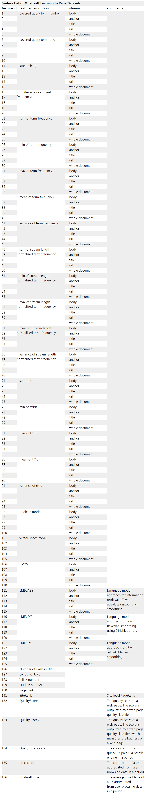
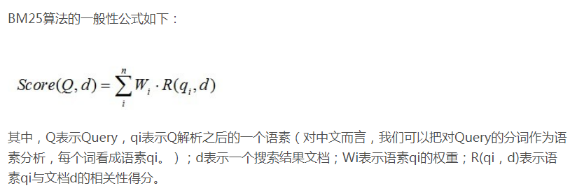
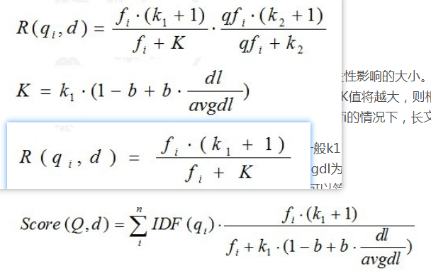

# rank_work编程

[TOC]

## 总体思想

目前比之前的rank.md更进一步的是已经确定了算法lambdamart和框架lightgbm。

按照elasticsearch的脚本进行整理训练。[相关说明](#case3) 

两个方案：点击模型和click data（理解为点击数作为相关度参考/还是采用实际点击作为量化，目前考虑后者也可以） 。[相关说明](#click data(就是将点击数据量作为相关度，也不考虑ctr，J我觉得可行，至少保底了))

还差一个特征工程的方法。特征包括：文本特征（如何考察全包含，歌手名，歌曲名），音频质量得分（可以滤除4秒的音乐），收藏数，点赞数，发布时间，评论数，播放数，付费与否（决定于推广与否）等等。[相关说明](#还是考虑query与目前召回中的进行对比，从而得到分词结果。必须得分词) J还是考虑调用es那边的bm25的相关性分数吧，自己写太累了。。。

需要滤除拦截的。

之后再考虑ubm的改进，比如browsing对吸引力的影响。

之后再考虑ctr使用平滑作为relevance。[相关说明](#ctr（就是根据ctr计算，也同样利用到了归一化）)

之后再考虑使用淘宝的方法进行数据集生成。[相关说明](#淘宝pairwise策略（可以作为备选使用，具体见rank.md）)

~~之后在考虑 inverse propensity weighting 的问题。<https://github.com/QingyaoAi/Unbiased-Learning-to-Rank-with-Unbiased-Propensity-Estimation>~~ 

~~之后再考虑合并unbiased rank。~~

后两项IPW基本看懂了，看论文笔记中的备注[Unbiased Learning to Rank with Unbiased Propensity Estimation](https://arxiv.org/pdf/1804.05938.pdf )和[Unbiased LambdaMART: An Unbiased Pairwise Learning-to-Rank Algorithm](https://arxiv.org/pdf/1809.05818v2.pdf)。**即IPW就是修改loss函数（除以位置的值），然后利用点击就是相关进行ltr计算。非直接得到relevance值。**

## click model

### spark

```linux
spark-shell \
--name jimmy_spark \
--master yarn \
--queue root.baseDepSarchQueue \
--deploy-mode client \
--executor-memory 10G \
--executor-cores 4 \
--num-executors 4 \
--conf spark.sql.shuffle.partitions=2001 \
--conf spark.network.timeout=800 \
--conf spark.scheduler.listenerbus.eventqueue.size=100000
```


```scala
import org.apache.spark.sql.expressions.{Window, WindowSpec}
import org.apache.spark.sql.{Column, SparkSession, Row}
import scala.reflect.runtime.universe._
val date_day = "2019-11-10"
val date_start = date_day
val date_end = date_day
val edition = "9156"
val datatable = "temp.jomei_search_cm_9156_click"
val lvt1 = date_day + " 00:00:00.000"
val lvt2 = date_day + " 23:59:59.999"
//val lvt1 = "2019-09-03 00:00:00.000"
//val lvt2 = "2019-09-03 23:59:59.999"
val sql_sessions_read= s"select q, u, r, d, c, s, cnt, choric_singer, songname from "+s"$datatable"+s"_sessions where cdt = '$date_end'"
val df_sessions_read = spark.sql(sql_sessions_read)

/*
q：查询词
u：歌曲id
r：位置，如果本地播放为0
d：与前一个点击的间距，如果本地播放为0
c：点击与否，如果本地播放为true
s：是否搜索，如果本地播放为0，1表示位置和相关都更新，2表示是折叠位置，则只更新相关，位置不用更新了
cnt：总数
choric_singer：歌手名
songname：歌曲名
|q|        u|  r|  d|    c|  s|cnt|       choric_singer|songname|
|G.E.M.邓紫棋|102542260|125| 19|false|  1|  1|G.E.M.邓紫棋|Victoria|
|victoria|102542260|  0|  0| true|  0|  1|G.E.M.邓紫棋|Victoria|
*/

```

### click版本spark

```scala
import org.apache.spark.sql.expressions.{Window, WindowSpec}
import org.apache.spark.sql.{Column, SparkSession, Row}
import scala.reflect.runtime.universe._
//val date_day = "2019-11-10"
val date_start = "2019-11-12"
val date_end = "2019-11-14"
val edition = "9156"
val datatable = "temp.jomei_search_cm_9156_click"
//val lvt1 = date_day + " 00:00:00.000"
//val lvt2 = date_day + " 23:59:59.999"
//val lvt1 = "2019-09-03 00:00:00.000"
//val lvt2 = "2019-09-03 23:59:59.999"
val sql_sessions_read= s"select q, u, r, d, c, s, cnt, choric_singer, songname from "+s"$datatable"+s"_sessions where cdt between "+s"'$date_start' and '$date_end'"
//只关心c为true的情况，因为这里只关心点击，不关心位置rd
val df_sessions_read = (spark.sql(sql_sessions_read).
 filter($"s" =!= 0).
 groupBy("q", "u", "choric_singer", "songname").
 agg(count("cnt").alias("num")).
 sort($"q".desc, $"num".desc)
)
df_sessions_read.persist()
df_sessions_read.filter($"q" === "周杰伦").show()
/*
q：查询词
u：歌曲id
r：位置，如果本地播放为0
d：与前一个点击的间距，如果本地播放为0
c：点击与否，如果本地播放为true
s：是否搜索，如果本地播放为0，1表示位置和相关都更新，2表示是折叠位置，则只更新相关，位置不用更新了
cnt：总数
choric_singer：歌手名
songname：歌曲名
|q|        u|  r|  d|    c|  s|cnt|       choric_singer|songname|
|G.E.M.邓紫棋|102542260|125| 19|false|  1|  1|G.E.M.邓紫棋|Victoria|
|victoria|102542260|  0|  0| true|  0|  1|G.E.M.邓紫棋|Victoria|
*/

val data_spec = "2019-11-11"
val sql_raw_read= s"select a, scid_albumid, ivar2, tv, fo, kw, mid, i, lvt, svar2, sty, status, st, spt from "+s"$datatable"+s"_raw where cdt = '$data_spec' and mid = '203558088414556161490737452342408042744'"
val df_raw_read = spark.sql(sql_raw_read)
```

### 更改埋点

删除reason的限制，and (trim(reason)<>'1' or reason is null)

7月份加入综合页

```sql
from ddl.dt_list_ard_d
where
(dt between """+s"""'$date_start'"""+""" and """+s"""'$date_end'"""+"""
    and lvt between """+s"""'$lvt1'"""+""" and """+s"""'$lvt2'"""+"""
    and a='3'
    and action='search'
    and fs='有搜索结果'
    and sct='歌曲'
    and coalesce(CAST(tv1 AS INT),CAST(tv AS INT))>="""+s"""'$edition'"""+""")
OR
(dt between """+s"""'$date_start'"""+""" and """+s"""'$date_end'"""+"""
    and lvt between """+s"""'$lvt1'"""+""" and """+s"""'$lvt2'"""+"""
    and a in ('9697', '10650', '10654')
    and scid_albumid IS NOT NULL
    and CAST(ivar2 AS BIGINT) > 0
    and action='search'
    and coalesce(CAST(tv1 AS INT),CAST(tv AS INT))>="""+s"""'$edition'"""+""")
OR
(dt between """+s"""'$date_start'"""+""" and """+s"""'$date_end'"""+"""
    and lvt between """+s"""'$lvt1'"""+""" and """+s"""'$lvt2'"""+"""
    and a ='14124'
    and scid_albumid IS NOT NULL
    and action='exposure'
    and coalesce(CAST(tv1 AS INT),CAST(tv AS INT))>="""+s"""'$edition'"""+"""
    and fo regexp '/搜索/[^/]+/(?:单曲)')
OR
(dt between """+s"""'$date_start'"""+""" and """+s"""'$date_end'"""+"""
    and lvt between """+s"""'$lvt1'"""+""" and """+s"""'$lvt2'"""+"""
    and a='4'
    and scid_albumid IS NOT NULL
    and action='play'
    and trim(fs)<>'播放错误'
    and trim(ivar10)='主动播放'
    and (trim(reason)<>'1' or reason is null)
    and coalesce(CAST(tv1 AS INT),CAST(tv AS INT))>="""+s"""'$edition'"""+"""
    and ((trim(sty)='音频' and fo regexp '/搜索/[^/]+/(?:单曲|歌曲)')
            or (trim(sty)='视频' and fo regexp '/搜索/[^/]+$')))

```

变成如下

```sql
from ddl.dt_list_ard_d
where
(dt between """+s"""'$date_start'"""+""" and """+s"""'$date_end'"""+"""
    and lvt between """+s"""'$lvt1'"""+""" and """+s"""'$lvt2'"""+"""
    and a='3'
    and action='search'
    and fs='有搜索结果'
    and sct in ('综合', '歌曲')
    and coalesce(CAST(tv1 AS INT),CAST(tv AS INT))>="""+s"""'$edition'"""+""")
OR
(dt between """+s"""'$date_start'"""+""" and """+s"""'$date_end'"""+"""
    and lvt between """+s"""'$lvt1'"""+""" and """+s"""'$lvt2'"""+"""
    and a in (10650, 10654, 9697, 14301, 14302, 14303)
    and b in ('搜索结果页-点击单曲播放','搜索结果页-点击加号插播','搜索结果页-下一首播放','搜索结果页-单曲-播放', '搜索结果页-单曲-加号插播', '搜索结果页-单曲-更多-下一首播放')
    and scid_albumid IS NOT NULL
    and CAST(ivar2 AS BIGINT) > 0
    and action='search'
    and coalesce(CAST(tv1 AS INT),CAST(tv AS INT))>="""+s"""'$edition'"""+""")
OR
(dt between """+s"""'$date_start'"""+""" and """+s"""'$date_end'"""+"""
    and lvt between """+s"""'$lvt1'"""+""" and """+s"""'$lvt2'"""+"""
    and a ='14124'
    and scid_albumid IS NOT NULL
    and action='exposure'
    and r in ('搜索综合tab页', '搜索单曲tab页')
    and coalesce(CAST(tv1 AS INT),CAST(tv AS INT))>="""+s"""'$edition'"""+"""
    and fo regexp '/搜索/[^/]+/(?:单曲)')
OR
(dt between """+s"""'$date_start'"""+""" and """+s"""'$date_end'"""+"""
    and lvt between """+s"""'$lvt1'"""+""" and """+s"""'$lvt2'"""+"""
    and a='4'
    and scid_albumid IS NOT NULL
    and action='play'
    and trim(fs)<>'播放错误'
    and trim(ivar10)='主动播放'
    and coalesce(CAST(tv1 AS INT),CAST(tv AS INT))>="""+s"""'$edition'"""+"""
    and ((trim(sty)='音频' and fo regexp '/搜索/[^/]+(/综合)?/(?:单曲|歌曲)')
            or (trim(sty)='视频' and fo regexp '/搜索/[^/]+$')))
```


## lightgbm

###启动环境

#### python安装

直接`pip install`即可，浪费了docker安装的时间。。。。


#### docker安装

```linux
mkdir lightgbm-docker
cd lightgbm-docker
wget https://raw.githubusercontent.com/Microsoft/LightGBM/master/docker/dockerfile-python
docker build -t lightgbm -f dockerfile-python .
```

加一个`ca-certificates`，解决问题：

```linux
ERROR: cannot verify repo.continuum.io's certificate, issued by `/C=US/O=Let's Encrypt/CN=Let's Encrypt Authority X3':
  Unable to locally verify the issuer's authority.
```


```dockerfile
FROM ubuntu:16.04
#RUN ln -s /etc/ssl/certs /usr/lib/ssl/certs
#RUN apt-get install ca-certificates
RUN apt-get update && \
    apt-get install -y --no-install-recommends \
        cmake \
        build-essential \
        gcc \
        g++ \
        git \
        wget \
        ca-certificates && \

# python-package
    # miniconda
    # --no-check-certificate
    wget https://repo.continuum.io/miniconda/Miniconda3-latest-Linux-x86_64.sh && \
    /bin/bash Miniconda3-latest-Linux-x86_64.sh -f -b -p /opt/conda && \
    export PATH="/opt/conda/bin:$PATH" && \
    conda config --set always_yes yes --set changeps1 no && \
    # lightgbm
    conda install -q -y numpy scipy scikit-learn pandas && \
    git clone --recursive --branch stable --depth 1 https://github.com/Microsoft/LightGBM && \
    cd LightGBM/python-package && python setup.py install && \

# clean
    apt-get autoremove -y && apt-get clean && \
    conda clean -a -y && \
    rm -rf /usr/local/src/*

ENV PATH /opt/conda/bin:$PATH
```

```linux
docker run --name=lightgbm_original --rm -it lightgbm
```

#### 加装juypter notebook等其他安装包

```linux
apt-get update
pip install jupyter tqdm requests pandas lxml matplotlib seaborn scikit-learn numpy scipy --upgrade -i https://pypi.tuna.tsinghua.edu.cn/simple
apt-get install vim
```

'sha1:3b357329f7bf:6d549c26939ef272aaeabfa1d24ec94d6b3de92a'

```linux
#生成jupyter配置文件，这个会生成配置文件.jupyter/jupyter_notebook_config.py
jupyter notebook --generate-config

#使用ipython生成密码，输入8个1
In [1]: from notebook.auth import passwd
In [2]: passwd()
Enter password: 
Verify password: 
Out[2]: 'sha1:******'

vi ~/.jupyter/jupyter_notebook_config.py
#去配置文件.jupyter/jupyter_notebook_config.py中修改以下参数
c.NotebookApp.ip='*'                          #绑定所有地址
c.NotebookApp.password = u'刚才生成的密码'
c.NotebookApp.open_browser = False            #启动后是否在浏览器中自动打开
c.NotebookApp.port =8888                      #指定一个访问端口，默认8888，注意和映射的docker端口对应
```

```linux
docker commit lightgbm_original lightgbm:jupyter
```

```linux
docker run --rm -it --name=lightgbm_notebook -p 8888:8888 lightgbm:jupyter
docker run --rm -it --name=lightgbm_notebook -p 8888:8888 -v //c/Users/material:/material lightgbm:jupyter
#注意windows中只能固定在这个目录：//c/Users/
进去后再输入
jupyter notebook  --allow-root
就会在真实ip的8888处打开，注意使用8个1密码登录
```

这里一直出问题，暂时先不管了。。

```linux
docker run --rm -it --name=lightgbm_notebook -p 8888:8888 lightgbm:jupyter su
 root -c 'jupyter notebook  --allow-root'
```

### 基础python api

####lightgbm.Dataset

Dataset in LightGBM.

```python
train_data = lgb.Dataset(x_train, label=y_train, group=q_train)
eval_data = lgb.Dataset(x_eval, label=y_eval, group=q_eval)
```

- **data** (*string**,* *numpy array**,* *pandas DataFrame**,* *H2O DataTable's Frame**,* *scipy.sparse* *or* *list of numpy arrays*) – Data source of Dataset. If string, it represents the path to txt file.
- **label** (*list**,* *numpy 1-D array**,* *pandas Series / one-column DataFrame* *or* *None**,* *optional* *(**default=None**)*) – Label of the data. 注意标签应该是整数类型，较大的数字代表更高的相关性。 
- **group** (*list**,* *numpy 1-D array**,* *pandas Series* *or* *None**,* *optional* *(**default=None**)*) – Group/query size for Dataset. 

#### lightgbm.train

Perform the training with given parameters.

```python
gbm = lgb.train(params, train_data, valid_sets=[eval_data])
gbm.save_model(model_save_path) #保存模型
```

- **params** (*dict*) – Parameters for training.
- **train_set** ([*Dataset*](https://lightgbm.readthedocs.io/en/latest/pythonapi/lightgbm.Dataset.html#lightgbm.Dataset)) – Data to be trained on.
- **valid_sets** (*list of Datasets* *or* *None**,* *optional* *(**default=None**)*) – List of data to be evaluated on during training.  **J注意其实这里可以传入train_data只是验证一下而已。如果设置了early-stop则会根据validation是否改进，从而判断是否停止训练。The model will train until the validation score stops improving.** 
- fobj (callable or None, optional (default=None)) – Customized objective function. Should accept two parameters: preds, train_data, and return (grad, hess).
- Returns:**booster** – The trained Booster model. 

 #### Parameters

```python
'task': 'train',  # 执行的任务类型
'boosting_type': 'gbrt',  # 基学习器
'objective': 'lambdarank',  # 排序任务(目标函数)
'metric': 'ndcg',  # 度量的指标(评估函数)，即lambdarank中在lambda中定义的loss，表示为ndcg的变化，ndcg本身越大越好，所以下面公式中为负数。
'max_position': 10,  # @NDCG 位置优化， used only in lambdarank application，optimizes NDCG at this position，J表示的总共10个位置需要进行优化。。而下面验证时候只也是这个意思，不是第10个位置，因为ndcg是累加的！
'metric_freq': 1,  # 每隔多少次输出一次度量结果
'train_metric': True,  # 训练时就输出度量结果
'ndcg_at': [10], #NDCG and MAP evaluation positions, separated by ,前一个是训练数据的ndcg优化度量位置，这个是验证数据的ndcg度量位置
'max_bin': 255,  # 一个整数，表示最大的桶的数量。默认值为 255。lightgbm 会根据它来自动压缩内存。如max_bin=255 时，则lightgbm 将使用uint8 来表示特征的每一个值。max number of bins that feature values will be bucketed in
'num_iterations': 500,  # 迭代次数，number of boosting iterations，boosting迭代的次数，也可以说是残差树的数目
'learning_rate': 0.01,  # 学习率
'num_leaves': 31,  # 叶子数
# 'max_depth':6,
'tree_learner': 'serial',  # 用于并行学习，‘serial’： 单台机器的tree learner
'min_data_in_leaf': 30,  # 一个叶子节点上包含的最少样本数量
'verbose': 2  # 显示训练时的信息，< 0: Fatal, = 0: Error (Warning), = 1: Info, > 1: Debug
```
#### [NDCG](https://mlexplained.com/2019/05/27/learning-to-rank-explained-with-code/ )

J猜测应该在训练时候，对验证集中的~~第十个~~**前十个（因为NDCG会累加）**位置进行下列公式计算，并且求平均。**注意显示出来的是验证集上的metric，训练集上的metric的作用是用来帮助梯度进行迭代优化。**


#### lightgbm.booster.predict

注意predict中就不需要传入group了，因为反正排完分之后，再进行排序即可。

```python
gbm = lgb.Booster(model_file=model_input_path)  # 加载model
ypred = gbm.predict(x_test)
```

- **data** (*string**,* *numpy array**,* *pandas DataFrame**,* *H2O DataTable's Frame* *or* *scipy.sparse*) – Data source for prediction. If string, it represents the path to txt file. 
- Returns:**result** – Prediction result. 格式为numpy array

#### Problems

##### ~~load_svmlight_file~~

就是说lightgbm本身是使用index=0开始的特征，如果要使用从index=1开始的特征，那么训练和预测都必须使用从1开始的特征，正如提供的rank.train和rank.test一样。

而load_svmlight_file则是采用auto选择进行启发寻找。**J意思是不用担心，只要统一训练和预测时候的格式即可。**最简单的就是在送入模型训练前，看下数据中的第一列是否是自己定义的。

LightGBM use the zero-based libsvm file (when pass libsvm file to LightGBM), while `load_svmlight_file` is one-based. So if your model is train by the one-based format, you should use the one-based data for the prediction, vice versa. 

##### 部署java

待看

<https://github.com/microsoft/LightGBM/issues/2382> 

<https://github.com/microsoft/LightGBM/issues/1820> 

##### spark

待看，对于大文件如果不适用spark的话，就考虑按照下面所说的，先导出到本地，再执行。

**官方建议是使用mmlspark。好像直接装既可以！！**<https://mmlspark.blob.core.windows.net/website/index.html#install> 

<https://github.com/microsoft/LightGBM/issues/1183> ****

**版本有要求：MMLSpark requires Scala 2.11, Spark 2.3+** 待联系！！！！！！！！！！！！！！！！！！！！！！

#####weight可用来控制样本的权重

在dataset中配置，从而帮助loss时候计算。

##### 自定义object function

见train中的fobj，[参考代码](https://github.com/Microsoft/LightGBM/blob/3ad9cba0321a8ac2e5f625da6dcc6f7c1516a750/examples/python-guide/advanced_example.py#L140-L145)，就是所谓的自定义损失函数的方式，

##### test中的ndcg得自己去定义实现

[ndcg实现](https://github.com/microsoft/LightGBM/issues/453 )

##### unbalanced中计算损失值

可见论文From ranknet to lambdarank to lambdamart: An overview ，相关[issue](https://github.com/microsoft/LightGBM/issues/332 )

##### 输入相关分值，会自动计算配对损失，同xgboost

[相关issue](https://github.com/dmlc/xgboost/issues/3915 )，[相关代码](https://github.com/dmlc/xgboost/blob/93f63324e62c9e04269d17bc6505137a18dcc900/src/objective/rank_obj.cc#L41 )，谈到了 enumerate buckets with same label, for each item in the lst, grab another sample randomly。

这篇[文章](https://blog.csdn.net/anshuai_aw1/article/details/86018105 )中也提到：**如何构造pair对？** xgboost/src/objective/rank_obj.cc,75行开始构造pair对。如上理论所说，每条文档移动的方向和趋势取决于其他所有与之 label 不同的文档。因此我们只需要构造不同label的“正向文档对”。其方法主要为:遍历所有的样本，从与本样本label不同的其他label桶中，任意取一个样本，构造成正样本； 

###数据来源

####[Yahoo](https://webscope.sandbox.yahoo.com/catalog.php?datatype=c&guccounter=1 )

注意query其实就是一个个真实的query。只不过里面的relevance是人工加上去的。这样反应出了位置的情况！！！见论文中描述。

Queries The queries were randomly sampled from the query logs of the Yahoo! search engine. Each query was given a unique identifier. **A frequent query is likely to be sampled several times from the query logs, and each of these replicates has a different identifier**. This was done to ensure that the query distribution in these datasets follows the same distribution as in the query logs: **frequent queries have effectively more weight**. 

数据规模：

Train Val Test Train Val Test

\# queries 19,944 2,994 6,983 1,266 1,266 3,798

\# urls 473,134 71,083 165,660 34,815 34,881 103,174

\# features 519 596

Number of features in the union of the two sets: 700; in the intersection: 415. **Each feature has been normalized to be in the [0,1] range.**

Each url is given a relevance judgment with respect to the query. **There are 5 levels of relevance from 0 (least relevant) to 4 (most relevant).**

具体的数据特征可见yahoo的[数据集论文](http://proceedings.mlr.press/v14/chapelle11a/chapelle11a.pdf )。**简而言之，每一行代表一个样本（url），然后第一个位置是相关度（0-4），后面就是特征编号及其分值，不一定每个样本都有全部的特征，理解为缺失值看做0值。然后用另一个[query文件](https://github.com/Microsoft/LightGBM/blob/master/docs/Parameters.rst#query-data )记录连续多少个样本是针对同一个query而言的样本。**

具体的是libsvm格式：

libsvm 使用的训练数据和检验数据文件格式如下：

```
[label][index1]:[value1][index2]:[value2] …

[label][index1]:[value1][index2]:[value2] …
```
label 目标值，就是说 class（属于哪一类），就是你要分类的种类，通常是一些整数。

index 是有顺序的索引，通常是连续的整数。就是指特征编号，**必须按照升序排列**

value 就是特征值，用来 train 的数据，通常是一堆实数组成。

####[MQ2008](http://www.bigdatalab.ac.cn/benchmark/bm/dd?data=MQ2008 )

有相关处理的[脚本](https://github.com/dmlc/xgboost/blob/master/demo/rank/trans_data.py )，简而言之，就是分为label：0,1,2三个档次。

=====================================
   Folds     Training set   Validation set   Test

set
   Fold1     {S1,S2,S3}

   S4                 S5

   Fold2     {S2,S3,S4}

   S5                 S1

   Fold3     {S3,S4,S5}

   S1                 S2

   Fold4     {S4,S5,S1}

   S2                 S3

   Fold5     {S5,S1,S2}

   S3                 S4

=====================================

Each row is a query-document pair. The first column is relevance label of this pair, the second column is query id, the following columns are features, and

the end of the row is comment about the pair, including id of the document. The larger the relevance label, the more relevant the query-document pair. A

query-document pair is represented by a 46-dimensional feature vector.


### 载入数据（J未找到相关说明，但是应该是按照排序列出的数据，越上面越要优化，否则就直接按照最大分数降序排了）

#### sklearn.datasets.load_svmlight_file

将libsvm格式的数据载入，返回一个scipy的sparse matrix（特征）和array（标签）。

Load datasets in the svmlight / libsvm format into sparse CSR matrix 

**X** : scipy.sparse matrix of shape (n_samples, n_features)

**y** : ndarray of shape (n_samples,), or, in the multilabel a list oftuples of length n_samples. 

#### numpy.loadtxt

读取文件，返回array，每行为array中1个元素。


####输出信息

因为不限制输出的范围，对test的输出可能存在负数。将其对同一个query内进行排序即可。[issue](For the ranking, we didn't limit its output range. And you can sort the prediction score (in per query) to get the rank result. )

##xgboost

### 官方demo

<https://github.com/dmlc/xgboost/tree/master/demo/rank> 

### 其他人写的示例程序

<https://www.jianshu.com/p/9caef967ec0a> 

<https://github.com/bigdong89/xgboostExtension> 

其中只有xgboost的ranker有用，feature是无关的，只是取其每棵树内的信息index而已。

### 可将lightgbm转成xgboost

有人提到可以这么转，从而帮助导入到elasticsearch中。

<https://github.com/o19s/elasticsearch-learning-to-rank/issues/150> 

## Elasticsearch

###[插件](https://www.infoq.cn/article/we-are-bringing-learning-to-rank-to-elasticsearch )

- 存储query-dependent feature，支持合并judgement list，从而方便导出数据。
- 本地训练模型，上传ltr模型，支持xgboost和ranklib。
- 上传ltr模型后，可以直接用模型对召回的item进行打分。考虑性能可以用BM25进行召回，对topN打分。
- **judgement list**的生成需要自己生成，推荐资源[视频](https://www.youtube.com/watch?v=JqqtWfZQUTU&list=PLq-odUc2x7i-9Nijx-WfoRMoAfHC9XzTt&index=5 )，[post](https://blog.wikimedia.org/2017/09/19/search-relevance-survey/ )；**特征**需要自己生成，推荐资源[book](https://www.manning.com/books/relevant-search )。

##relevance/judgement list计算

###对于query的两种策略：
#### query不合并，直接采样，从而可能会重复采样，不用样本权重，排序就按照此原有query排序。（J推荐用此策略）
见yahoo论文中的格式说明。**J可能目前歌手名搜索会有相关性问题，考虑不用这类导航类的搜索词，比如歌手。而相关性则可以考虑直接将总体计算好的相关性，再补到每一个query上。**

#### query合并，取最多出现rank进行排序，若需改变样本权重则另外使用样本权重。

见下方clickmodel的例子研究。

### click model（J推荐尝试，目前根据资料就是根据分值然后归一化为等级，不过具体等级数需要尝试）

####case1

[openliveq的比赛分享](https://github.com/mpkato/openliveq ) 2016年

其中将点击模型作为relevance的预估，其中代码如下。简而言之就是将同一个query下的各个项目的最大值作为归一化分母，然后划分到grade中去，J这里的排序我认为是**按照大多数出现的情况进行rank，因此实际上不会出现同一query，因为query下都已经合并到一个了，通过加权重从而搞定样本权重**。

```python
    res = ClickModel.estimate(ctrs, sigma=sigma, topk=topk) #得到字典，value为分值，key为query和question的id，如下所示
    #result[(ctr.query_id, ctr.question_id)] = aprob
    res_per_q = defaultdict(list)
    for ids, s in res.items():
        res_per_q[ids[0]].append((ids, s))
    for query_id in sorted(res_per_q):
        scores = [s for ids, s in res_per_q[query_id]]
        max_score = max(scores) #得到同一query下的最大分值。
        for ids, score in res_per_q[query_id]:
            if max_score > 0:
                score = int(score / max_score * max_grade) # normalization
            output_file.write("\t".join(list(ids) + [str(score)]) + "\n")
            
    @classmethod
    def estimate(cls, ctrs, sigma=10.0, topk=10):
        result = {}
        for ctr in ctrs:
            if ctr.rank <= topk: 
                eprob = cls._eprob(ctr.rank, sigma)
                aprob = min([1.0, ctr.ctr / eprob])
                result[(ctr.query_id, ctr.question_id)] = aprob
        return result

    @classmethod
    def _eprob(cls, rank, sigma):
        return exp(- float(rank) / sigma)
```

`Relevance(d_qr) = CTR_qr / exp(- r / sigma)`

where `d_qr` is the `r`-th ranked document for query `q`, `CTR_qr` is the clickthrough rate of `d_qr`, and `sigma` is a parameter. This model assumes that the examination probability only depends on the rank.

而其中[数据格式](http://www.openliveq.net/ )为：

1. Query ID (a query for the question)
2. Question ID
3. **Most frequent rank of the question** in a Yahoo! Chiebukuro search result for **the query of Query ID**
4. Clickthrough rate

#### case2

[wikimedia经验分享](https://wikimedia-research.github.io/Discovery-Search-Test-InterleavedLTR/#) 2017年

*MjoLniR* – our Python and Spark-based library for handling the backend data processing for Machine Learned Ranking at Wikimedia – uses a click-based [Dynamic Bayesian Network](https://en.wikipedia.org/wiki/Dynamic_Bayesian_network) (Chapelle and Zhang [2009](https://wikimedia-research.github.io/Discovery-Search-Test-InterleavedLTR/#ref-DBNclix-2009)) (implemented via [ClickModels](https://github.com/varepsilon/clickmodels) Python library) to create relevance labels for training data fed into [XGBoost](https://en.wikipedia.org/wiki/Xgboost). It is [available as open source](https://github.com/wikimedia/search-MjoLniR). 

但是根本无法查看其代码逻辑怎么跑的，缺少了utilities中的data_pipeline！垃圾。但是估计应该就是和case1一样，定好之后，然后设计了labeled data

#### case3

[elasticsearch分享](https://www.slideshare.net/jettro/combining-machine-learning-and-search-through-learning-to-rank?from_action=save ) 2018年

采用点击模型P33，相关[脚本](https://github.com/o19s/elasticsearch-learning-to-rank/tree/master/demo )为P35，**脚本是直接用了judgement不过仍然很不错按照此教程些写脚本**，得到结果为分级grade(0-4)P36。

最终在其github [issue](https://github.com/o19s/elasticsearch-learning-to-rank/issues/111#issuecomment-348656874)中找到其使用点击模型的方法。

Currently we use `int(prediction*10)` to get a label between 0 and 9. We are still evaluating what the best method to convert the prediction into a label and how many labels should be used. It's a tough problem so we looked at a sampling of results from a few different methods and decided this looked "good enough". 

###Clicks combined with dwell time (time spent on a page) 

[Context Models For Web Search Personalization ](http://www.cs.toronto.edu/~mvolkovs/yandex_kaggle_model.pdf ) 2015年

relevance 0: documents with no clicks or dwell time strictly less than 50 time units 

relevance 1: documents with clicks and dwell time between 50 and 399 time units 

relevance 2: documents with clicks and dwell time of at least 400 time units as well as documents with last click in session 

### click data(就是将点击数据量作为相关度，也不考虑ctr，J我觉得可行，至少保底了)
[论文](https://arxiv.org/pdf/1809.05818.pdf)中有阐述该方法。**其实论文中的意思是点击就是相关的，未点击就是不相关，所以是仅仅聚焦于一次query内的点击与否。那么为了容易进行相关度量化匹配（点击模型中会有量化），我们就采用整体click数作为相关度参考进行排序，等于就是为了拟合出一个函数。**

其实也可以只是两个量化，就是点击为相关，不点击为不相关。先按照上面的走，然后再考虑是否用此方法对比吧。

### ctr（就是根据ctr计算，也同样利用到了归一化）

[On Application of Learning to Rank for E-Commerce Search](https://www.researchgate.net/profile/Shubhra_Kanti_Karmaker_Santu/publication/316998625_On_Application_of_Learning_to_Rank_for_E-Commerce_Search/links/59d7cf73458515a5bc1ee532/On-Application-of-Learning-to-Rank-for-E-Commerce-Search.pdf ) 2017年

**文章随机抽取了2.8K个query词，J这意味着可能会有相同的query词，然后利用BM25F得到召回项，此外计算ctr时候滤除小于100的项目，避免震荡**。

**J其实我认为ctr还不如用ubm点击模型呢，因为不点的，ctr给了很大的惩罚，而点击模型则不是。<u>当然ctr有一种平滑方法，可以考虑使用</u>。**

**Our E-Com data set consists of 2.8K randomly selected product search queries**, and a catalog of 5M product/documents1 . **For each query, we retrieved top 120 products using a BM25F** [26] based retrieval algorithm. For each query-document pair (q,d), we then collected statistics on impressions2 (imp(q,d)), clicks (clicks(q,d)), add-to-carts (atc(q,d)), orders (orders(q,d)) and revenue (rev(q,d)) from search logs. Based on these statistics, we then assigned relevance ratings as follows. 

**For each query, we eliminated products for which less than 100 impressions were observed in the search log**, to reduce variance in rate estimates. One can also use alternate smoothing strategies here [13], but since these have not previously been tested on ECom data and we had sucient data available, we decided to simply drop the low impression products/documents. Post the €ltering step, we had on average 94.2 documents per query. Each  pair is considered as a single training instance to the LETOR methods. 

### bm25（未看）
https://content.sciendo.com/view/journals/dim/ahead-of-print/article-10.2478-dim-2019-0010.xml?tab_body=Article

### 淘宝pairwise策略（可以作为备选使用，具体见rank.md）

其实等于就是两个grade，0和1

[Learning to rank在淘宝的应用](https://mp.weixin.qq.com/mp/appmsg/show?__biz=MjM5MTY3ODcxNA==&appmsgid=10000062&itemidx=1&sign=e00d2e1f1fd917b1457c6e47421a4336&scene=20&xtrack=1&uin=MTcwOTYyNDY2MA%3D%3D&key=c55f77d6ac845d334f02598df6f4ecf26c3b3997975c989a5166c9abc5af96486ceb76f84a66a8c9fb5e48a8a1eab064735d7b9624c0867dde754e1183951a6b093013d51738b09dac8c0f327d2eb516&ascene=1&devicetype=Windows+7&version=62060739&lang=zh_CN&pass_ticket=EngB48mcD8xDHpo2QLfAzMRWm10btoeqOyABAeVcCEyUGzDOQ8sWFJW5qwAUWfGm ) 

### 搜索策略

####搜索click model, relevance, grade, xgboost等关键字
"click model" "xgboost"OR"ranklib" "judgment"OR"relevance"

搜索得到关于如何用点击模型进行grade的代码。[case1](#case1) 

拓展到搜索搜狗数据集，没有文章讨论这方面工作。

"click model" relevance "grade"OR"level" normalize "xgboost"OR"ranklib"OR"lightgbm"

找到关于elasticsearch的github代码。[case3](#case3)

基本认为得到了答案。

## feature特征

###两类特征传统特征（相关性，重要性），文档本身特征

[机器学习算法-初识Learning to Rank](https://jiayi797.github.io/2017/08/30/%E6%9C%BA%E5%99%A8%E5%AD%A6%E4%B9%A0%E7%AE%97%E6%B3%95-%E5%88%9D%E8%AF%86Learning-to-Rank/ )

总结来说，L2R的特征有以下两点：

1. 传统排序模型的输出，既包括相关性排序模型的输出f(q,d)，也包括重要性排序模型的输出。
2. 文档本身的一些特征，比如是否是Spam等。

1.1. 相关度排序模型(Relevance Ranking Model)

相关度排序模型根据查询和文档之间的相似度来对文档进行排序。常用的模型包括：布尔模型(Boolean Model)，向量空间模型(Vector Space Model)，隐语义分析(Latent Semantic Analysis)，BM25，LMIR模型等等。

相关度排序模型主要用在查询（例如搜索引擎）上，它主要是要计算【关键字】与【文档】之间的相关性，给出【关于关键字】的排序。

1.2. 重要性排序模型(Importance Ranking Model)

重要性排序模型就不考虑上述提到的【查询】，而仅仅根据网页(亦即文档)之间的图结构来判断文档的权威程度，典型的权威网站包括Google，Yahoo!等。常用的模型包括PageRank，HITS，HillTop，TrustRank等等。

### 三类特征（文档与query的特征，文档本身特征，query本身特征）

[排序学习（Learning to rank）综述](https://blog.csdn.net/anshuai_aw1/article/details/86018105 )

feature可以分为3大类：

1. Doc本身的特征：Pagerank、内容丰富度、是否是spam、质量值、CTR等
2. Query-Doc的特征：Query-Doc的相关性、Query在文档中出现的次数，査询词的Proximity值（即在文档中多大的窗口内可以出现所有査询词）等。当然，有些Query-Doc的特征不是显式的，而是有Semantic的，即虽然Query在文档中没有出现，但是语义上是有关系的。
3. Query的特征：Query 在所有Query 中的出现次数、比率等

### 类似上面的文档query特征

[推荐系统中的排序学习](https://lumingdong.cn/learning-to-rank-in-recommendation-system.html#%E7%89%B9%E5%BE%81%E6%8F%90%E5%8F%96 )

在排序学习模型中，文档都是转化成特征向量来表征的，这便涉及一系列文本特征提取的工作，我们这里简单介绍一些可能用到的特征提取方法以及常用的特征类型。

文档的特征通常可以从传统排序模型获得一些相关特征或者相关度打分值，所以可分为两种类型：

一是文档本身的特征，比如 Pagerank 值、内容丰富度、spam 值、number of slash、url length、inlink number、outlink number、siterank，用户停留时间、CTR、二跳率等。

二是 Query-Doc 的特征：文档对应查询的相关度、每个域的 tf、idf 值，bool model，vsm，bm25，**indri?** language model 相关度等。

也可以对文档分域，如对于一个网页文本，特征所在的文档区域可以包括 body 域，anchor 域，title 域，url 域，whole document 域等。

通过各个域和各种特征，我们可以组合出很多特征，当然有些特征是正相关有些是负相关，这需要我们通过学习过程去选取优化。

### yahoo特征，categorical feature 变成binary feature

[Yahoo! Learning to Rank Challenge Overview ](http://proceedings.mlr.press/v14/chapelle11a/chapelle11a.pdf )

即将分类特征变成二元特征，只有0，1取值。

**Web graph** This type of features tries to determine the quality or the popularity of a document based on its connectivity in the web graph. Simple features are functions of the number of inlinks and outlinks while more complex ones involve some kind of propagation on the graph. A famous example is PageRank (Page et al., 1999). Other features include distance or propagation of a score from known good or bad documents (Gy¨ongyi et al., 2004; Joshi et al., 2007). 

**Document statistics** These features compute some basic statistics of the document such as the number of words in various fields. This category also includes characteristics of the url, for instance the number of slashes. 

**Document classifier** Various classifiers are applied to the document, such as spam, adult, language, main topic, quality, type of page (e.g. navigational destination vs informational). In case of a binary classifier, the feature value is the real-valued output of the classifier. In case of multiples classes, there is one feature per class. 

**Query** Features which help in characterizing the query type: number of terms, frequency of the query and of its terms, click-through rate of the query. There are also result set features, that are computed as an average of other features over the top documents retrieved by a previous ranking function. For example, the average adult score of the top documents retrieved for a query is a good indicator of whether the query is an adult one or not. 

**Text match** The most important type of features is of course the textual similarity between the query and the document; this is the largest category of features. The basic features are computed from different sections of the document (title, body, abstract, keywords) as well as from the anchor text and the url. These features are then aggregated to form new composite features. The match score can be as simple as a count or can be more complex such as BM25 (Robertson and Zaragoza, 2009). Counts can be the number of occurrences in the document, the number of missing query terms or the number of extra terms (i.e. not in the query). Some basic features are defined over the query terms, while some others are arithmetic functions (min, max, or average) of them. Finally, there are also proximity features which try to quantify how far in the document are the query terms (the closer the better) (Metzler and Croft, 2005). 

**Topical matching** This type of feature tries to go beyond similarity at the word level and compute similarity at the topic level. This can for instance been done by classifying both the query and the document in a large topical taxonomy. In the context of contextual advertising, details can be found in (Broder et al., 2007). 

**Click** These features try to incorporate the user feedback, most importantly the clicked results (Agichtein et al., 2006). They are derived either from the search or the toolbar logs. For a given query and document, different click probabilities can be computed: probability of click, first click, last click, long dwell time click or only click. Also of interest is the probability of skip (not clicked, but a document below is). If the given query is rare, these clicks features can be computed using similar, but more frequent queries. The average dwell time can be used as an indication of the landing page quality. The geographic similarity of the users clicking on a page is a useful feature to determine its localness. Finally, for a given host, the entropy of the click distribution over queries is an indication of its specificity. 

**External references** For certain documents, some meta-information, such as Delicious tags, is available and can be use to refine the text matching features. Also documents from specific domains have additional information which can be used to evaluate the quality of the page: for instance, the rating of an answer in Yahoo! Answers documents. 

**Time** For time sensitive queries, the freshness of a page is important. There are several features which measure the age of a document as well as the one of its inlinks and outlinks. More information on such features can be found in (Dong et al., 2010, Section 5.1). 

### microsoft特征，一共136个特征（推荐看看较全）

[Microsoft Learning to Rank Datasets](https://www.microsoft.com/en-us/research/project/mslr/?from=http%3A%2F%2Fresearch.microsoft.com%2Fmslr )

Each query-url pair is represented by a 136-dimensional vector.



### 电商中分词匹配得到颜色等具体阈值

[On Application of Learning to Rank for E-Commerce Search ](https://www.researchgate.net/profile/Shubhra_Kanti_Karmaker_Santu/publication/316998625_On_Application_of_Learning_to_Rank_for_E-Commerce_Search/links/59d7cf73458515a5bc1ee532/On-Application-of-Learning-to-Rank-for-E-Commerce-Search.pdf )

**Text match**: query - product BM25F[24] score, computed by matching the query with various text €elds (eg. Brand, Title, Description, Department etc.) present in a semi-structured product speci€cation document. 

**Product attributes**: Overall product sales, rating, number of reviews, expected demand, brand, price etc. 

**query-Document attribute match**: Whether an aŠribute that takes a non-null value for the query, also takes a non-null value in the document. Similar to the €rst sample feature shown in Figure 1. 

**query-Document attribute value match**: Whether the predicted query aŠribute value matches the document aŠribute value. Similar to the second and third sample features shown in Figure 1. One feature for each type of aŠribute (eg. Category, Brand, Price, Color, Size etc.) available in the product catalog. 

### 不分词的话可以考虑共现词

[learnint to rank学习基础](http://kubicode.me/2016/02/15/Machine%20Learning/Learning-To-Rank-Base-Knowledge/#%E7%89%B9%E5%BE%81%E6%8F%90%E5%8F%96 )

检索系统会使用一系列特征来表示一次查询，通过模型之后最终决定文档的排序顺序，这里用q来表示查询,d表示查询的文档,occur-term表示q与d共现的词，则提取的特征主要有以下三大类:

occur-term与q特征
共现在查询中的出现次数、比率等
occur-term与d的特征
共现在文档中的出现次数、比率等
共现词与文档的相关性特征:BM25系列
d自身特征
PageRank值
Spam信息
Quality质量分
行为分,ctr，停留时间，二跳率等..

### 还是考虑query与目前召回中的进行对比，从而得到分词结果。必须得分词

[回顾·搜索引擎算法体系简介——排序和意图篇](https://posts.careerengine.us/p/5d84ca049d411c0a95cda95d )

其中明确了query和title的相似度计算都是在各自分词term的基础上。J我可以省略这部分直接用已有数据，不用大规模分词了吧。。。。

[L2r 验证结果](http://cslt.riit.tsinghua.edu.cn/mediawiki/index.php/L2r_%E9%AA%8C%E8%AF%81%E7%BB%93%E6%9E%9C )

利用"learning to rank 特征 分词"没搜到更进一步的资料了，估计就是这样了。**分词后，然后对各个领域(歌曲名，歌手名，版本备注，其他备注)计算共现等比例。理论上已经有分完词的结果了（ES已经处理好），只要计算下这类特征即可。考虑调用es进行分词（最好用这个）或者我自己写一个（直接取所有歌曲中的结果歌曲名，歌手名，版本，《》进行固定分词，作为词典了，其他考虑用hanlp分词，去除停用词等）**。

### BM25（ES默认，说明需要分词）
[BM25计算公式](https://blog.csdn.net/zhoubl668/article/details/7321012) 





[BM25对tfidf的改进](https://www.jianshu.com/p/ff28004efb8a )

### 搜索策略

"learning to rank 特征 BM25F"

"learning to rank 特征 分词"

"learning to rank microsoft 136"

## 项目计划

针对在工业界的经验，**先根据业务场景做提取统计类特征（连续特征）使用gbdt模型快速拿到收益**，然后考虑加入海量离散类特征（比如个性化因素等），使用LR/FM模型进一步提升效果。至于原有的统计类特征可以通过gbdt叶子节点转换成离散特征一并加入到LR/FM中。**这两步估计够迭代优化半年时间了**。

<https://www.zhihu.com/question/35821566/answer/357786181> 

**其实可以先考虑直接这么做，不用管position biased，看下效果，跑通整个流程！**

**然后之后再考虑去除position biased。**

## 问题

本身存在的浏览问题，导致的相关度出现问题。

## Reference

- [docker容器下配置jupyter notebook](https://blog.csdn.net/leng_yan/article/details/87208363 )
- [用docker启动一个jupyter notebook](https://www.jianshu.com/p/21d5afc1c079 )
- [mount from docker](https://superuser.com/a/907953)


[#还是考虑query与目前召回中的进行对比，从而得到分词结果。必须得分词]: 