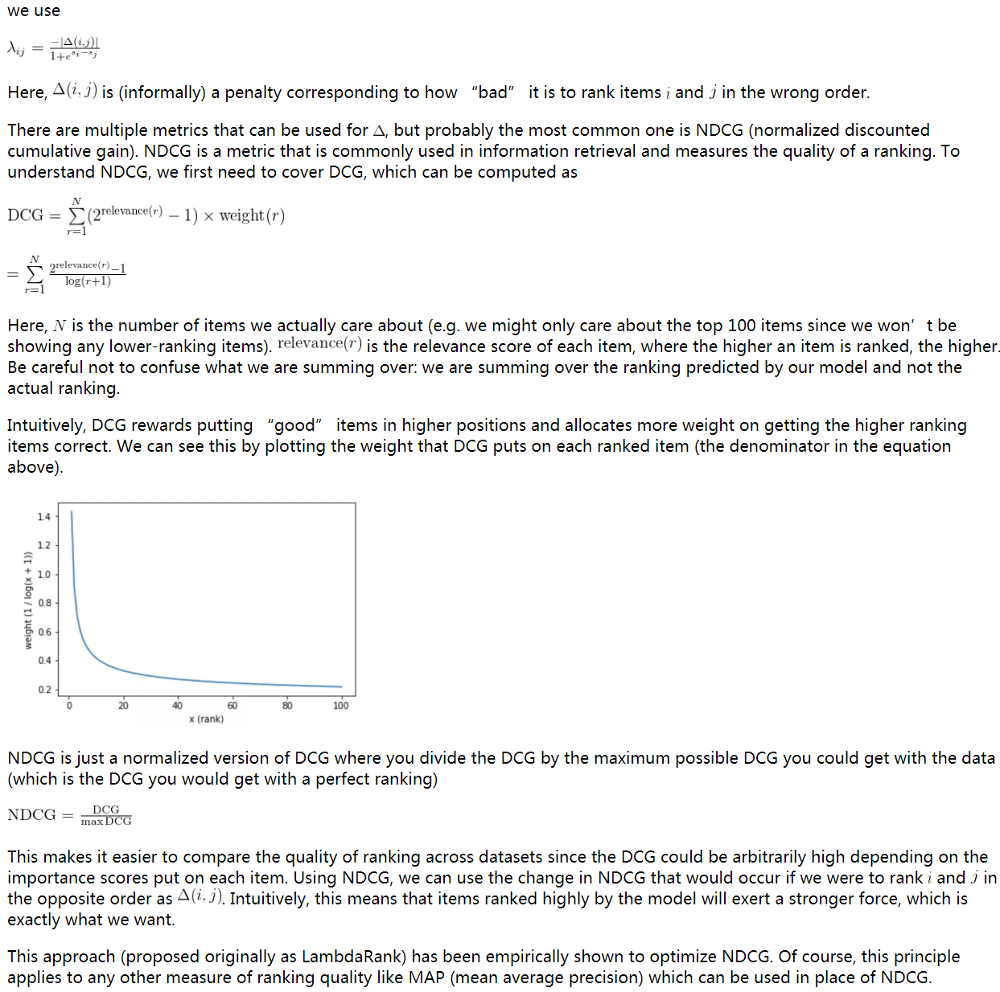

# rank_work编程

## click model

### spark

```linux
spark-shell \
--name jimmy_spark \
--master yarn \
--queue root.baseDepSarchQueue \
--deploy-mode client \
--executor-memory 10G \
--executor-cores 4 \
--num-executors 4 \
--conf spark.sql.shuffle.partitions=2001 \
--conf spark.network.timeout=800 \
--conf spark.scheduler.listenerbus.eventqueue.size=100000
```


```scala
import org.apache.spark.sql.expressions.{Window, WindowSpec}
import org.apache.spark.sql.{Column, SparkSession, Row}
import scala.reflect.runtime.universe._
val date_start = "2019-09-03"
val date_end = "2019-09-03"
val edition = "9156"
val datatable = "temp.jomei_search_cm_9156_click"
val lvt1 = "2019-09-03 00:00:00.000"
val lvt2 = "2019-09-03 23:59:59.999"
val sql_sessions_read= s"select q, u, r, d, c, s, cnt, choric_singer, songname from "+s"$datatable"+s"_sessions where cdt = '$date_end'"
val df_sessions_read = spark.sql(sql_sessions_read)

/*
q：查询词
u：歌曲id
r：位置，如果本地播放为0
d：与前一个点击的间距，如果本地播放为0
c：点击与否，如果本地播放为true
s：是否搜索，如果本地播放为0
cnt：总数
choric_singer：歌手名
songname：歌曲名
|q|        u|  r|  d|    c|  s|cnt|       choric_singer|songname|
|G.E.M.邓紫棋|102542260|125| 19|false|  1|  1|G.E.M.邓紫棋|Victoria|
|victoria|102542260|  0|  0| true|  0|  1|G.E.M.邓紫棋|Victoria|
*/

```

## lightgbm

###启动环境

```
docker run --rm -it --name=lightgbm_notebook -p 8888:8888 -v //c/Users/material:/material lightgbm:jupyter
#注意windows中只能固定在这个目录：//c/Users/
进去后再输入
jupyter notebook  --allow-root
就会在真实ip的8888处打开，注意使用8个1密码登录
```

#### docker安装

```linux
mkdir lightgbm-docker
cd lightgbm-docker
wget https://raw.githubusercontent.com/Microsoft/LightGBM/master/docker/dockerfile-python
docker build -t lightgbm -f dockerfile-python .
```

加一个`ca-certificates`，解决问题：

```linux
ERROR: cannot verify repo.continuum.io's certificate, issued by `/C=US/O=Let's Encrypt/CN=Let's Encrypt Authority X3':
  Unable to locally verify the issuer's authority.
```


```dockerfile
FROM ubuntu:16.04
#RUN ln -s /etc/ssl/certs /usr/lib/ssl/certs
#RUN apt-get install ca-certificates
RUN apt-get update && \
    apt-get install -y --no-install-recommends \
        cmake \
        build-essential \
        gcc \
        g++ \
        git \
        wget \
        ca-certificates && \

# python-package
    # miniconda
    # --no-check-certificate
    wget https://repo.continuum.io/miniconda/Miniconda3-latest-Linux-x86_64.sh && \
    /bin/bash Miniconda3-latest-Linux-x86_64.sh -f -b -p /opt/conda && \
    export PATH="/opt/conda/bin:$PATH" && \
    conda config --set always_yes yes --set changeps1 no && \
    # lightgbm
    conda install -q -y numpy scipy scikit-learn pandas && \
    git clone --recursive --branch stable --depth 1 https://github.com/Microsoft/LightGBM && \
    cd LightGBM/python-package && python setup.py install && \

# clean
    apt-get autoremove -y && apt-get clean && \
    conda clean -a -y && \
    rm -rf /usr/local/src/*

ENV PATH /opt/conda/bin:$PATH
```

```linux
docker run --name=lightgbm_original --rm -it lightgbm
```

#### 加装juypter notebook等其他安装包

```linux
apt-get update
pip install jupyter tqdm requests pandas lxml matplotlib seaborn scikit-learn numpy scipy --upgrade -i https://pypi.tuna.tsinghua.edu.cn/simple
apt-get install vim
```

'sha1:3b357329f7bf:6d549c26939ef272aaeabfa1d24ec94d6b3de92a'

```linux
#生成jupyter配置文件，这个会生成配置文件.jupyter/jupyter_notebook_config.py
jupyter notebook --generate-config

#使用ipython生成密码，输入8个1
In [1]: from notebook.auth import passwd
In [2]: passwd()
Enter password: 
Verify password: 
Out[2]: 'sha1:******'

vi ~/.jupyter/jupyter_notebook_config.py
#去配置文件.jupyter/jupyter_notebook_config.py中修改以下参数
c.NotebookApp.ip='*'                          #绑定所有地址
c.NotebookApp.password = u'刚才生成的密码'
c.NotebookApp.open_browser = False            #启动后是否在浏览器中自动打开
c.NotebookApp.port =8888                      #指定一个访问端口，默认8888，注意和映射的docker端口对应
```

```linux
docker commit lightgbm_original lightgbm:jupyter
```

```linux
docker run --rm -it --name=lightgbm_notebook -p 8888:8888 lightgbm:jupyter
docker run --rm -it --name=lightgbm_notebook -p 8888:8888 -v //c/Users/material:/material lightgbm:jupyter
#注意windows中只能固定在这个目录：//c/Users/
进去后再输入
jupyter notebook  --allow-root
就会在真实ip的8888处打开，注意使用8个1密码登录
```

这里一直出问题，暂时先不管了。。

```linux
docker run --rm -it --name=lightgbm_notebook -p 8888:8888 lightgbm:jupyter su
 root -c 'jupyter notebook  --allow-root'
```

### 基础python api

####lightgbm.Dataset

Dataset in LightGBM.

```python
train_data = lgb.Dataset(x_train, label=y_train, group=q_train)
eval_data = lgb.Dataset(x_eval, label=y_eval, group=q_eval)
```

- **data** (*string**,* *numpy array**,* *pandas DataFrame**,* *H2O DataTable's Frame**,* *scipy.sparse* *or* *list of numpy arrays*) – Data source of Dataset. If string, it represents the path to txt file.
- **label** (*list**,* *numpy 1-D array**,* *pandas Series / one-column DataFrame* *or* *None**,* *optional* *(**default=None**)*) – Label of the data. 注意标签应该是整数类型，较大的数字代表更高的相关性。 
- **group** (*list**,* *numpy 1-D array**,* *pandas Series* *or* *None**,* *optional* *(**default=None**)*) – Group/query size for Dataset. 

#### lightgbm.train

Perform the training with given parameters.

```python
gbm = lgb.train(params, train_data, valid_sets=[eval_data])
gbm.save_model(model_save_path) #保存模型
```

- **params** (*dict*) – Parameters for training.
- **train_set** ([*Dataset*](https://lightgbm.readthedocs.io/en/latest/pythonapi/lightgbm.Dataset.html#lightgbm.Dataset)) – Data to be trained on.
- **valid_sets** (*list of Datasets* *or* *None**,* *optional* *(**default=None**)*) – List of data to be evaluated on during training.  **J注意其实这里可以传入train_data只是验证一下而已。如果设置了early-stop则会根据validation是否改进，从而判断是否停止训练。The model will train until the validation score stops improving.** 
- fobj (callable or None, optional (default=None)) – Customized objective function. Should accept two parameters: preds, train_data, and return (grad, hess).
- Returns:**booster** – The trained Booster model. 

 #### Parameters

```python
'task': 'train',  # 执行的任务类型
'boosting_type': 'gbrt',  # 基学习器
'objective': 'lambdarank',  # 排序任务(目标函数)
'metric': 'ndcg',  # 度量的指标(评估函数)，即lambdarank中在lambda中定义的loss，表示为ndcg的变化，ndcg本身越大越好，所以下面公式中为负数。
'max_position': 10,  # @NDCG 位置优化， used only in lambdarank application，optimizes NDCG at this position，J表示的总共10个位置需要进行优化。。而下面验证时候只也是这个意思，不是第10个位置，因为ndcg是累加的！
'metric_freq': 1,  # 每隔多少次输出一次度量结果
'train_metric': True,  # 训练时就输出度量结果
'ndcg_at': [10], #NDCG and MAP evaluation positions, separated by ,前一个是训练数据的ndcg优化度量位置，这个是验证数据的ndcg度量位置
'max_bin': 255,  # 一个整数，表示最大的桶的数量。默认值为 255。lightgbm 会根据它来自动压缩内存。如max_bin=255 时，则lightgbm 将使用uint8 来表示特征的每一个值。max number of bins that feature values will be bucketed in
'num_iterations': 500,  # 迭代次数，number of boosting iterations，boosting迭代的次数，也可以说是残差树的数目
'learning_rate': 0.01,  # 学习率
'num_leaves': 31,  # 叶子数
# 'max_depth':6,
'tree_learner': 'serial',  # 用于并行学习，‘serial’： 单台机器的tree learner
'min_data_in_leaf': 30,  # 一个叶子节点上包含的最少样本数量
'verbose': 2  # 显示训练时的信息，< 0: Fatal, = 0: Error (Warning), = 1: Info, > 1: Debug
```
#### [NDCG](https://mlexplained.com/2019/05/27/learning-to-rank-explained-with-code/ )

J猜测应该在训练时候，对验证集中的~~第十个~~**前十个（因为NDCG会累加）**位置进行下列公式计算，并且求平均。**注意显示出来的是验证集上的metric，训练集上的metric的作用是用来帮助梯度进行迭代优化。**



#### lightgbm.booster.predict

注意predict中就不需要传入group了，因为反正排完分之后，再进行排序即可。

```python
gbm = lgb.Booster(model_file=model_input_path)  # 加载model
ypred = gbm.predict(x_test)
```

- **data** (*string**,* *numpy array**,* *pandas DataFrame**,* *H2O DataTable's Frame* *or* *scipy.sparse*) – Data source for prediction. If string, it represents the path to txt file. 
- Returns:**result** – Prediction result. 格式为numpy array

#### Problems

##### ~~load_svmlight_file~~

就是说lightgbm本身是使用index=0开始的特征，如果要使用从index=1开始的特征，那么训练和预测都必须使用从1开始的特征，正如提供的rank.train和rank.test一样。

而load_svmlight_file则是采用auto选择进行启发寻找。**J意思是不用担心，只要统一训练和预测时候的格式即可。**最简单的就是在送入模型训练前，看下数据中的第一列是否是自己定义的。

LightGBM use the zero-based libsvm file (when pass libsvm file to LightGBM), while `load_svmlight_file` is one-based. So if your model is train by the one-based format, you should use the one-based data for the prediction, vice versa. 

##### 部署java

待看

<https://github.com/microsoft/LightGBM/issues/2382> 

<https://github.com/microsoft/LightGBM/issues/1820> 

##### spark

待看，对于大文件如果不适用spark的话，就考虑按照下面所说的，先导出到本地，再执行。

**官方建议是使用mmlspark。好像直接装既可以！！**<https://mmlspark.blob.core.windows.net/website/index.html#install> 

<https://github.com/microsoft/LightGBM/issues/1183> ****

**版本有要求：MMLSpark requires Scala 2.11, Spark 2.3+** 待联系！！！！！！！！！！！！！！！！！！！！！！

#####weight可用来控制样本的权重

在dataset中配置，从而帮助loss时候计算。

##### 自定义object function

见train中的fobj，[参考代码](https://github.com/Microsoft/LightGBM/blob/3ad9cba0321a8ac2e5f625da6dcc6f7c1516a750/examples/python-guide/advanced_example.py#L140-L145)，就是所谓的自定义损失函数的方式，

##### test中的ndcg得自己去定义实现

[ndcg实现](https://github.com/microsoft/LightGBM/issues/453 )

##### unbalanced中计算损失值

可见论文From ranknet to lambdarank to lambdamart: An overview ，相关[issue](https://github.com/microsoft/LightGBM/issues/332 )

###数据来源

[Yahoo](https://webscope.sandbox.yahoo.com/catalog.php?datatype=c&guccounter=1 )

Train Val Test Train Val Test

\# queries 19,944 2,994 6,983 1,266 1,266 3,798

\# urls 473,134 71,083 165,660 34,815 34,881 103,174

\# features 519 596

Number of features in the union of the two sets: 700; in the intersection: 415. **Each feature has been normalized to be in the [0,1] range.**

Each url is given a relevance judgment with respect to the query. **There are 5 levels of relevance from 0 (least relevant) to 4 (most relevant).**

具体的数据特征可见yahoo的[数据集论文](http://proceedings.mlr.press/v14/chapelle11a/chapelle11a.pdf )。**简而言之，每一行代表一个样本（url），然后第一个位置是相关度（0-4），后面就是特征编号及其分值，不一定每个样本都有全部的特征，理解为缺失值看做0值。然后用另一个[query文件](https://github.com/Microsoft/LightGBM/blob/master/docs/Parameters.rst#query-data )记录连续多少个样本是针对同一个query而言的样本。**

具体的是libsvm格式：

libsvm 使用的训练数据和检验数据文件格式如下：

```
[label][index1]:[value1][index2]:[value2] …

[label][index1]:[value1][index2]:[value2] …
```
label 目标值，就是说 class（属于哪一类），就是你要分类的种类，通常是一些整数。

index 是有顺序的索引，通常是连续的整数。就是指特征编号，**必须按照升序排列**

value 就是特征值，用来 train 的数据，通常是一堆实数组成。

### 载入数据

#### sklearn.datasets.load_svmlight_file

将libsvm格式的数据载入，返回一个scipy的sparse matrix（特征）和array（标签）。

Load datasets in the svmlight / libsvm format into sparse CSR matrix 

**X** : scipy.sparse matrix of shape (n_samples, n_features)

**y** : ndarray of shape (n_samples,), or, in the multilabel a list oftuples of length n_samples. 

#### numpy.loadtxt

读取文件，返回array，每行为array中1个元素。


####输出信息

因为不限制输出的范围，对test的输出可能存在负数。将其对同一个query内进行排序即可。[issue](For the ranking, we didn't limit its output range. And you can sort the prediction score (in per query) to get the rank result. )

## 项目计划

针对在工业界的经验，**先根据业务场景做提取统计类特征（连续特征）使用gbdt模型快速拿到收益**，然后考虑加入海量离散类特征（比如个性化因素等），使用LR/FM模型进一步提升效果。至于原有的统计类特征可以通过gbdt叶子节点转换成离散特征一并加入到LR/FM中。**这两步估计够迭代优化半年时间了**。

<https://www.zhihu.com/question/35821566/answer/357786181> 

**其实可以先考虑直接这么做，不用管position biased，看下效果，跑通整个流程！**

**然后之后再考虑去除position biased。**

## Reference

- [docker容器下配置jupyter notebook](https://blog.csdn.net/leng_yan/article/details/87208363 )
- [用docker启动一个jupyter notebook](https://www.jianshu.com/p/21d5afc1c079 )
- [mount from docker](https://superuser.com/a/907953)