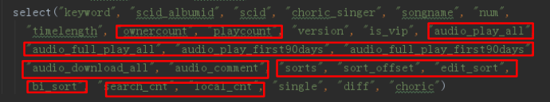

# rank_work编程

[TOC]

## 总体思想

目前比之前的rank.md更进一步的是已经确定了算法lambdamart和框架lightgbm。

按照elasticsearch的脚本进行整理训练。[相关说明](#case3) 

两个方案：点击模型和click data（理解为点击数作为相关度参考/还是采用实际点击作为量化，目前考虑后者也可以） 。[相关说明](#click data(就是将点击数据量作为相关度，也不考虑ctr，J我觉得可行，至少保底了))

还差一个特征工程的方法。特征包括：文本特征（如何考察全包含，歌手名，歌曲名），音频质量得分（可以滤除4秒的音乐），收藏数，点赞数，发布时间，评论数，播放数，付费与否（决定于推广与否）等等。[相关说明](#还是考虑query与目前召回中的进行对比，从而得到分词结果。必须得分词) J还是考虑调用es那边的bm25的相关性分数吧，自己写太累了。。。

需要滤除拦截的。

之后再考虑ubm的改进，比如browsing对吸引力的影响。

之后再考虑ctr使用平滑作为relevance。[相关说明](#ctr（就是根据ctr计算，也同样利用到了归一化）)

之后再考虑使用淘宝的方法进行数据集生成。[相关说明](#淘宝pairwise策略（可以作为备选使用，具体见rank.md）)

~~之后在考虑 inverse propensity weighting 的问题。<https://github.com/QingyaoAi/Unbiased-Learning-to-Rank-with-Unbiased-Propensity-Estimation>~~ 

~~之后再考虑合并unbiased rank。~~

后两项IPW基本看懂了，看论文笔记中的备注[Unbiased Learning to Rank with Unbiased Propensity Estimation](https://arxiv.org/pdf/1804.05938.pdf )和[Unbiased LambdaMART: An Unbiased Pairwise Learning-to-Rank Algorithm](https://arxiv.org/pdf/1809.05818v2.pdf)。**即IPW就是修改loss函数（除以位置的值），然后利用点击就是相关进行ltr计算。非直接得到relevance值。**

## click model

### spark

```linux
spark-shell \
--name jimmy_spark \
--master yarn \
--queue root.baseDepSarchQueue \
--deploy-mode client \
--executor-memory 10G \
--executor-cores 4 \
--num-executors 4 \
--conf spark.sql.shuffle.partitions=2001 \
--conf spark.network.timeout=800 \
--conf spark.scheduler.listenerbus.eventqueue.size=100000
```

### click版本spark

```scala
import org.apache.spark.sql.expressions.{Window, WindowSpec}
import org.apache.spark.sql.{Column, SparkSession, Row}
import scala.reflect.runtime.universe._
//val date_day = "2019-11-10"
val date_start = "2019-11-21"
val date_end = "2019-11-21"
val edition = "9156"
val datatable = "temp.jomei_search_cm_9156_click"
val thisdatatable = "temp.jomei_search_clickmodel_9156_click"
val sql_clickdata_read= s"select keyword, scid_albumid, choric_singer, songname, num, position from "+s"$datatable"+s"_click_data where cdt between "+s"'$date_start' and '$date_end'"
val df_clickdata_read = spark.sql(sql_clickdata_read)
df_clickdata_read.persist()
df_clickdata_read.filter($"keyword" === "倒带").sort($"num".desc).show()                
df_clickdata_read.count()
res4: Long = 8033243     

df_clickdata_read.select("keyword").distinct().count()
res6: Long = 2511506

val window_all = Window.partitionBy("keyword")
val df_clickdata_read_total = (df_clickdata_read.
     withColumn("total", sum($"num").over(window_all)))
df_clickdata_read_total.sort($"total".desc, $"keyword".desc, $"num".desc).show() 

df_clickdata_read_total.select("total").distinct().sort($"total".desc).show()

df_clickdata_read_total.select("total").distinct().filter($"total" > 10000).count()
res16: Long = 1260
df_clickdata_read_total.filter($"total" > 10000).count()
res21: Long = 197399

df_clickdata_read_total.select("total").distinct().filter($"total" > 5000).count()
res17: Long = 2412
df_clickdata_read_total.filter($"total" > 5000).count()
res20: Long = 334118                                                            

df_clickdata_read_total.select("total").distinct().filter($"total" > 1000).count()
res18: Long = 5167 
scala> df_clickdata_read_total.filter($"total" > 1000).count()
res19: Long = 777892    
//J感觉1000阈值够了，因为mq2008也只有800个query。而yahoo的url也只有473134个训练。lightgbm中抽样出训练201个query，总共3000个url。测试50个query。而yahoo中train与test比例在3比1。

df_clickdata_read_total.filter($"total" <= 1000).sort($"total".desc, $"keyword".desc, $"num".desc).show() 


```

#### 原始的点击模型测试效果

```scala
import org.apache.spark.sql.expressions.{Window, WindowSpec}
import org.apache.spark.sql.{Column, SparkSession, Row}
import scala.reflect.runtime.universe._
//val date_day = "2019-11-10"
val date_start = "2019-11-21"
val date_end = "2019-11-21"
val edition = "9156"
val datatable = "temp.jomei_search_cm_9156_click"
val thisdatatable = "temp.jomei_search_clickmodel_9156_click"
//有效播放
val sql_clickmodel_read= s"select q, u, choric_singer, songname, numerator, denominator, local, click, mean_nums, mean_alpha, mean_nums_3, mean_alpha_2, mean_alpha_3, alpha, alpha_t, alpha_c, alpha_search, alpha_direct, alpha_v from "+s"$thisdatatable"+s"_result_new_combine_v_2 where cdt between "+s"'$date_start' and '$date_end'"
val df_clickmodel_read = spark.sql(sql_clickmodel_read)
df_clickmodel_read.persist()
df_clickmodel_read.filter($"q" === "倒带").sort($"alpha".desc).show()   
//点击
val sql_clickmodelclick_read= s"select q, u, choric_singer, songname, numerator, denominator, click, mean_nums, mean_alpha, mean_nums_2, mean_alpha_2, alpha, alpha_t, alpha_search, alpha_v, alpha_r, play_count, play_count_30, play_count_60, play_count_all from "+s"$thisdatatable"+s"_result_new_combine_v_2_click where cdt between "+s"'$date_start' and '$date_end'"
val df_clickmodelclick_read = spark.sql(sql_clickmodelclick_read)
df_clickmodelclick_read.persist()
df_clickmodelclick_read.filter($"q" === "倒带").sort($"alpha".desc).show()   


```


#### 确定数据集范围和比例

**见上述scala代码，尝试将阈值设定在1000搜索量以上的比例。进行5比1划分训练与测试集**

最早的计算，关键字下的1000操作量，有777892配对

```scala
import org.apache.spark.sql.expressions.{Window, WindowSpec}
import org.apache.spark.sql.{Column, SparkSession, Row}
import scala.reflect.runtime.universe._
val date_start = "2019-11-27"
val date_end = "2019-11-27"
val edition = "9156"
val datatable = "temp.jomei_search_cm_9156_click"
val thisdatatable = "temp.jomei_search_clickmodel_9156_click"
val sql_feature_read = """select keyword, scid_albumid, scid, choric_singer, songname, num, position, albumid, timelength, publish_time, is_choric, is_single, ownercount, playcount, version, is_vip, audio_play_all, audio_full_play_all, audio_play_first90days, audio_full_play_first90days, audio_download_all, audio_comment, sorts, sort_offset, edit_sort, bi_sort from """+s"""$datatable"""+s"""_features_data where cdt='$date_end'"""
val df_feature_read = spark.sql(sql_feature_read)
df_feature_read.persist()
df_feature_read.filter($"keyword" === "张杰").sort($"num".desc).show()

//Array((keyword,StringType), (scid_albumid,StringType), (scid,StringType), (choric_singer,StringType), (songname,StringType), (num,IntegerType), (position,IntegerType), (albumid,StringType), (timelength,LongType), (publish_time,StringType), (is_choric,StringType), (is_single,StringType), (ownercount,LongType), (playcount,LongType), (version,StringType), (is_vip,IntegerType), (audio_play_all,LongType), (audio_full_play_all,LongType), (audio_play_first90days,LongType), (audio_full_play_first90days,LongType), (audio_download_all,LongType), (audio_comment,LongType), (sorts,IntegerType), (sort_offset,IntegerType), (edit_sort,IntegerType), (bi_sort,IntegerType))
val window_all = Window.partitionBy("keyword")
val df_feature_read_total = df_feature_read.withColumn("total", sum($"num").over(window_all))

df_feature_read_total.select("total").distinct().filter($"total" > 1000).count()
res18: Long = 5095 
df_feature_read_total.filter($"total" > 1000).count()
res19: Long = 687599  

df_feature_read.select("is_choric").distinct.show()
```

##### 异常值null处理（其他都是最小值，除了diff用365天和50年，因为用平均会发现很大）

```scala
//用平均会发现，3000天，太大
df_feature_filtered.groupBy("scid_albumid").agg(max("diff") as "diff").as("d1").agg(avg($"d1.diff")).show()

//滤除掉50年内仍然很大，2900天
df_feature_filtered_pre.filter($"diff" <= 18250).groupBy("scid_albumid").agg(max("diff") as "diff").as("d1").agg(avg($"d1.diff")).show()
```

针对此情况，进行分类讨论，**分别计算sing，song，singersong的平均diff，剔除大diff的情况下。对于大diff的情况，进行计算singersong和singer，若无则统计到50年；对于null的情况，进行计算singersong和song，若无则统计到1年。若使用singerid会很麻烦，先这么干吧**

```scala
    val window_singersong = Window.partitionBy("choric_singer", "song")
    val window_song = Window.partitionBy("song")
    val window_singer = Window.partitionBy("choric_singer")
    val df_feature_filtered = df_feature_filtered_pre.withColumn("song", regexp_replace($"songname", "[ ]*\\([^\\(\\)]*\\)$", "")).
      withColumn("diff_limited",
        when($"diff" <= 18250,
          $"diff").
          otherwise(null)).
      withColumn("avg_diff_singersong", avg("diff_limited").over(window_singersong)).
      withColumn("avg_diff_song", avg("diff_limited").over(window_song)).
      withColumn("avg_diff_singer", avg("diff_limited").over(window_singer)).
      withColumn("final_diff",
        when($"diff".isNotNull,
          when($"diff" <= 18250, $"diff").
            otherwise(
              when($"avg_diff_singersong".isNotNull, $"avg_diff_singersong").
                otherwise(
                  when($"avg_diff_singer".isNotNull, $"avg_diff_singer").
                    otherwise(18250)))).
          otherwise(
            when($"avg_diff_singersong".isNotNull, $"avg_diff_singersong").
              otherwise(
                when($"avg_diff_song".isNotNull, $"avg_diff_song").
                  otherwise(365))))

```


```scala
import org.apache.spark.sql.types.{IntegerType, LongType}
import org.apache.spark.sql.functions.datediff

val df_test = df_feature_read.filter($"scid_albumid" =!= "" and $"scid_albumid".isNotNull and $"scid".isNotNull and $"scid" =!= "").filter($"keyword" =!= "" and $"keyword".isNotNull).filter($"choric_singer" =!= "" and $"choric_singer".isNotNull).filter($"songname" =!= "" and $"songname".isNotNull).withColumn("length", $"timelength".cast(LongType)).withColumn("single", convert_label($"is_single")).withColumn("diff", datediff(current_date(), $"publish_time")).withColumn("choric", when($"songname".contains("+"), 0).otherwise(1))

    val null_map = Map("ownercount" -> 0, "playcount" -> 0, "audio_play_all" -> 0,
      "audio_full_play_all" -> 0, "audio_play_first90days" -> 0, "audio_full_play_first90days" -> 0,
      "audio_download_all" -> 0, "audio_comment" -> 0, "sorts" -> 9999999,
      "sort_offset" -> 0, "edit_sort" -> 9999999, "bi_sort" -> 0,
      "diff" -> 30)

对于日期缺失的作为30天处理

```

- 加入组曲，标志

```scala
.withColumn("choric", when($"songname".contains("+"), 0).otherwise(1))
```


- 修正类型值（**不需要了timelength后来自动变成longtype，此外single变成了数值**）

```scala
withColumn("length", $"timelength".cast(Longtype)).withColumn("single", $"is_single".cast(Integertype))
//默认将null值设置成0.6中间值

```

- 修正日期

```scala
import org.apache.spark.sql.functions.datediff
.withColumn("diff", datediff(current_date(), $"publish_time"))
//默认将null值设置成平均值
//若是常数，则使用lit("2019-10-28")
```


- 滤除scid是null的情况，在之前的程序Clickdata中滤除

```scala
      filter($"scid_albumid" =!= "" and $"scid_albumid".isNotNull and $"scid".isNotNull and $"scid" =!= "").
      filter($"keyword" =!= "" and $"keyword".isNotNull).
```

- 歌手数据同时存在null的情况，四个同时为null，填补其空缺。

```scala
df_feature_read.filter($"scid".isNotNull).filter($"sorts".isNull).filter($"sort_offset".isNotNull or $"edit_sort".isNotNull or $"bi_sort".isNotNull).show()

df_feature_read.filter($"scid".isNotNull).filter($"sort_offset".isNull).filter($"sorts".isNotNull or $"edit_sort".isNotNull or $"bi_sort".isNotNull).show()

df_feature_read.filter($"scid".isNotNull).filter($"edit_sort".isNull).filter($"sorts".isNotNull or $"sort_offset".isNotNull or $"bi_sort".isNotNull).show()

df_feature_read.filter($"scid".isNotNull).filter($"bi_sort".isNull).filter($"sorts".isNotNull or $"sort_offset".isNotNull or $"edit_sort".isNotNull).show()

```

- 其他未发现null值，但仍然要处理，全部设置成平均值


#####特征处理方法（相关内容放到了onenote中的sparse feature）

- category feature容易变成高维稀疏数据，不适合gbdt继续工作。

- 高维稀疏特征定义：如果把我们的每一个数据点，想象成一个vector（向量），记作y，对应的feature则可以用另外一个vector来表示，记作x。那么关于稀疏特性的feature（sparse feature），其实 曾博同学已经说得一针见血了....就是x这个向量里面有很多index都是0....而非零的index远小于x的维度（x向量的长度）。

- 不适合的原因：gbdt不适合高维稀疏特征
  1、高维特征会导致gbdt运行过于耗时，每一次分割时需要比较大量的特征，特征太多，模型训练很耗费时间。
  2、从高维稀疏特征中难以进行有效的特征空间划分，且对噪音会很敏感。

  想想一个例子，有个年龄特征0~100，如果对这样特征进行one-hot编码后变为稀疏特征，第i维表示是否为i岁。

  如果将这种特征直接输入gbdt然后输出是否是青年人。很显然gbdt将变成枚举各个年龄是否为青年人。这类特征是非常容易过拟合的，如果当训练样本中存在一些噪声样本如80岁的青年人，如果在80岁没有足够的样本，这个错误将被gbdt学到。而如果直接采用连续特征进行分类，gbdt会有更好的泛化性能。

  3、高维稀疏特征大部分特征为0，假设训练集各个样本70%的特征为0，30%的特征非0。则某个维度特征在所有样本上也期望具有近似的取0的比例。当作分裂时，特征选择非常低效，特征只会在少部分特征取值非0的样本上得到有效信息。而稠密向量可以得到样本集的整体特征信息。
  也就是说：树的分割往往只考虑了少部分特征，大部分的特征都用不到，所有的高维稀疏的特征会造成大量的特征浪费。

  可能无法在这个类别特征上进行切分。使用one-hot coding的话，意味着在每一个决策节点上只能用 one-vs-rest (例如是不是狗，是不是猫，等等) 的切分方式。当特征纬度高时，每个类别上的数据都会比较少，这时候产生的切分不平衡，切分增益（split gain）也会很小（比较直观的理解是，不平衡的切分和不切分几乎没有区别）。 

  会产生样本切分不平衡问题，切分增益会非常小。如，国籍切分后，会产生是否中国，是否美国等一系列特征，这一系列特征上只有少量样本为 1，大量样本为 0。这种划分的增益非常小：较小的那个拆分样本集，它占总样本的比例太小。无论增益多大，乘以该比例之后几乎可以忽略；较大的那个拆分样本集，它几乎就是原始的样本集，增益几乎为零；

  4、会影响决策树的学习。因为就算可以在这个类别特征进行切分，也会把数据切分到很多零散的小空间上，如图1左所示。而决策树学习时利用的是统计信息，在这些数据量小的空间上，统计信息不准确，学习会变差。但如果使用图1右边的切分方法，数据会被切分到两个比较大的空间，进一步的学习也会更好。 

  影响决策树学习：决策树依赖的是数据的统计信息，而独热码编码会把数据切分到零散的小空间上。在这些零散的小空间上统计信息不准确的，学习效果变差。本质是因为独热码编码之后的特征的表达能力较差的，特征的预测能力被人为的拆分成多份，每一份与其他特征竞争最优划分点都失败，最终该特征得到的重要性会比实际值低。

- [category feature的应对方法](https://zhuanlan.zhihu.com/p/40231966 )

    - label encoding

    - - 特征存在内在顺序 (ordinal feature)，is_single采用此方法，默认无法确定的为中间值，1=原唱>4=原唱其他版本 >3,0,6未确定> 2=翻唱 >5=翻唱其他版本 ，变成5，4，3，2，1=>1,0.8,0.6,0.4,0.2

    - one hot encoding

    - - 特征无内在顺序，category数量 < 4，所以is_vip, is_choric用二元特征。

    - target encoding (mean encoding, likelihood encoding, impact encoding)

    - - 特征无内在顺序，category数量 > 4，由于spark没有实现该方法，所以version还是采用[ohe](https://blog.csdn.net/wangpei1949/article/details/53140372 )

- 规范化：分位数标准化，即inverse cdf。

  - 考虑要么将昨天的加载进来，fit之后再transform进行增量
  - 要么索性就对今天的进行重新计算。比如下面代码中的df_test2

- **inputCol:** 需要进行离散化的属性名称

- **inputCols:** 需要进行离散化的一组属性名称，一次处理多个属性的便捷方式

- **outputCol:** 离散化后的属性名称 (默认值: quantileDiscretizer_######_output)

- **outputCols:** 离散化后的属性名称，一次处理多个属性的便捷方式，次序和上面的**inputCols**一致

- **numBuckets:** 需要分成多少个类别(bucket)，分完箱之后每个类别的编号取值范围为0～numBuckets-1 (>=2的整数，默认值: 2)

- **numBucketsArray:** 针对每一个属性需要分成多少个类别(bucket)的值组成的数组，一次处理多个属性的便捷方式，次序和上面的**inputCols**一致

- **handleInvalid:** 表示在transform期间如何处理Null值。 (默认值: error)
  可选项1. skip-放弃有Null值的row；
  可选项2. error-抛出异常`org.apache.spark.SparkException: Failed to execute user defined function($anonfun$apply$1: (double) => double)`；
  可选项3. keep-将Null值都放入一个额外的类别(bucket)，该额外类别编号为**numBuckets**定义的数字。

- **relativeError:** 分位数近似算法的误差精度 ([0,1]之间的实数，0表示没有误差，默认值0.001）

```scala
import org.apache.spark.ml.feature.QuantileDiscretizer
import org.apache.spark.sql.expressions.{Window, WindowSpec}
import org.apache.spark.sql.{Column, SparkSession, Row}
import scala.reflect.runtime.universe._
val date_start = "2019-11-26"
val date_end = "2019-11-27"
val edition = "9156"
val datatable = "temp.jomei_search_cm_9156_click"
val thisdatatable = "temp.jomei_search_clickmodel_9156_click"

val sql_feature_read = """select keyword, scid_albumid, scid, choric_singer, songname, num, position, albumid, timelength, publish_time, is_choric, is_single, ownercount, playcount, version, is_vip, audio_play_all, audio_full_play_all, audio_play_first90days, audio_full_play_first90days, audio_download_all, audio_comment, sorts, sort_offset, edit_sort, bi_sort from """+s"""$datatable"""+s"""_features_data where cdt='$date_end'"""
val df_feature_read = spark.sql(sql_feature_read)
df_feature_read.persist()
val df_test = df_feature_read.filter($"ownercount".isNotNull).withColumn("oc", $"ownercount".cast("double"))
val discretizer = (new QuantileDiscretizer()
  .setInputCol("oc")
  .setOutputCol("result")
  .setNumBuckets(101))
val result = discretizer.fit(df_test).transform(df_test)
result.filter($"keyword" === "张杰").sort($"num".desc).show()
result.filter($"keyword" === "一剪梅").sort($"num".desc).select("keyword", "choric_singer", "songname", "num", "position", "ownercount","result").show()

val sql_feature_read2 = """select keyword, scid_albumid, scid, choric_singer, songname, num, position, albumid, timelength, publish_time, is_choric, is_single, ownercount, playcount, version, is_vip, audio_play_all, audio_full_play_all, audio_play_first90days, audio_full_play_first90days, audio_download_all, audio_comment, sorts, sort_offset, edit_sort, bi_sort from """+s"""$datatable"""+s"""_features_data where cdt='$date_start'"""
val df_feature_read2 = spark.sql(sql_feature_read2)
df_feature_read2.persist()
val df_test2 = df_feature_read2.filter($"ownercount".isNotNull).withColumn("oc", $"ownercount".cast("double"))
val result2 = discretizer.fit(df_test).transform(df_test2)
result2.filter($"keyword" === "一剪梅").sort($"num".desc).select("keyword", "choric_singer", "songname", "num", "position", "ownercount","result").show()
```

```scala
//is_single采用此方法，默认无法确定的为中间值，1=原唱>4=原唱其他版本 >3,0,6未确定> 2=翻唱 >5=翻唱其他版本 ，变成5，4，3，2，1=>1,0.8,0.6,0.4,0.2
val convert_label = udf{(single: String) =>
  val t = (single) match {
    case a if a =="1" => 1.0
    case a if a =="4" => 0.8
    case a if List("3", "0", "6").contains(a) => 0.6
    case a if a =="2" => 0.4
    case a if a =="5" => 0.2
    case _ => 0.6
  }
  t
}
df_feature_read.withColumn("single", convert_label($"is_single"))
```
######特征转换代码，总体思路：用分位数转换，然后使用minmax进行线性平移，变换到[0-1]

```scala
    //7)related function and val

    val null_map = Map("ownercount" -> 0, "playcount" -> 0, "audio_play_all" -> 0,
      "audio_full_play_all" -> 0, "audio_play_first90days" -> 0, "audio_full_play_first90days" -> 0,
      "audio_download_all" -> 0, "audio_comment" -> 0, "sorts" -> 9999999, "sort_offset" -> 0,
      "edit_sort" -> 9999999, "bi_sort" -> 0, "search_cnt" -> 0, "local_cnt" -> 0, "version" -> "0")

    val changes_column = List("timelength", "final_ownercount", "final_playcount",
      "final_audio_play_all", "final_audio_full_play_all", "final_audio_play_first90days",
      "final_audio_full_play_first90days", "final_audio_download_all", "final_audio_comment",
      "sorts", "sort_offset", "edit_sort", "bi_sort", "final_search_cnt", "final_local_cnt",
      "final_diff")
    val maintain_column = List("keyword", "scid_albumid", "scid", "choric_singer", "songname", "version", "single")
    val maintain2_column = List("keyword", "scid_albumid", "scid", "choric_singer", "songname", "num", "version", "is_vip", "single", "choric")

    def func_combine(name: String) = {
      if (maintain_column.contains(name)){
        col(name)
      }
      else{
        col(name).cast(DoubleType)
      }
    }
    val result_column = maintain2_column.toArray ++ changes_column.toArray.map(c => s"${c}_disc") ++ Array("featuresArr")

    val vecToArray = udf( (xs: linalg.Vector) => xs.toArray )
    // sizeof `elements` should be equal to the number of entries in column `features`
    val elements = changes_column.toArray
    val sqlExpr_basic = maintain2_column.toArray.map{ case (name) => col(name)}
    // Create a SQL-like expression using the array
    val sqlExpr = elements.zipWithIndex.map{ case (alias, idx) => bround(col("featuresArr").getItem(idx), 2).as(alias) }

    val convert_version = udf{(version: String) =>
      val version_new = version match {
        case a if List("-2", "-1", "10", "14", "15").contains(a) => 0.0 //cause 10, 14, 15 not exists in traing test
        case a if List("-4", "-3", "0", "1", "2", "3", "4", "5", "6", "7", "8", "9", "11", "12", "13").contains(a) => Math.abs(a.toDouble)
        case a if a == "16" => 10.0 //just fill the 10
        case _ => 0.0
      }
      version_new
    }

    //is_single采用此方法，默认无法确定的为中间值，1=原唱>4=原唱其他版本 >3,0,6未确定> 2=翻唱 >5=翻唱其他版本 ，变成5，4，3，2，1=>1,0.8,0.6,0.4,0.2
    val convert_label = udf{(single: String) =>
      val label_int = (single) match {
        case a if a =="1" => 1.0
        case a if a =="4" => 0.8
        case a if List("3", "0", "6").contains(a) => 0.6
        case a if a =="2" => 0.4
        case a if a =="5" => 0.2
        case _ => 0.6
      }
      label_int
    }

    val change_version = udf{(version: Double, item: Double) =>
      if (version == item) 1.0 else 0.0
    }

    val targetColumns = Map("undo" -> 0.0, "danqu" -> 1.0, "xianchang" -> 2.0, "lingsheng" -> 3.0,
      "banzou" -> 4.0, "dj" -> 5.0, "quyi" -> 6.0, "xiju" -> 7.0, "hunyin" -> 8.0, "chunyinyue" -> 9.0,
      "pianduan" -> 10.0, "yousheng" -> 11.0, "guagnchangwu" -> 12.0, "xiaoyin" -> 13.0
    )

    val final_column = (List("keyword", "scid_albumid", "scid", "choric_singer",
  "songname", "num", "is_vip", "single", "choric").toArray ++
  changes_column.toArray[String] ++
  targetColumns.keys.toArray[String]).map{case (name) => col(name)}

    //8)feature transformation
    val sql_feature_data_read= s"select keyword, scid_albumid, scid, choric_singer, songname, num, position, albumid, timelength, publish_time, is_choric, is_single, ownercount, playcount, version, is_vip, audio_play_all, audio_full_play_all, audio_play_first90days, audio_full_play_first90days, audio_download_all, audio_comment, sorts, sort_offset, edit_sort, bi_sort, search_cnt, local_cnt from "+s"$datatable"+s"_features_datas where cdt = '$date_end'"
    val df_clickdata_features_read = spark.sql(sql_feature_data_read)


    //format transformation
    //single, diff, choric
    val df_feature_formated = df_clickdata_features_read.
      withColumn("single", convert_label($"is_single")).
//      withColumn("diff", datediff(current_date(), $"publish_time")).
      withColumn("diff", datediff(lit(s"$date_after"), $"publish_time")).
      withColumn("choric", when($"songname".contains("+"), 0).otherwise(1)).
      select("keyword", "scid_albumid", "scid", "choric_singer", "songname", "num",
        "timelength", "ownercount", "playcount", "version", "is_vip", "audio_play_all",
        "audio_full_play_all", "audio_play_first90days", "audio_full_play_first90days",
        "audio_download_all", "audio_comment", "sorts", "sort_offset", "edit_sort",
        "bi_sort", "search_cnt", "local_cnt", "single", "diff", "choric")

    //filter unnormal point

    val df_feature_filtered_pre = df_feature_formated.
      filter($"timelength".isNotNull and $"timelength" > 0).
      filter($"ownercount" >= 0).
      filter($"playcount" >= 0).
      filter($"audio_play_all" >= 0).
      filter($"audio_full_play_all" >= 0).
      filter($"audio_play_first90days" >= 0).
      filter($"audio_full_play_first90days" >= 0).
      filter($"audio_download_all" >= 0).
      filter($"audio_comment" >= 0).
      filter($"sorts" >=1 and $"sorts" <= 9999999).
      filter($"edit_sort" >=1 and $"edit_sort" <= 9999999).
      filter($"sorts" >=1 and $"sorts" <= 9999999).
      filter($"bi_sort" >= 0).
      filter($"diff" >= 0 or $"diff".isNull).
      na.fill(null_map)

    //diff
    //对于大diff的情况，进行计算singersong和singer，若无则统计到50年；
    // 对于null的情况，进行计算singersong和song，若无则统计到1年。
    val window_singersong = Window.partitionBy("choric_singer", "song")
    val window_song = Window.partitionBy("song")
    val window_singer = Window.partitionBy("choric_singer")
    val df_feature_filtered = df_feature_filtered_pre.withColumn("song", regexp_replace($"songname", "[ ]*\\([^\\(\\)]*\\)$", "")).
      withColumn("diff_limited",
        when($"diff" <= s"$diff_max",
          $"diff").
          otherwise(null)).
      withColumn("avg_diff_singersong", avg("diff_limited").over(window_singersong)).
      withColumn("avg_diff_song", avg("diff_limited").over(window_song)).
      withColumn("avg_diff_singer", avg("diff_limited").over(window_singer)).
      withColumn("final_diff",
        when($"diff".isNotNull,
          when($"diff" <= s"$diff_max", $"diff").
            otherwise(
              when($"avg_diff_singersong".isNotNull, $"avg_diff_singersong").
                otherwise(
                  when($"avg_diff_singer".isNotNull, $"avg_diff_singer").
                    otherwise(s"$diff_max")))).
          otherwise(
            when($"avg_diff_singersong".isNotNull, $"avg_diff_singersong").
              otherwise(
                when($"avg_diff_song".isNotNull, $"avg_diff_song").
                  otherwise(s"$diff_miss")))).
      withColumn("final_ownercount",
        when($"final_diff" === 0, 0).
          otherwise($"ownercount")).
      withColumn("final_playcount",
        when($"final_diff" === 0, 0).
          otherwise($"playcount")).
      withColumn("final_audio_play_all",
        when($"final_diff" === 0, 0).
          otherwise($"audio_play_all")).
      withColumn("final_audio_full_play_all",
        when($"final_diff" === 0, 0).
          otherwise($"audio_full_play_all")).
      withColumn("final_audio_play_first90days",
        when($"final_diff" === 0, 0).
          otherwise($"audio_play_first90days")).
      withColumn("final_audio_full_play_first90days",
        when($"final_diff" === 0, 0).
          otherwise($"audio_full_play_first90days")).
      withColumn("final_audio_download_all",
        when($"final_diff" === 0, 0).
          otherwise($"audio_download_all")).
      withColumn("final_audio_comment",
        when($"final_diff" === 0, 0).
          otherwise($"audio_comment")).
      withColumn("final_search_cnt",
        when($"final_diff" === 0, 0).
          otherwise($"search_cnt")).
      withColumn("final_local_cnt",
        when($"final_diff" === 0, 0).
          otherwise($"local_cnt")).
      select("keyword", "scid_albumid", "scid", "choric_singer", "songname", "num",
        "timelength", "final_ownercount", "final_playcount", "version", "is_vip",
        "final_audio_play_all", "final_audio_full_play_all", "final_audio_play_first90days",
        "final_audio_full_play_first90days", "final_audio_download_all", "final_audio_comment",
        "sorts", "sort_offset", "edit_sort", "bi_sort", "final_search_cnt", "final_local_cnt",
        "single", "final_diff", "choric")

    //filter by count by threshold_keyword and cast some column to Double
    val window_all = Window.partitionBy("keyword")
    val df_total_feature = df_feature_filtered.
      withColumn("total", sum($"num").over(window_all)).
      filter($"total" > s"$threshold_keyword").
      select(df_feature_filtered.columns.map(name => func_combine(name)): _*)

    df_total_feature.persist() //cause model.fit is an action, we persist to avoid repeat calculation

    //QuantileDiscretizer and MinMax
    val discretizer = new QuantileDiscretizer().
      setInputCols(changes_column.toArray).
      setOutputCols(changes_column.toArray.map(c => s"${c}_disc")).
      setNumBuckets(101)
    //    19/12/03 17:46:25 WARN QuantileDiscretizer: Some quantiles were identical. Bucketing to 46 buckets as a result.
    //    19/12/03 17:46:25 WARN QuantileDiscretizer: Some quantiles were identical. Bucketing to 84 buckets as a result.
    //    19/12/03 17:46:25 WARN QuantileDiscretizer: Some quantiles were identical. Bucketing to 87 buckets as a result.
    //    19/12/03 17:46:25 WARN QuantileDiscretizer: Some quantiles were identical. Bucketing to 80 buckets as a result.
    //    19/12/03 17:46:25 WARN QuantileDiscretizer: Some quantiles were identical. Bucketing to 87 buckets as a result.
    //    19/12/03 17:46:25 WARN QuantileDiscretizer: Some quantiles were identical. Bucketing to 97 buckets as a result.
    //    19/12/03 17:46:25 WARN QuantileDiscretizer: Some quantiles were identical. Bucketing to 83 buckets as a result.
    //    19/12/03 17:46:25 WARN QuantileDiscretizer: Some quantiles were identical. Bucketing to 14 buckets as a result.
    //    19/12/03 17:46:25 WARN QuantileDiscretizer: Some quantiles were identical. Bucketing to 95 buckets as a result.

    val assembler = new VectorAssembler().
      setInputCols(changes_column.toArray.map(c => s"${c}_disc")).
      setOutputCol("features")

    val scaler = new MinMaxScaler().
      setInputCol("features").
      setOutputCol("scaledFeatures").
      setMax(1).
      setMin(0)

    //version

    val pipeline = new Pipeline().setStages(Array(discretizer, assembler, scaler))
    val model = pipeline.fit(df_total_feature) //is transformation not action!
    val df_feature_transformed = model.transform(df_total_feature).
      withColumn("featuresArr" , vecToArray($"scaledFeatures")).
      select(result_column.map(name => col(name)): _*).
      select(sqlExpr_basic ++ sqlExpr : _*).
      withColumn("version_new", convert_version($"version"))

    val resultDf = targetColumns.foldLeft(df_feature_transformed){
      case (df, (k, v)) =>
        df.withColumn(k, change_version($"version_new", lit(v)))
    }.select(final_column: _*)

```


#####~~新值填补，使用之前的平均数~~直接修改训练集，采用第二天的数据。1,2,3三天，第3天计算，拿第2天的num，结合第2天算出来的特征，进行组合。

下面这些为0值遇到新歌，就保持为0值吧（final_diff为0的情况），除了歌手的sorts系列。



比如小阿枫这首久违，12月4号上线。那么12月3号的特征中是有这首歌曲的，但是没有关键字“久违”，只有关键字“小阿枫”，但是用4号数据作为参考值，能够排在第一位。达到了效果。

```scala
    //save average of specific column to be used later
//    "ownercount", "playcount", "audio_play_all", "audio_full_play_all",
//    "audio_play_first90days", "audio_full_play_first90days",
//    "audio_download_all", "audio_comment", "sorts", "sort_offset",
//    "edit_sort", "bi_sort", "search_cnt", "local_cnt",

scala> df_final.filter($"keyword" === "李宇春").sort($"num".desc).select("keyword", "scid_albumid", "scid", "choric_singer", "songname", "num", "final_diff", "grade").show()
+-------+------------+--------+-------------------------------------+---------------------------+----+----------+-----+
|keyword|scid_albumid|    scid|                        choric_singer|                   songname| num|final_diff|grade|
+-------+------------+--------+-------------------------------------+---------------------------+----+----------+-----+
| 李宇春|   240765221|63831777|                               李宇春|               如果我不是我|1191|       0.0|  5.0|
| 李宇春|    42192006| 4207777|                               李宇春|    下个,路口,见 (吉特巴版)| 692|      0.46|  2.0|

scala> df_final.filter($"keyword" === "小阿枫").sort($"num".desc).select("keyword", "scid_albumid", "scid", "choric_singer", "songname", "num", "final_diff", "grade").show()
+-------+------------+--------+-------------+---------------------+-----+----------+-----+
|keyword|scid_albumid|    scid|choric_singer|             songname|  num|final_diff|grade|
+-------+------------+--------+-------------+---------------------+-----+----------+-----+
| 小阿枫|   240146523|63780711|       小阿枫|                 久违|25524|       0.0|  5.0|
```

###### 合并代码及relevance计算代码，思路是利用log10函数减少第一个的马太效应，再进行归一化。

```scala
    //====================================================================
    //1) read click data of today(data_end)
    val sql_clickdata_read= s"select keyword, scid_albumid, scid, choric_singer, songname, num, position from "+s"$datatable"+s"_clicks_data where cdt = '$date_end'"
    val df_clickdata_read = spark.sql(sql_clickdata_read)

    //2) check existence of feature data of yesterday(data_before)
    // spark.sql("SHOW PARTITIONS "+s"$datatable"+s"_feature_result_data PARTITION(cdt='$date_after')")
    val data_before_empty = spark.sql("SHOW PARTITIONS "+s"$datatable"+s"_feature_result_data PARTITION(cdt='$date_before')").head(1).isEmpty

    // if feature not exist close the spark and return
    if (data_before_empty){
      println("table "+s"$datatable"+"_feature_result_data of "+s"$date_before"+" is empty")
      spark.stop()
      return
    }

    println("table "+s"$datatable"+"_feature_result_data of "+s"$date_before"+" exists")
    //3) read feature data of yesterday(data_before) without num field
    val sql_feature_result_read= s"select keyword, scid_albumid, scid, choric_singer, songname, is_vip, single, choric, timelength, final_ownercount, final_playcount, final_audio_play_all, final_audio_full_play_all, final_audio_play_first90days, final_audio_full_play_first90days, final_audio_download_all, final_audio_comment, sorts, sort_offset, edit_sort, bi_sort, final_search_cnt, final_local_cnt, final_diff, xiaoyin, danqu, pianduan, banzou, undo, hunyin, yousheng, lingsheng, chunyinyue, dj, xianchang, quyi, guagnchangwu, xiju from "+s"$datatable"+s"_feature_result_data where cdt = '$date_before'"
    val resultDf_read = spark.sql(sql_feature_result_read)

    val finalDf = resultDf_read.as("d1").
      join(df_clickdata_read.as("d2"),
        $"d1.keyword" === $"d2.keyword" and
          $"d1.scid_albumid" === $"d2.scid_albumid",
        "left").
      select("d1.*", "d2.num").
      filter($"num".isNotNull)

//    val max_grade = 5
    val window_keyword = Window.partitionBy("keyword")
    val df_final = finalDf.withColumn("log", log10($"num").cast(DoubleType)).
      withColumn("maxlog", max("log").over(window_keyword).cast(DoubleType)).
      withColumn("gradelog", round(lit(max_grade) * ($"log"/$"maxlog")).cast(DoubleType))

    df_final.createOrReplaceTempView("final_combine_data")

```


##### 数据探索

```scala
df_feature_formated.agg(
max(df_feature_formated("timelength")), 
min(df_feature_formated("timelength")),
max(df_feature_formated("diff")), 
min(df_feature_formated("diff")),
max(df_feature_formated("choric")), 
min(df_feature_formated("choric")),
max(df_feature_formated("ownercount")), 
min(df_feature_formated("ownercount")),
max(df_feature_formated("playcount")), 
min(df_feature_formated("playcount")),
max(df_feature_formated("is_vip")), 
min(df_feature_formated("is_vip")),
max(df_feature_formated("audio_play_all")), 
min(df_feature_formated("audio_play_all")),
max(df_feature_formated("audio_full_play_all")), 
min(df_feature_formated("audio_full_play_all")),
max(df_feature_formated("audio_play_first90days")), 
min(df_feature_formated("audio_play_first90days")),
max(df_feature_formated("audio_full_play_first90days")), 
min(df_feature_formated("audio_full_play_first90days")),
max(df_feature_formated("audio_download_all")), 
min(df_feature_formated("audio_download_all")),
max(df_feature_formated("audio_comment")), 
min(df_feature_formated("audio_comment")),
max(df_feature_formated("sorts")), 
min(df_feature_formated("sorts")), 
max(df_feature_formated("sort_offset")), 
min(df_feature_formated("sort_offset")), 
max(df_feature_formated("edit_sort")), 
min(df_feature_formated("edit_sort")), 
max(df_feature_formated("bi_sort")), 
min(df_feature_formated("bi_sort")),
max(df_feature_formated("search_cnt")), 
min(df_feature_formated("search_cnt")),
max(df_feature_formated("local_cnt")), 
min(df_feature_formated("local_cnt"))
).show()
```

```
+---------------+---------------+---------+---------+-----------+-----------+---------------+---------------+--------------+--------------+-----------+-----------+-------------------+-------------------+------------------------+------------------------+---------------------------+---------------------------+--------------------------------+--------------------------------+-----------------------+-----------------------+------------------+------------------+----------+----------+----------------+----------------+--------------+--------------+------------+------------+---------------+---------------+--------------+--------------+
|max(timelength)|min(timelength)|max(diff)|min(diff)|max(choric)|min(choric)|max(ownercount)|min(ownercount)|max(playcount)|min(playcount)|max(is_vip)|min(is_vip)|max(audio_play_all)|min(audio_play_all)|max(audio_full_play_all)|min(audio_full_play_all)|max(audio_play_first90days)|min(audio_play_first90days)|max(audio_full_play_first90days)|min(audio_full_play_first90days)|max(audio_download_all)|min(audio_download_all)|max(audio_comment)|min(audio_comment)|max(sorts)|min(sorts)|max(sort_offset)|min(sort_offset)|max(edit_sort)|min(edit_sort)|max(bi_sort)|min(bi_sort)|max(search_cnt)|min(search_cnt)|max(local_cnt)|min(local_cnt)|
+---------------+---------------+---------+---------+-----------+-----------+---------------+---------------+--------------+--------------+-----------+-----------+-------------------+-------------------+------------------------+------------------------+---------------------------+---------------------------+--------------------------------+--------------------------------+-----------------------+-----------------------+------------------+------------------+----------+----------+----------------+----------------+--------------+--------------+------------+------------+---------------+---------------+--------------+--------------+
|     2147483647|              0|   734624|  -364144|          1|          0|       12458008|              0|        239926|             0|          1|          0|         6272233878|                  0|              4620233112|                       0|                 1603766902|                          0|                      1230225817|                               0|              220258221|                      0|           3630731|                 0|   9999999|         1|           81447|          -79362|       9999999|             1|    26391309|           0|         728220|              0|        304843|             0|
+---------------+---------------+---------+---------+-----------+-----------+---------------+---------------+--------------+--------------+-----------+-----------+-------------------+-------------------+------------------------+------------------------+---------------------------+---------------------------+--------------------------------+--------------------------------+-----------------------+-----------------------+------------------+------------------+----------+----------+----------------+----------------+--------------+--------------+------------+------------+---------------+---------------+--------------+--------------+
```


#### 开发的spark代码临时用

```scala
//val lvt1 = date_day + " 00:00:00.000"
//val lvt2 = date_day + " 23:59:59.999"
//val lvt1 = "2019-09-03 00:00:00.000"
//val lvt2 = "2019-09-03 23:59:59.999"
val sql_sessions_read= s"select q, u, r, d, c, s, cnt, choric_singer, songname from "+s"$datatable"+s"_sessions where cdt between "+s"'$date_start' and '$date_end'"
//只关心c为true的情况，因为这里只关心点击，不关心位置rd
val df_sessions_read = (spark.sql(sql_sessions_read).
 filter($"s" =!= 0).
 groupBy("q", "u", "choric_singer", "songname").
 agg(sum("cnt").alias("num")).
 sort($"q".desc, $"num".desc)
)
df_sessions_read.persist()
df_sessions_read.filter($"q" === "周杰伦").show()
/*
q：查询词
u：歌曲id
r：位置，如果本地播放为0
d：与前一个点击的间距，如果本地播放为0
c：点击与否，如果本地播放为true
s：是否搜索，如果本地播放为0，1表示位置和相关都更新，2表示是折叠位置，则只更新相关，位置不用更新了
cnt：总数，对于q,u,r,d,c,s组合的总数
choric_singer：歌手名
songname：歌曲名
|q|        u|  r|  d|    c|  s|cnt|       choric_singer|songname|
|G.E.M.邓紫棋|102542260|125| 19|false|  1|  1|G.E.M.邓紫棋|Victoria|
|victoria|102542260|  0|  0| true|  0|  1|G.E.M.邓紫棋|Victoria|
*/

val date_spec = "2019-11-18"
val sql_raw_read2= s"select a, scid_albumid, ivar2, tv, fo, kw, mid, i, lvt, svar2, sty, status, st, spt from "+s"$datatable"+s"_raw where cdt = '$date_spec' and mid = '203558088414556161490737452342408042744'"
val df_raw_read2 = spark.sql(sql_raw_read2)

val date_spec = "2019-11-18"
val sql_raw_read= s"select a, scid_albumid, ivar2, tv, fo, kw, mid, i, lvt, svar2, sty, status, st, spt from "+s"$datatable"+s"_raw where cdt = '$date_spec' and scid_albumid = '32190512'"
val df_raw_read = spark.sql(sql_raw_read)
df_raw_read.persist()
val df_raw_read_filter = (df_raw_read.
 filter($"a".isin("10650", "10654", "9697", "14301", "14302", "14303")).
 groupBy("q", "u", "choric_singer", "songname").
 agg(count("cnt").alias("num")).
 sort($"q".desc, $"num".desc)
)

val sql_edit_read= s"select a, mid, i, scid_albumid, lvt, keyword, valid, ivar from "+s"$datatable"+s"_edit where cdt = '$date_spec' and scid_albumid = '32190512'"
val df_edit_read = spark.sql(sql_edit_read)
df_edit_read.persist()
val df_edit_read_filter = (df_edit_read.
 filter($"a" === "4").
 filter($"a".isin("10650", "10654", "9697", "14301", "14302", "14303"))
)

val date_spec = "2019-11-18"
val sql_edit_read= s"select a, mid, i, scid_albumid, lvt, keyword, valid, ivar from "+s"$datatable"+s"_edit where cdt = '$date_spec' and keyword = '倒带'"
val df_edit_read = spark.sql(sql_edit_read)
df_edit_read.persist()
val df_edit_read_filter = (df_edit_read.
 //filter($"a" === "4").
 filter($"a".isin("10650", "10654", "9697", "14301", "14302", "14303")).
 groupBy("keyword", "scid_albumid", "ivar").
 agg(count("*").alias("num")).
 sort($"keyword".desc, $"num".desc)
)
df_edit_read_filter.createOrReplaceTempView("sessions_pre_data")
val sql_song_retrieve= s"""
select
    a.*,
    b.choric_singer,
    b.songname
from sessions_pre_data a
left join (
    select
            mixsongid,
            choric_singer,
            songname
    from common.st_k_mixsong_part
    where dt = '$date_spec'
    group by
             mixsongid,
             choric_singer,
             songname
) b
on a.scid_albumid = b.mixsongid
"""

val df_edit_read_song = spark.sql(sql_song_retrieve)
df_edit_read_song.sort($"num".desc).show()
//对同一mixsongid，选择数量最大的位置作为主位置。
import org.apache.spark.sql.expressions.{Window, WindowSpec}
val window_position = Window.partitionBy("keyword", "scid_albumid").orderBy(desc("num"))
val df_edit_read_position = (df_edit_read_song.
     withColumn("position", first($"ivar").over(window_position)).
     groupBy("keyword", "scid_albumid", "choric_singer", "songname").
     agg(sum("num").alias("num"), first("position").alias("position")))
//再对同名的且同位置的不同mixsongid的进行删除，只取数量最大值进行保留
val window_fold = Window.partitionBy("keyword", "choric_singer", "songname_new", "position").orderBy(desc("num"))
val df_edit_read_fold = (df_edit_read_position.
     withColumn("songname_new", regexp_replace($"songname", "[ ]*\\([^\\(\\)]*\\)$", "")).
     withColumn("mixsongid", first($"scid_albumid").over(window_fold)).
     filter($"mixsongid" === $"scid_albumid").
     select("keyword", "scid_albumid", "choric_singer", "songname", "num", "position"))
//有些位置缺失，应该是调整排序后导致的数据量偏移，不过没有关系，反正最后按照num进行相关度度量
df_edit_read_fold.sort($"num".desc).show(40)

max($"tag").over(window_click_position)

val sql_session_read= s"select mid, i, parent, scid_albumid, position, kw, session from "+s"$datatable"+s"_session where cdt = '$date_spec' and mid = '203558088414556161490737452342408042744'"
val df_session_read = spark.sql(sql_session_read)

```

```scala
import org.apache.spark.sql.expressions.{Window, WindowSpec}
import org.apache.spark.sql.{Column, SparkSession, Row}
import scala.reflect.runtime.universe._
//val date_day = "2019-11-10"
val date_start = "2019-11-24"
val date_end = "2019-11-24"
val edition = "9156"
val datatable = "temp.jomei_search_cm_9156_click"
val thisdatatable = "temp.jomei_search_clickmodel_9156_click"
val date_spec = date_end
val sql_edit_read= s"select a, mid, i, scid_albumid, lvt, keyword, valid, ivar from "+s"$datatable"+s"_edit where cdt = '$date_spec' and keyword = '倒带'"
val df_edit_read = spark.sql(sql_edit_read)
df_edit_read.persist()
val df_edit_read_filter = (df_edit_read.
 //filter($"a" === "4").
 filter($"a".isin("10650", "10654", "9697", "14301", "14302", "14303")).
 groupBy("keyword", "scid_albumid", "ivar").
 agg(count("*").alias("num")).
 sort($"keyword".desc, $"num".desc)
)
df_edit_read_filter.createOrReplaceTempView("sessions_pre_data")
val sql_song_retrieve= s"""
select
    a.*,
    b.choric_singer,
    b.songname
from sessions_pre_data a
left join (
    select
            mixsongid,
            choric_singer,
            songname
    from common.st_k_mixsong_part
    where dt = '$date_spec'
    group by
             mixsongid,
             choric_singer,
             songname
) b
on a.scid_albumid = b.mixsongid
"""

val df_edit_read_song = spark.sql(sql_song_retrieve)
//df_edit_read_song.sort($"num".desc).show()
//对同一mixsongid，选择数量最大的位置作为主位置。
import org.apache.spark.sql.expressions.{Window, WindowSpec}
val window_position = Window.partitionBy("keyword", "scid_albumid").orderBy(desc("num"))
val df_edit_read_position = (df_edit_read_song.
     withColumn("position", first($"ivar").over(window_position)).
     groupBy("keyword", "scid_albumid", "choric_singer", "songname").
     agg(sum("num").alias("num"), first("position").alias("position")))
//再对同名的且同位置的不同mixsongid的进行删除，只取数量最大值进行保留
val window_fold = Window.partitionBy("keyword", "choric_singer", "songname_new", "position").orderBy(desc("num"))
val df_edit_read_fold = (df_edit_read_position.
     withColumn("songname_new", regexp_replace($"songname", "[ ]*\\([^\\(\\)]*\\)$", "")).
     withColumn("mixsongid", first($"scid_albumid").over(window_fold)).
     filter($"mixsongid" === $"scid_albumid").
     select("keyword", "scid_albumid", "choric_singer", "songname", "num", "position"))
//有些位置缺失，应该是调整排序后导致的数据量偏移，不过没有关系，反正最后按照num进行相关度度量
df_edit_read_fold.persist()
df_edit_read_fold.createOrReplaceTempView("position_new_click_data")
df_edit_read_fold.sort($"num".desc).show(40)
//6)auquire more feature
val sql_feature_retrieve= s"""
select
    a.*,
    b.albumid,
    b.timelength, 
    b.publish_time, 
    b.is_choric, 
    b.is_single, 
    b.ownercount, 
    b.playcount, 
    b.version
from position_new_click_data a
left join common.st_k_mixsong_part b
on a.scid_albumid = b.mixsongid and b.dt = '$date_end'
"""

val df_edit_read_feature = spark.sql(sql_feature_retrieve)
df_edit_read_feature.persist()
df_edit_read_feature.sort($"num".desc).show(40)
```


#### 更改埋点

修改scala代码中的`regexp_extract($"fo","/搜索/[^/]+(/综合)?/(?:单曲|歌曲)",1)).`

删除reason的限制，and (trim(reason)<>'1' or reason is null)

删除b的限制，and b in ('搜索结果页-点击单曲播放','搜索结果页-点击加号插播','搜索结果页-下一首播放','搜索结果页-单曲-播放', '搜索结果页-单曲-加号插播', '搜索结果页-单曲-更多-下一首播放')

7月份加入综合页

```sql
from ddl.dt_list_ard_d
where
(dt between """+s"""'$date_start'"""+""" and """+s"""'$date_end'"""+"""
    and lvt between """+s"""'$lvt1'"""+""" and """+s"""'$lvt2'"""+"""
    and a='3'
    and action='search'
    and fs='有搜索结果'
    and sct='歌曲'
    and coalesce(CAST(tv1 AS INT),CAST(tv AS INT))>="""+s"""'$edition'"""+""")
OR
(dt between """+s"""'$date_start'"""+""" and """+s"""'$date_end'"""+"""
    and lvt between """+s"""'$lvt1'"""+""" and """+s"""'$lvt2'"""+"""
    and a in ('9697', '10650', '10654')
    and scid_albumid IS NOT NULL
    and CAST(ivar2 AS BIGINT) > 0
    and action='search'
    and coalesce(CAST(tv1 AS INT),CAST(tv AS INT))>="""+s"""'$edition'"""+""")
OR
(dt between """+s"""'$date_start'"""+""" and """+s"""'$date_end'"""+"""
    and lvt between """+s"""'$lvt1'"""+""" and """+s"""'$lvt2'"""+"""
    and a ='14124'
    and scid_albumid IS NOT NULL
    and action='exposure'
    and coalesce(CAST(tv1 AS INT),CAST(tv AS INT))>="""+s"""'$edition'"""+"""
    and fo regexp '/搜索/[^/]+/(?:单曲)')
OR
(dt between """+s"""'$date_start'"""+""" and """+s"""'$date_end'"""+"""
    and lvt between """+s"""'$lvt1'"""+""" and """+s"""'$lvt2'"""+"""
    and a='4'
    and scid_albumid IS NOT NULL
    and action='play'
    and trim(fs)<>'播放错误'
    and trim(ivar10)='主动播放'
    and (trim(reason)<>'1' or reason is null)
    and coalesce(CAST(tv1 AS INT),CAST(tv AS INT))>="""+s"""'$edition'"""+"""
    and ((trim(sty)='音频' and fo regexp '/搜索/[^/]+/(?:单曲|歌曲)')
            or (trim(sty)='视频' and fo regexp '/搜索/[^/]+$')))

```

变成如下

```sql
from ddl.dt_list_ard_d
where
(dt between """+s"""'$date_start'"""+""" and """+s"""'$date_end'"""+"""
    and lvt between """+s"""'$lvt1'"""+""" and """+s"""'$lvt2'"""+"""
    and a='3'
    and action='search'
    and fs='有搜索结果'
    and sct in ('综合', '歌曲')
    and coalesce(CAST(tv1 AS INT),CAST(tv AS INT))>="""+s"""'$edition'"""+""")
OR
(dt between """+s"""'$date_start'"""+""" and """+s"""'$date_end'"""+"""
    and lvt between """+s"""'$lvt1'"""+""" and """+s"""'$lvt2'"""+"""
    and a in (10650, 10654, 9697, 14301, 14302, 14303)
    and b in ('搜索结果页-点击单曲播放','搜索结果页-点击加号插播','搜索结果页-下一首播放','搜索结果页-单曲-播放', '搜索结果页-单曲-加号插播', '搜索结果页-单曲-更多-下一首播放')
    and scid_albumid IS NOT NULL
    and CAST(ivar2 AS BIGINT) > 0
    and action='search'
    and coalesce(CAST(tv1 AS INT),CAST(tv AS INT))>="""+s"""'$edition'"""+""")
OR
(dt between """+s"""'$date_start'"""+""" and """+s"""'$date_end'"""+"""
    and lvt between """+s"""'$lvt1'"""+""" and """+s"""'$lvt2'"""+"""
    and a ='14124'
    and scid_albumid IS NOT NULL
    and action='exposure'
    and r in ('搜索综合tab页', '搜索单曲tab页')
    and coalesce(CAST(tv1 AS INT),CAST(tv AS INT))>="""+s"""'$edition'"""+"""
    and fo regexp '/搜索/[^/]+/(?:单曲)')
OR
(dt between """+s"""'$date_start'"""+""" and """+s"""'$date_end'"""+"""
    and lvt between """+s"""'$lvt1'"""+""" and """+s"""'$lvt2'"""+"""
    and a='4'
    and scid_albumid IS NOT NULL
    and action='play'
    and trim(fs)<>'播放错误'
    and trim(ivar10)='主动播放'
    and coalesce(CAST(tv1 AS INT),CAST(tv AS INT))>="""+s"""'$edition'"""+"""
    and ((trim(sty)='音频' and fo regexp '/搜索/[^/]+(/综合)?/(?:单曲|歌曲)')
            or (trim(sty)='视频' and fo regexp '/搜索/[^/]+$')))
```

####获取特征

文本特征（BM25）；<u>音频长度</u>；收藏数；评论数；<u>发布时间</u>；历史播放总数；一周播放总数；<u>付费与否（vip）</u>；<u>原唱与否标记</u>；歌手排名热度和飙升；

```scala
import org.apache.spark.sql.expressions.{Window, WindowSpec}
import org.apache.spark.sql.{Column, SparkSession, Row}
import scala.reflect.runtime.universe._
import org.apache.spark.sql.types.IntegerType
//val date_day = "2019-11-10"
val date_start = "2019-11-24"
val date_end = "2019-11-24"
val edition = "9156"
val datatable = "temp.jomei_search_cm_9156_click"
val thisdatatable = "temp.jomei_search_clickmodel_9156_click"
val date_spec = date_end
val sql_clickdata_read= s"select keyword, scid_albumid, choric_singer, songname, num, position from "+s"$datatable"+s"_click_data where cdt = '$date_end' and keyword = '张杰'"
val df_clickdata_read = spark.sql(sql_clickdata_read)
//df_clickdata_read.persist()
df_clickdata_read.createOrReplaceTempView("position_new_click_data")
//df_clickdata_read.sort($"num".desc).show(40)
//6)auquire more feature
val sql_feature_retrieve= s"""
select
    a.*,
    b.albumid,
    b.timelength, 
    b.publish_time, 
    b.is_choric, 
    b.is_single, 
    b.ownercount, 
    b.playcount, 
    b.version
from position_new_click_data a
left join common.st_k_mixsong_part b
on a.scid_albumid = b.mixsongid and b.dt = '$date_end'
"""

val df_clickdata_read_feature = spark.sql(sql_feature_retrieve)
df_clickdata_read_feature.persist()
df_clickdata_read_feature.sort($"num".desc).show(40)

val sql_author_read= s"select scid_albumid, author_id from temp.search_authorid where cdt = '$date_end'"
val df_author_read = spark.sql(sql_author_read)
//df_author_read.persist()
df_author_read.createOrReplaceTempView("author_data")

val sql_singer_retrieve= s"""
select
    a.*,
    b.singername,
    b.grade,
    b.sextype, 
    b.sorts, 
    b.sort_offset, 
    b.edit_sort, 
    b.bi_sort
from author_data a
left join common.k_singer_part b
on a.author_id = b.singerid and b.dt = '$date_end'
"""
val df_singer_read = spark.sql(sql_singer_retrieve)
//df_singer_read.agg(max(df_singer_read(df_singer_read.columns(5))), min(df_singer_read(df_singer_read.columns(5))), max(df_singer_read(df_singer_read.columns(6))), min(df_singer_read(df_singer_read.columns(6))), max(df_singer_read(df_singer_read.columns(7))), min(df_singer_read(df_singer_read.columns(7))), max(df_singer_read(df_singer_read.columns(8))), min(df_singer_read(df_singer_read.columns(8)))).show()

//df_singer_read.persist()
//采用最大最小，也比较合理
val df_singer_combine = (df_singer_read.withColumn("grade_new", when($"grade" === "0", 7).otherwise($"grade".cast(IntegerType))).groupBy("scid_albumid").
                         agg(min("grade_new").alias("grade"),
                             min("sorts").alias("sorts"),
                             max("sort_offset").alias("sort_offset"),
                             min("edit_sort").alias("edit_sort"),
                             max("bi_sort").alias("bi_sort")))
val df_clickdata_feature = df_clickdata_read_feature.as("d1").join(df_singer_combine.as("d2"), $"d1.scid_albumid" === $"d2.scid_albumid", "left").select("d1.*", "d2.sorts", "d2.sort_offset", "d2.edit_sort", "d2.bi_sort")

df_clickdata_feature.persist()
```

```
+----------+----------+----------------+----------------+--------------+--------------+------------+------------+
|max(sorts)|min(sorts)|max(sort_offset)|min(sort_offset)|max(edit_sort)|min(edit_sort)|max(bi_sort)|min(bi_sort)|
+----------+----------+----------------+----------------+--------------+--------------+------------+------------+
|   9999999|         1|           80101|          -79484|       9999999|             1|    28961193|           0|
+----------+----------+----------------+----------------+--------------+--------------+------------+------------+
```

相关hive

```shell
#!/bin/bash
source $BIPROG_ROOT/bin/shell/common.sh
vDay=${DATA_DATE} #yesterday
yyyy_mm_dd_1=`date -d "$vDay" +%Y-%m-%d` #yesterday
yyyy_mm_dd_3=`date -d "$vDay -2 days" +%Y-%m-%d` #three days
sql="
set mapreduce.job.queuename=${q};
use temp;
create table if not exists temp.search_authorid
(
      scid_albumid string,
      author_id string
)
partitioned by (cdt string)
row format delimited fields terminated by '|' lines terminated by '\n' stored as textfile;
insert overwrite table temp.search_authorid partition (cdt='${yyyy_mm_dd_1}')
select 
        a.scid_albumid, 
        b.author_id
from (
        select 
                scid_albumid
        from temp.jomei_search_cm_9156_click_clicks_data
        where cdt='${yyyy_mm_dd_1}'
        group by scid_albumid
)a
left join common.canal_k_album_audio_author b 
where a.scid_albumid=b.album_audio_id
"
hive -e "$sql"
```

####30秒与点击

用戴的表不好，因为只记录第一个，很多为null，改用我自己的30秒有效表。


```scala
val sql_query = s"""
select 
    inputstring, 
    result_id, 
    count(1) as cnt
from (
    select  
        case when trim(hint_type)='1' then hint_key
        else regexp_replace(regexp_replace(inputstring,'\\n|\\t',''),'\\\\|','') end inputstring,  
        result_id
    from dcl.st_valid_search_d
    where dt='${date_end}'
    and pt='android'
    and area='单曲'
    and result_id IS Not NULL
    and cast(is_valid as int)=1
    and cast(filenameindex as int)>0
) a
group by inputstring, result_id
"""
val df_query = spark.sql(sql_query)
val df = df_test.as("d1").join(df_query.as("d2"),  ($"d1.scid_albumid" === $"d2.result_id" and $"d1.keyword" === $"d2.inputstring"), "left").select("d1.*", "d2.cnt")
df.filter($"keyword" === "倒带").sort($"num".desc).select("keyword", "scid_albumid", "scid", "choric_singer", "songname", "num", "position", "cnt").show()

//改用下面的方法
val sql_sessions_read= s"select q, u, r, d, c, s, cnt, choric_singer, songname from "+s"$datatable"+s"_sessions where cdt between "+s"'$date_end' and '$date_end'"
//只关心c为true的情况，因为这里只关心点击，不关心位置rd
val df_sessions_read = (spark.sql(sql_sessions_read).
 groupBy("q", "u", "choric_singer", "songname").
 agg(sum("cnt").alias("num"))
)

//两个本地和搜索作为两个特征
val df_sessions_read = (spark.sql(sql_sessions_read).
  groupBy("q", "u", "choric_singer", "songname").
  agg(
    sum(when($"s" === 0, $"cnt").otherwise(0)).as("local_cnt"),
    sum(when($"s" =!= 0, $"cnt").otherwise(0)).as("search_cnt")
  ))

val df = df_test.as("d1").join(df_sessions_read.as("d2"),  ($"d1.scid_albumid" === $"d2.u" and $"d1.keyword" === $"d2.q"), "left").select("d1.*", "d2.search_cnt", "d2.local_cnt")
df.filter($"keyword" === "牛奶面包").sort($"num".desc).select("keyword", "scid_albumid", "scid", "choric_singer", "songname", "num", "position", "search_cnt", "local_cnt").show()
//搞错了c没考虑所以其实都是点击而已。。。。
//虽然短视频可能30秒更有优势，考虑后面再更换特征，目前下面这个例子还可以，第二首还是比下面的短歌cnt高的

+-------+------------+--------+--------------+--------------------+----+--------+----+
|keyword|scid_albumid|    scid| choric_singer|            songname| num|position| cnt|
+-------+------------+--------+--------------+--------------------+----+--------+----+
|   牛奶面包|   182439882|57643189|         李现、杨紫|This is Gun+牛奶面包 ...|6446|       1|8686|
|   牛奶面包|   175187789|57080111|           曾雪晴|                牛奶面包|5936|       2|7118|
|   牛奶面包|   225540408|61662951|            杨紫|           牛奶面包 (片段)|3159|       4|3338|
|   牛奶面包|   183396570|57335992|           苏小念|                牛奶面包|2873|       3|4526|
|   牛奶面包|   177425628|57308775|            李现|         牛奶面包 (Live)|1659|       5|1982|
|   牛奶面包|   179942340|57428159|           兔子牙|         牛奶面包 (Live)| 804|       6| 978|
|   牛奶面包|   179198281|57379545|           红格格|                牛奶面包| 489|       7| 536|
|   牛奶面包|   190447283|58355992|           董嘉鸿|                牛奶面包|  57|       8| 149|
|   牛奶面包|   184721493|57836611|           蓝七七|                牛奶面包|  35|      11|  91|
```


```hive
select singerid, singername, grade, sextype, sorts, sort_offset, play_times, edit_sort, heat_offset from common.k_singer_part a LEFT SEMI JOIN (select author_id from common.canal_k_album_audio_author where album_audio_id = "108847683" group by author_id )b on (a.singerid = b.author_id and a.dt = "2019-11-21");
```


```sql
105077632 爱情转移
32190512 倒带
101217643 倒带live
40478056 倒带live
select mixsongid, songname, albumid, singerid, choric_singer, timelength, publish_time, is_choric, is_single, ownercount, playcount, vip, version from common.st_k_mixsong_part where dt='2019-11-17' and mixsongid='32190512';
select mixsongid, songname, albumid, singerid, choric_singer, timelength, publish_time, is_choric, is_single, ownercount, playcount, vip, version from common.st_k_mixsong_part where dt='2019-11-17' and mixsongid='105077632';
select mixsongid, songname, albumid, singerid, choric_singer, timelength, publish_time, is_choric, is_single, ownercount, playcount, vip, version from common.st_k_mixsong_part where dt='2019-11-17' and mixsongid='101217643';
select mixsongid, songname, albumid, singerid, choric_singer, timelength, publish_time, is_choric, is_single, ownercount, playcount, vip, version from common.st_k_mixsong_part where dt='2019-11-17' and mixsongid='40478056';

```


```
bi_sort	BI飙升排名	Int(11)	BI飙升排名（BI的原始数据草稿）
sort	歌手飙升排名	Int(11)	歌手飙升排名
排名数升序
BI数据来源
更新频率：每天
sort_offset	歌手飙升差值	   Int(11)	歌手飙升差值
BI数据来源
更新频率：每天
play_times	歌手热度值	   Int(11)	歌手热度值
BI数据来源
更新频率：每天
edit_sort	歌手热度排名	Int(11)	歌手热度排名
排名数升序
服务器组数据来源
更新频率：每天
heat_offset	歌手热度差值	int(11)	歌手热度差值
BI数据来源
更新频率：每天
```

```
mixsongid, songname, albumid, singerid, choric_singer, timelength, publish_time, is_choric, is_single, ownercount, playcount, vip, version

mixsongid               string                  混合歌曲ID              
songname                string                  歌曲名                 
other_info              string                  其他信息 淘汰字段           
albumid                 string                  专辑ID                
albumname               string                  专辑名称 冗余字段           
singerid                string                  歌手ID                
singername              string                  歌手名                 
language                string                  歌曲的语言               
choric_singer           string                  显示歌手名 历史作为合唱歌手      
extname                 string                  歌曲扩展名               
gd_sort                 string                  歌单排序                
hash                    string                  歌曲文件hash            
filesize                string                  歌曲文件大小              
timelength              string                  歌曲时长(毫秒)            
bitrate                 string                  歌曲比特率               
publish_time            string                  歌曲发行时间              
disc                    string                  所在CD盘               
addtime                 string                  添加时间                
edittime                string                  修改时间                
is_choric               string                  是否合唱                
is_single               string                  是否单曲                
is_break_rule           string                  歌曲是否违规              
is_file_head            string                  是否有200k头文件          
is_copyright            string                  是否有版权               
ownercount              string                  拥有者数                
playcount               string                  播放次数                
updater                 string                  最新修改人               
upload_time             string                  上传歌曲文件时间            
official_songname       string                  正式歌曲名(不带任何版本信息) 淘汰字段
is_recommend            string                  是否推到新歌榜 1=已推        
editor                  string                  标签编辑                
is_finish               string                  打标签是否完成 0=不需要处理的单曲 1=完成处理的单曲 2=需要处理的单曲
is_publish              string                  歌曲是否发布 同时满足扩散和m4a即可发布。
platform_break_rule     string                  平台违规 位运算 1=pc 2=web  4=android  8=ios
composer                string                  作曲人 淘汰字段            
lyrics                  string                  作词人 淘汰字段            
company                 string                  版权公司 淘汰字段           
songid                  string                  歌曲词条ID              
mv_hash                 string                  标清mv哈希 手机使用         
high_mv_hash            string                  高清mv哈希 手机使用         
mv_size                 string                  低码流mv文件大小           
high_mv_size            string                  高码流mv文件大小           
mv_type                 string                  mv类型                
is_mv_file_head         string                  PC 高清MV 云标记         
music_trac              string                  mv声道                
hash_320                string                  320哈希               
filesize_320            string                  320mp3的大小           
hash_m4a                string                  m4a哈希               
m4a_size                string                  m4a文件大小             
hash_128                string                  128哈希               
filesize_128            string                  128文件大小             
source                  string                  来源　12＝抢鲜听 1=已扩散准备替换的 2=有m4a的
hash_192                string                  192的哈希              
filesize_192            string                  192的文件大小            
hash_ape                string                  APE的哈希              
filesize_ape            string                  APE的文件大小            
bitrate_ape             string                  APE的比特率             
hash_flac               string                  FLAC的哈希             
filesize_flac           string                  FLAC的文件大小           
bitrate_flac            string                  FLAC的比特率            
scid                    string                  词条分类ID              
vip                     string                  VIP限制（三大唱片公司）       
mvid                    string                  MV ID               
is_search               string                  0：false 1:true      
remark                  string                  备注                  
ori_audio_name          string                  歌曲名                 
suffix_audio_name       string                  版本                  
version                 string                                      
bpm                     string                  歌曲节奏                
hash_high               string                  推荐的HIFI音质文件hash     
hash_super              string                  推荐的超hifi音质文件hash    
dt                      string                                      
                 
```


```
common.st_k_mixsong_part表中的mixsongid，
链接到singerid，k_singer的主键
timelength歌曲时长
publish_time发行时间
is_single歌曲性质，1原唱，2翻唱
vip限制
version版本
-1 '外包未处理',
  0  '未处理',
  1  '单曲',
  2  '现场',
  3  '铃声',
  4  '原版伴奏'
  5  'DJ',
  6  '曲艺',
  7  '戏剧',
  8  '混音',
  9  '纯音乐',
  10 '综艺',
  11 '有声读物',
  12 '广场舞',
```

```
dsl.restruct_dwm_list_all_play_d中的
select
    a.*,
    b.play_count,
    b.play_count_30,
    b.play_count_60,
    b.play_count_all
from song_combine_click_data a
left join (
    select
            mixsongid,
            sum(play_count) as play_count,
            sum(case when regexp_extract(spttag,'[0-9]+$',0)>30 then play_count else 0 end) as play_count_30,
            sum(case when regexp_extract(spttag,'[0-9]+$',0)>60 then play_count else 0 end) as play_count_60,
            sum(case when status='完整播放' then play_count else 0 end) as play_count_all
    from dsl.restruct_dwm_list_all_play_d
    where dt = """ + s"""'$date_end'""" + """
            and pt='android'
            and sty='音频'
            and status<>'播放错误'
            and (fo rlike '搜索/' or fo rlike '^(/)?搜索$')
    group by
            mixsongid
) b
on a.u = b.mixsongid
```

```
select
    a.*,
    b.choric_singer,
    b.songname
from sessions_pre_click_data a
left join (
    select
            mixsongid,
            choric_singer,
            songname
    from common.st_k_mixsong_part
    where dt = '$date_end'
    group by
             mixsongid,
             choric_singer,
             songname
) b
on a.u = b.mixsongid
```

#### 特征工程中用到的数据源（目前的想法）

**目前特征，~~本想再加入之前query下的播放量，但是想了想似乎不适合那些新的query计算。干脆不用了。反正那些也是可以考虑说本身播放量，测试下下过看看是否要加入该特征~~。微软中还是有query-url的属性的，所以我们也加入，如果为0则采用平均值（前一天或前一次lightgbm模型保存）填充。目前暂时用30秒的，以后考虑更改点击计算（[相关说明](#30秒与点击) ）。**

```
length,歌曲长度
diff,发布时间间隔日
choric,组曲
single,原唱翻唱
ownercount,日歌曲的三端+本地播放次数
playcount,日歌曲的vip搜索播放次数
version,版本
is_vip,vip与否
audio_play_all,累计的播放量
audio_full_play_all,累计完整播放量
audio_play_first90days,首发90天播放量（从有播放量开始算）
audio_full_play_first90days,首发90天完整播放量（从有播放量开始算）
audio_download_all,累计下载量
audio_comment,累计评论量（前端口径）
sorts, 歌手飙升排序,1最大,9999999最小
sort_offset, 歌手飙升排名最近2次的排名偏移值
edit_sort, 歌手热度排序,1最大,9999999最小
bi_sort, 歌手歌曲播放量累加值，降序
query_search, 日query下的点击次数
query_play, 日query下的点击次数


```

```
query下的点击，见30秒与点击板块，用自己生成的表，而非戴奇的表。
```


对同一scid的数据可以考虑进行消除。

```
k_mixsong的singerid是没用的，因为复合歌手是一个单独的id，使用mixsongid查询k_album_audio_author，得到author_id，表示分别两个歌手的id。
曲库外部表，需要使用hive去跑。
```

```
k_mixsong表提供
    b.scid, 对应多个scid_albumid
    b.choric_singer, 歌手名
    b.songname, 歌曲名
    b.albumid, 专辑id
    b.timelength, 时长
    b.publish_time, 发行时间，会有空缺0000-00-00
    b.is_choric, 组曲，就是有加号，不过不全，考虑用"+"判断名字
    b.is_single,  原唱
    b.ownercount,  日歌曲的三端+本地播放次数（代表歌曲热度）
    b.playcount, 日歌曲的vip搜索播放次数（代表歌曲热度）
    b.version 版本现场等
```

```
k_singer表提供
grade,歌手评级 0:无评级 1:S 2:A 3:B 4:C 5:D 6:E
sextype, 歌手类型标识，0=女 1=男 2=乐队等，考虑不用了，似乎类型没啥用
sorts, 歌手飙升排序
sort_offset, 歌手飙升排名最近2次的排名偏移值
edit_sort, 歌手热度排序
bi_sort, 歌手歌曲播放量累加值，降序
有两个数据缺失，应该是BI没有同步
play_times,歌手热度排序的实际热度值，降序
heat_offset,歌手热度排名最近2次的排名偏移值
而hot_sort是null，应该是BI同步时候出错
```

```
k_album，考虑不用，等于就是播放量而已。。。
hot,专辑歌曲scid搜索播放累加值，仅搜索排序用
其他字段BI未同步
sum_ownercount,专辑歌曲mixsongid播放累加值
```

```
dal.listen_pay_songs_d表提供付费试听的mixsongid
存在的mixsongid就是付费试听的
```

```
搜索处国花提供拦截表，其中是由ownercount决定排序，即非该query下决定。
而绿色信号则是round(b.search_play*power(overplay/a.search_play,2),6) as play_last，所以考虑不用。

生成的python代码见下面：
create table temp.jintercept (intercept string);
load data local inpath'/data1/baseDepSarch/keyword_intercept/intercept.txt' overwrite into table temp.jintercept;

```

```python
import pandas as pd
#存在编码问题 儿童歌曲 幼儿园中会出现\xa0
tag_list = pd.read_excel("标签拦截导出表_1574393888.xls", encoding="utf-8")["标签"].tolist()
keyword_list=[keyword.replace('\xa0', ' ') for tag in tag_list for keyword in tag.split("|")]    
with open("intercept.txt", "w", encoding='utf-8') as f:
    for k in keyword_list:
        f.write(k)
        f.write("\n")
```

```
评论数，考虑不用
评论表ddl.dt_special_songcomments_new_part
group by下mixsongid，然后count下，就能得到从7月份加入mixsongid后截止dt=2019-11-25时的评论总数，不用此数据，因为这个其实同一scid享有同样的数据。
select 
        album_audio_id, 
        count(album_audio_id) as num_remark, 
        sum(weight) as weight_remark
from (
        select 
                get_json_object(friday,"""+"""'$.album_audio_id'"""+s""") as album_audio_id, 
                weight
        from ddl.dt_special_songcomments_new_part
        WHERE dt='$date_end' 
        and status='1'
)f
group by album_audio_id

select 
        e.*,
        g.num_remark,
        g.weight_remark
from(
        select
                c.*,
                CASE
                    WHEN d.mixsongid IS NULL
                    THEN 0
                    ELSE 1
                END as is_vip
        from (
                select
                    a.*,
                    b.scid,
                    b.albumid,
                    b.timelength, 
                    b.publish_time, 
                    b.is_choric, 
                    b.is_single, 
                    b.ownercount, 
                    b.playcount, 
                    b.version
                from position_new_click_data a
                left join common.st_k_mixsong_part b
                on a.scid_albumid = b.mixsongid and b.dt = '$date_end'
        )c 
        LEFT JOIN dal.listen_pay_songs_d d 
        on (c.scid_albumid = d.mixsongid 
            and d.dt='$date_end')
)e
LEFT JOIN (
        select 
                album_audio_id, 
                count(album_audio_id) as num_remark, 
                sum(weight) as weight_remark
        from (
                select 
                        get_json_object(friday,"""+"""'$.album_audio_id'"""+s""") as album_audio_id, 
                        weight
                from ddl.dt_special_songcomments_new_part
                WHERE dt='$date_end' 
                and status='1'
        )f
        group by album_audio_id
)g
where e.scid_albumid=g.album_audio_id
```

```
对同一scid的歌曲，会在搜索结果中进行折叠
下载数和红心收藏数oa_scid_addtime_and_allplay_d
下载数也米有，只有当天的数据，那就和ownercount没啥区别了，考虑不用了。。。
红心收藏数dal.oa_list_songcollect_scid_d_extend是针对scid的没有mixsongid维度的数据，所以无法用。
```

```
来自于表describe dal.oa_scid_addtime_and_allplay_d
audio_play_all          bigint                  累计的播放领              
audio_full_play_all     bigint                  累计完整播放量             
audio_play_first90days  bigint                  首发90天播放量（从有播放量开始算）  
audio_full_play_first90days     bigint                  首发90天完整播放量（从有播放量开始算）
audio_download_all      bigint                  累计下载量               
audio_comment           bigint                  累计评论量（前端口径）

```


#### 去除收费和拦截的，计算相关特征（收费暂时未去除）


## lightgbm

###启动环境

#### python安装

直接`pip install`即可，浪费了docker安装的时间。。。。


#### docker安装

```linux
mkdir lightgbm-docker
cd lightgbm-docker
wget https://raw.githubusercontent.com/Microsoft/LightGBM/master/docker/dockerfile-python
docker build -t lightgbm -f dockerfile-python .
```

加一个`ca-certificates`，解决问题：

```linux
ERROR: cannot verify repo.continuum.io's certificate, issued by `/C=US/O=Let's Encrypt/CN=Let's Encrypt Authority X3':
  Unable to locally verify the issuer's authority.
```


```dockerfile
FROM ubuntu:16.04
#RUN ln -s /etc/ssl/certs /usr/lib/ssl/certs
#RUN apt-get install ca-certificates
RUN apt-get update && \
    apt-get install -y --no-install-recommends \
        cmake \
        build-essential \
        gcc \
        g++ \
        git \
        wget \
        ca-certificates && \

# python-package
    # miniconda
    # --no-check-certificate
    wget https://repo.continuum.io/miniconda/Miniconda3-latest-Linux-x86_64.sh && \
    /bin/bash Miniconda3-latest-Linux-x86_64.sh -f -b -p /opt/conda && \
    export PATH="/opt/conda/bin:$PATH" && \
    conda config --set always_yes yes --set changeps1 no && \
    # lightgbm
    conda install -q -y numpy scipy scikit-learn pandas && \
    git clone --recursive --branch stable --depth 1 https://github.com/Microsoft/LightGBM && \
    cd LightGBM/python-package && python setup.py install && \

# clean
    apt-get autoremove -y && apt-get clean && \
    conda clean -a -y && \
    rm -rf /usr/local/src/*

ENV PATH /opt/conda/bin:$PATH
```

```linux
docker run --name=lightgbm_original --rm -it lightgbm
```

#### 加装juypter notebook等其他安装包

```linux
apt-get update
pip install jupyter tqdm requests pandas lxml matplotlib seaborn scikit-learn numpy scipy --upgrade -i https://pypi.tuna.tsinghua.edu.cn/simple
apt-get install vim
```

'sha1:3b357329f7bf:6d549c26939ef272aaeabfa1d24ec94d6b3de92a'

```linux
#生成jupyter配置文件，这个会生成配置文件.jupyter/jupyter_notebook_config.py
jupyter notebook --generate-config

#使用ipython生成密码，输入8个1
In [1]: from notebook.auth import passwd
In [2]: passwd()
Enter password: 
Verify password: 
Out[2]: 'sha1:******'

vi ~/.jupyter/jupyter_notebook_config.py
#去配置文件.jupyter/jupyter_notebook_config.py中修改以下参数
c.NotebookApp.ip='*'                          #绑定所有地址
c.NotebookApp.password = u'刚才生成的密码'
c.NotebookApp.open_browser = False            #启动后是否在浏览器中自动打开
c.NotebookApp.port =8888                      #指定一个访问端口，默认8888，注意和映射的docker端口对应
```

```linux
docker commit lightgbm_original lightgbm:jupyter
```

```linux
docker run --rm -it --name=lightgbm_notebook -p 8888:8888 lightgbm:jupyter
docker run --rm -it --name=lightgbm_notebook -p 8888:8888 -v //c/Users/material:/material lightgbm:jupyter
#注意windows中只能固定在这个目录：//c/Users/
进去后再输入
jupyter notebook  --allow-root
就会在真实ip的8888处打开，注意使用8个1密码登录
```

这里一直出问题，暂时先不管了。。

```linux
docker run --rm -it --name=lightgbm_notebook -p 8888:8888 lightgbm:jupyter su
 root -c 'jupyter notebook  --allow-root'
```

### 基础python api

####lightgbm.Dataset

Dataset in LightGBM.

```python
train_data = lgb.Dataset(x_train, label=y_train, group=q_train)
eval_data = lgb.Dataset(x_eval, label=y_eval, group=q_eval)
```

- **data** (*string**,* *numpy array**,* *pandas DataFrame**,* *H2O DataTable's Frame**,* *scipy.sparse* *or* *list of numpy arrays*) – Data source of Dataset. If string, it represents the path to txt file.
- **label** (*list**,* *numpy 1-D array**,* *pandas Series / one-column DataFrame* *or* *None**,* *optional* *(**default=None**)*) – Label of the data. 注意标签应该是整数类型，较大的数字代表更高的相关性。 
- **group** (*list**,* *numpy 1-D array**,* *pandas Series* *or* *None**,* *optional* *(**default=None**)*) – Group/query size for Dataset. 

#### lightgbm.train

Perform the training with given parameters.

```python
gbm = lgb.train(params, train_data, valid_sets=[eval_data])
gbm.save_model(model_save_path) #保存模型
```

- **params** (*dict*) – Parameters for training.
- **train_set** ([*Dataset*](https://lightgbm.readthedocs.io/en/latest/pythonapi/lightgbm.Dataset.html#lightgbm.Dataset)) – Data to be trained on.
- **valid_sets** (*list of Datasets* *or* *None**,* *optional* *(**default=None**)*) – List of data to be evaluated on during training.  **J注意其实这里可以传入train_data只是验证一下而已。如果设置了early-stop则会根据validation是否改进，从而判断是否停止训练。The model will train until the validation score stops improving.** 
- fobj (callable or None, optional (default=None)) – Customized objective function. Should accept two parameters: preds, train_data, and return (grad, hess).
- Returns:**booster** – The trained Booster model. 

 #### Parameters

```python
'task': 'train',  # 执行的任务类型
'boosting_type': 'gbrt',  # 基学习器
'objective': 'lambdarank',  # 排序任务(目标函数)
'metric': 'ndcg',  # 度量的指标(评估函数)，即lambdarank中在lambda中定义的loss，表示为ndcg的变化，ndcg本身越大越好，所以下面公式中为负数。
'max_position': 10,  # @NDCG 位置优化， used only in lambdarank application，optimizes NDCG at this position，J表示的总共10个位置需要进行优化。。而下面验证时候只也是这个意思，不是第10个位置，因为ndcg是累加的！
'metric_freq': 1,  # 每隔多少次输出一次度量结果
'train_metric': True,  # 训练时就输出度量结果
'ndcg_at': [10], #NDCG and MAP evaluation positions, separated by ,前一个是训练数据的ndcg优化度量位置，这个是验证数据的ndcg度量位置
'max_bin': 255,  # 一个整数，表示最大的桶的数量。默认值为 255。lightgbm 会根据它来自动压缩内存。如max_bin=255 时，则lightgbm 将使用uint8 来表示特征的每一个值。max number of bins that feature values will be bucketed in
'num_iterations': 500,  # 迭代次数，number of boosting iterations，boosting迭代的次数，也可以说是残差树的数目
'learning_rate': 0.01,  # 学习率
'num_leaves': 31,  # 叶子数
# 'max_depth':6,
'tree_learner': 'serial',  # 用于并行学习，‘serial’： 单台机器的tree learner
'min_data_in_leaf': 30,  # 一个叶子节点上包含的最少样本数量
'verbose': 2  # 显示训练时的信息，< 0: Fatal, = 0: Error (Warning), = 1: Info, > 1: Debug
```
#### [NDCG](https://mlexplained.com/2019/05/27/learning-to-rank-explained-with-code/ )

~~J猜测应该~~（读完源码验证了这一点，就是前k个）在训练时候，对验证集中的~~第十个~~**前十个（因为NDCG会累加）**位置进行下列公式计算，并且求平均。**注意显示出来的是验证集上的metric，训练集上的metric的作用是用来帮助梯度进行迭代优化。**


#### lightgbm.booster.predict

注意predict中就不需要传入group了，因为反正排完分之后，再进行排序即可。

```python
gbm = lgb.Booster(model_file=model_input_path)  # 加载model
ypred = gbm.predict(x_test)
```

- **data** (*string**,* *numpy array**,* *pandas DataFrame**,* *H2O DataTable's Frame* *or* *scipy.sparse*) – Data source for prediction. If string, it represents the path to txt file. 
- Returns:**result** – Prediction result. 格式为numpy array

#### Problems

##### ~~load_svmlight_file~~

就是说lightgbm本身是使用index=0开始的特征，如果要使用从index=1开始的特征，那么训练和预测都必须使用从1开始的特征，正如提供的rank.train和rank.test一样。

而load_svmlight_file则是采用auto选择进行启发寻找。**J意思是不用担心，只要统一训练和预测时候的格式即可。**最简单的就是在送入模型训练前，看下数据中的第一列是否是自己定义的。

LightGBM use the zero-based libsvm file (when pass libsvm file to LightGBM), while `load_svmlight_file` is one-based. So if your model is train by the one-based format, you should use the one-based data for the prediction, vice versa. 

##### 部署java

待看

<https://github.com/microsoft/LightGBM/issues/2382> 

<https://github.com/microsoft/LightGBM/issues/1820> 

##### spark

待看，对于大文件如果不适用spark的话，就考虑按照下面所说的，先导出到本地，再执行。

**官方建议是使用mmlspark。好像直接装既可以！！**<https://mmlspark.blob.core.windows.net/website/index.html#install> 

<https://github.com/microsoft/LightGBM/issues/1183> ****

**版本有要求：MMLSpark requires Scala 2.11, Spark 2.3+** 待联系！！！！！！！！！！！！！！！！！！！！！！

官方maven：<https://mvnrepository.com/search?q=mmlspark> 

jar包下载：<https://search.maven.org/artifact/com.microsoft.ml.spark/mmlspark_2.11/0.18.1/jar> 

```linux
spark-shell \
--jars mmlspark_2.11-0.18.1.jar \
--name jimmy_spark_debug \
--master yarn \
--queue root.baseDepSarchQueue \
--deploy-mode client \
--executor-memory 10G \
--executor-cores 4 \
--num-executors 4 \
--conf spark.sql.shuffle.partitions=2001 \
--conf spark.network.timeout=800 \
--conf spark.scheduler.listenerbus.eventqueue.size=100000
```

##### mmlspark相关问题（mmlspark卡在glibc）

使用maven编译了jar包

```xml
        <dependency>
            <groupId>com.microsoft.ml.spark</groupId>
            <artifactId>mmlspark_2.11</artifactId>
            <version>0.18.1</version>
        </dependency>
```


```linux
spark-shell --jars mmlspark_2.11-0.18.1.jar
#报错：error java.lang.NoClassDefFoundError: Lcom/microsoft/ml/lightgbm/SWIGTYPE_p_void
#解决方法，加入lightgbm包
https://github.com/Azure/mmlspark/issues/295#issuecomment-529171303
```


```linux
spark-shell --jars mmlspark_2.11-0.18.1.jar,lightgbmlib-2.2.350.jar 
报错：
查看glibc版本：getconf GNU_LIBC_VERSION
glibc 2.12
查看系统版本：cat /etc/redhat-release
CentOS release 6.9 (Final)
必须更新glibc
https://github.com/Azure/mmlspark/issues/335#issuecomment-501014489
```


```linux
19/12/17 18:19:59 ERROR Executor: Exception in task 0.0 in stage 1.0 (TID 320)  
java.lang.UnsatisfiedLinkError: /tmp/mml-natives8221713268820158750/lib_lightgbm.so: /lib64/libc.so.6: version `GLIBC_2.14' not found (required by /tmp/mml-natives8221713268820158750/lib_lightgbm.so)
        at java.lang.ClassLoader$NativeLibrary.load(Native Method)
        at java.lang.ClassLoader.loadLibrary0(ClassLoader.java:1941)
        at java.lang.ClassLoader.loadLibrary(ClassLoader.java:1824)
        at java.lang.Runtime.load0(Runtime.java:809)
        at java.lang.System.load(System.java:1086)
        at com.microsoft.ml.spark.core.env.NativeLoader.loadLibraryByName(NativeLoader.java:59)
        at com.microsoft.ml.spark.lightgbm.LightGBMUtils$.initializeNativeLibrary(LightGBMUtils.scala:40)
        at com.microsoft.ml.spark.lightgbm.TrainUtils$$anonfun$15.apply(TrainUtils.scala:396)
        at com.microsoft.ml.spark.lightgbm.TrainUtils$$anonfun$15.apply(TrainUtils.scala:393)
        at com.microsoft.ml.spark.core.env.StreamUtilities$.using(StreamUtilities.scala:28)
        at com.microsoft.ml.spark.lightgbm.TrainUtils$.trainLightGBM(TrainUtils.scala:392)
        at com.microsoft.ml.spark.lightgbm.LightGBMBase$$anonfun$6.apply(LightGBMBase.scala:85)
        at com.microsoft.ml.spark.lightgbm.LightGBMBase$$anonfun$6.apply(LightGBMBase.scala:85)
        at org.apache.spark.sql.execution.MapPartitionsExec$$anonfun$5.apply(objects.scala:188)
        at org.apache.spark.sql.execution.MapPartitionsExec$$anonfun$5.apply(objects.scala:185)
        at org.apache.spark.rdd.RDD$$anonfun$mapPartitionsInternal$1$$anonfun$apply$24.apply(RDD.scala:836)
        at org.apache.spark.rdd.RDD$$anonfun$mapPartitionsInternal$1$$anonfun$apply$24.apply(RDD.scala:836)
        at org.apache.spark.rdd.MapPartitionsRDD.compute(MapPartitionsRDD.scala:52)
        at org.apache.spark.rdd.RDD.computeOrReadCheckpoint(RDD.scala:324)
        at org.apache.spark.rdd.RDD.iterator(RDD.scala:288)
        at org.apache.spark.rdd.MapPartitionsRDD.compute(MapPartitionsRDD.scala:52)
        at org.apache.spark.rdd.RDD.computeOrReadCheckpoint(RDD.scala:324)
        at org.apache.spark.rdd.RDD.iterator(RDD.scala:288)
        at org.apache.spark.scheduler.ResultTask.runTask(ResultTask.scala:90)
        at org.apache.spark.scheduler.Task.run(Task.scala:121)
        at org.apache.spark.executor.Executor$TaskRunner$$anonfun$10.apply(Executor.scala:408)
        at org.apache.spark.util.Utils$.tryWithSafeFinally(Utils.scala:1360)
        at org.apache.spark.executor.Executor$TaskRunner.run(Executor.scala:414)
        at java.util.concurrent.ThreadPoolExecutor.runWorker(ThreadPoolExecutor.java:1149)
        at java.util.concurrent.ThreadPoolExecutor$Worker.run(ThreadPoolExecutor.java:624)
        at java.lang.Thread.run(Thread.java:748)
19/12/17 18:19:59 ERROR Executor: Exception in task 2.0 in stage 1.0 (TID 322)
java.lang.UnsatisfiedLinkError: /tmp/mml-natives4480680396895670770/lib_lightgbm.so: /lib64/libc.so.6: version `GLIBC_2.14' not found (required by /tmp/mml-natives4480680396895670770/lib_lightgbm.so)
        at java.lang.ClassLoader$NativeLibrary.load(Native Method)
        at java.lang.ClassLoader.loadLibrary0(ClassLoader.java:1941)
        at java.lang.ClassLoader.loadLibrary(ClassLoader.java:1824)
        at java.lang.Runtime.load0(Runtime.java:809)
        at java.lang.System.load(System.java:1086)
        at com.microsoft.ml.spark.core.env.NativeLoader.loadLibraryByName(NativeLoader.java:59)
        at com.microsoft.ml.spark.lightgbm.LightGBMUtils$.initializeNativeLibrary(LightGBMUtils.scala:40)
        at com.microsoft.ml.spark.lightgbm.TrainUtils$$anonfun$15.apply(TrainUtils.scala:396)
        at com.microsoft.ml.spark.lightgbm.TrainUtils$$anonfun$15.apply(TrainUtils.scala:393)
        at com.microsoft.ml.spark.core.env.StreamUtilities$.using(StreamUtilities.scala:28)
        at com.microsoft.ml.spark.lightgbm.TrainUtils$.trainLightGBM(TrainUtils.scala:392)
        at com.microsoft.ml.spark.lightgbm.LightGBMBase$$anonfun$6.apply(LightGBMBase.scala:85)
        at com.microsoft.ml.spark.lightgbm.LightGBMBase$$anonfun$6.apply(LightGBMBase.scala:85)
        at org.apache.spark.sql.execution.MapPartitionsExec$$anonfun$5.apply(objects.scala:188)
        at org.apache.spark.sql.execution.MapPartitionsExec$$anonfun$5.apply(objects.scala:185)
        at org.apache.spark.rdd.RDD$$anonfun$mapPartitionsInternal$1$$anonfun$apply$24.apply(RDD.scala:836)
        at org.apache.spark.rdd.RDD$$anonfun$mapPartitionsInternal$1$$anonfun$apply$24.apply(RDD.scala:836)
        at org.apache.spark.rdd.MapPartitionsRDD.compute(MapPartitionsRDD.scala:52)
        at org.apache.spark.rdd.RDD.computeOrReadCheckpoint(RDD.scala:324)
        at org.apache.spark.rdd.RDD.iterator(RDD.scala:288)
        at org.apache.spark.rdd.MapPartitionsRDD.compute(MapPartitionsRDD.scala:52)
        at org.apache.spark.rdd.RDD.computeOrReadCheckpoint(RDD.scala:324)
        at org.apache.spark.rdd.RDD.iterator(RDD.scala:288)
        at org.apache.spark.scheduler.ResultTask.runTask(ResultTask.scala:90)
        at org.apache.spark.scheduler.Task.run(Task.scala:121)
        at org.apache.spark.executor.Executor$TaskRunner$$anonfun$10.apply(Executor.scala:408)
        at org.apache.spark.util.Utils$.tryWithSafeFinally(Utils.scala:1360)
        at org.apache.spark.executor.Executor$TaskRunner.run(Executor.scala:414)
        at java.util.concurrent.ThreadPoolExecutor.runWorker(ThreadPoolExecutor.java:1149)
        at java.util.concurrent.ThreadPoolExecutor$Worker.run(ThreadPoolExecutor.java:624)
        at java.lang.Thread.run(Thread.java:748)
19/12/17 18:19:59 ERROR Executor: Exception in task 3.0 in stage 1.0 (TID 323)
java.lang.UnsatisfiedLinkError: /tmp/mml-natives1335476541382903173/lib_lightgbm.so: /lib64/libc.so.6: version `GLIBC_2.14' not found (required by /tmp/mml-natives1335476541382903173/lib_lightgbm.so)
        at java.lang.ClassLoader$NativeLibrary.load(Native Method)
        at java.lang.ClassLoader.loadLibrary0(ClassLoader.java:1941)
        at java.lang.ClassLoader.loadLibrary(ClassLoader.java:1824)
        at java.lang.Runtime.load0(Runtime.java:809)
        at java.lang.System.load(System.java:1086)
        at com.microsoft.ml.spark.core.env.NativeLoader.loadLibraryByName(NativeLoader.java:59)
        at com.microsoft.ml.spark.lightgbm.LightGBMUtils$.initializeNativeLibrary(LightGBMUtils.scala:40)
        at com.microsoft.ml.spark.lightgbm.TrainUtils$$anonfun$15.apply(TrainUtils.scala:396)
        at com.microsoft.ml.spark.lightgbm.TrainUtils$$anonfun$15.apply(TrainUtils.scala:393)
        at com.microsoft.ml.spark.core.env.StreamUtilities$.using(StreamUtilities.scala:28)
        at com.microsoft.ml.spark.lightgbm.TrainUtils$.trainLightGBM(TrainUtils.scala:392)
        at com.microsoft.ml.spark.lightgbm.LightGBMBase$$anonfun$6.apply(LightGBMBase.scala:85)
        at com.microsoft.ml.spark.lightgbm.LightGBMBase$$anonfun$6.apply(LightGBMBase.scala:85)
        at org.apache.spark.sql.execution.MapPartitionsExec$$anonfun$5.apply(objects.scala:188)
        at org.apache.spark.sql.execution.MapPartitionsExec$$anonfun$5.apply(objects.scala:185)
        at org.apache.spark.rdd.RDD$$anonfun$mapPartitionsInternal$1$$anonfun$apply$24.apply(RDD.scala:836)
        at org.apache.spark.rdd.RDD$$anonfun$mapPartitionsInternal$1$$anonfun$apply$24.apply(RDD.scala:836)
        at org.apache.spark.rdd.MapPartitionsRDD.compute(MapPartitionsRDD.scala:52)
        at org.apache.spark.rdd.RDD.computeOrReadCheckpoint(RDD.scala:324)
        at org.apache.spark.rdd.RDD.iterator(RDD.scala:288)
        at org.apache.spark.rdd.MapPartitionsRDD.compute(MapPartitionsRDD.scala:52)
        at org.apache.spark.rdd.RDD.computeOrReadCheckpoint(RDD.scala:324)
        at org.apache.spark.rdd.RDD.iterator(RDD.scala:288)
        at org.apache.spark.scheduler.ResultTask.runTask(ResultTask.scala:90)
        at org.apache.spark.scheduler.Task.run(Task.scala:121)
        at org.apache.spark.executor.Executor$TaskRunner$$anonfun$10.apply(Executor.scala:408)
        at org.apache.spark.util.Utils$.tryWithSafeFinally(Utils.scala:1360)
        at org.apache.spark.executor.Executor$TaskRunner.run(Executor.scala:414)
        at java.util.concurrent.ThreadPoolExecutor.runWorker(ThreadPoolExecutor.java:1149)
        at java.util.concurrent.ThreadPoolExecutor$Worker.run(ThreadPoolExecutor.java:624)
        at java.lang.Thread.run(Thread.java:748)
19/12/17 18:19:59 ERROR Executor: Exception in task 1.0 in stage 1.0 (TID 321)
java.lang.UnsatisfiedLinkError: /tmp/mml-natives8612279995968073922/lib_lightgbm.so: /lib64/libc.so.6: version `GLIBC_2.14' not found (required by /tmp/mml-natives8612279995968073922/lib_lightgbm.so)
        at java.lang.ClassLoader$NativeLibrary.load(Native Method)
        at java.lang.ClassLoader.loadLibrary0(ClassLoader.java:1941)
        at java.lang.ClassLoader.loadLibrary(ClassLoader.java:1824)
        at java.lang.Runtime.load0(Runtime.java:809)
        at java.lang.System.load(System.java:1086)
        at com.microsoft.ml.spark.core.env.NativeLoader.loadLibraryByName(NativeLoader.java:59)
        at com.microsoft.ml.spark.lightgbm.LightGBMUtils$.initializeNativeLibrary(LightGBMUtils.scala:40)
        at com.microsoft.ml.spark.lightgbm.TrainUtils$$anonfun$15.apply(TrainUtils.scala:396)
        at com.microsoft.ml.spark.lightgbm.TrainUtils$$anonfun$15.apply(TrainUtils.scala:393)
        at com.microsoft.ml.spark.core.env.StreamUtilities$.using(StreamUtilities.scala:28)
        at com.microsoft.ml.spark.lightgbm.TrainUtils$.trainLightGBM(TrainUtils.scala:392)
        at com.microsoft.ml.spark.lightgbm.LightGBMBase$$anonfun$6.apply(LightGBMBase.scala:85)
        at com.microsoft.ml.spark.lightgbm.LightGBMBase$$anonfun$6.apply(LightGBMBase.scala:85)
        at org.apache.spark.sql.execution.MapPartitionsExec$$anonfun$5.apply(objects.scala:188)
        at org.apache.spark.sql.execution.MapPartitionsExec$$anonfun$5.apply(objects.scala:185)
        at org.apache.spark.rdd.RDD$$anonfun$mapPartitionsInternal$1$$anonfun$apply$24.apply(RDD.scala:836)
        at org.apache.spark.rdd.RDD$$anonfun$mapPartitionsInternal$1$$anonfun$apply$24.apply(RDD.scala:836)
        at org.apache.spark.rdd.MapPartitionsRDD.compute(MapPartitionsRDD.scala:52)
        at org.apache.spark.rdd.RDD.computeOrReadCheckpoint(RDD.scala:324)
        at org.apache.spark.rdd.RDD.iterator(RDD.scala:288)
        at org.apache.spark.rdd.MapPartitionsRDD.compute(MapPartitionsRDD.scala:52)
        at org.apache.spark.rdd.RDD.computeOrReadCheckpoint(RDD.scala:324)
        at org.apache.spark.rdd.RDD.iterator(RDD.scala:288)
        at org.apache.spark.scheduler.ResultTask.runTask(ResultTask.scala:90)
        at org.apache.spark.scheduler.Task.run(Task.scala:121)
        at org.apache.spark.executor.Executor$TaskRunner$$anonfun$10.apply(Executor.scala:408)
        at org.apache.spark.util.Utils$.tryWithSafeFinally(Utils.scala:1360)
        at org.apache.spark.executor.Executor$TaskRunner.run(Executor.scala:414)
        at java.util.concurrent.ThreadPoolExecutor.runWorker(ThreadPoolExecutor.java:1149)
        at java.util.concurrent.ThreadPoolExecutor$Worker.run(ThreadPoolExecutor.java:624)
        at java.lang.Thread.run(Thread.java:748)
19/12/17 18:19:59 WARN TaskSetManager: Lost task 1.0 in stage 1.0 (TID 321, localhost, executor driver): java.lang.UnsatisfiedLinkError: /tmp/mml-natives8612279995968073922/lib_lightgbm.so: /lib64/libc.so.6: version `GLIBC_2.14' not found (required by /tmp/mml-natives8612279995968073922/lib_lightgbm.so)
        at java.lang.ClassLoader$NativeLibrary.load(Native Method)
        at java.lang.ClassLoader.loadLibrary0(ClassLoader.java:1941)
        at java.lang.ClassLoader.loadLibrary(ClassLoader.java:1824)
        at java.lang.Runtime.load0(Runtime.java:809)
        at java.lang.System.load(System.java:1086)
        at com.microsoft.ml.spark.core.env.NativeLoader.loadLibraryByName(NativeLoader.java:59)
        at com.microsoft.ml.spark.lightgbm.LightGBMUtils$.initializeNativeLibrary(LightGBMUtils.scala:40)
        at com.microsoft.ml.spark.lightgbm.TrainUtils$$anonfun$15.apply(TrainUtils.scala:396)
        at com.microsoft.ml.spark.lightgbm.TrainUtils$$anonfun$15.apply(TrainUtils.scala:393)
        at com.microsoft.ml.spark.core.env.StreamUtilities$.using(StreamUtilities.scala:28)
        at com.microsoft.ml.spark.lightgbm.TrainUtils$.trainLightGBM(TrainUtils.scala:392)
        at com.microsoft.ml.spark.lightgbm.LightGBMBase$$anonfun$6.apply(LightGBMBase.scala:85)
        at com.microsoft.ml.spark.lightgbm.LightGBMBase$$anonfun$6.apply(LightGBMBase.scala:85)
        at org.apache.spark.sql.execution.MapPartitionsExec$$anonfun$5.apply(objects.scala:188)
        at org.apache.spark.sql.execution.MapPartitionsExec$$anonfun$5.apply(objects.scala:185)
        at org.apache.spark.rdd.RDD$$anonfun$mapPartitionsInternal$1$$anonfun$apply$24.apply(RDD.scala:836)
        at org.apache.spark.rdd.RDD$$anonfun$mapPartitionsInternal$1$$anonfun$apply$24.apply(RDD.scala:836)
        at org.apache.spark.rdd.MapPartitionsRDD.compute(MapPartitionsRDD.scala:52)
        at org.apache.spark.rdd.RDD.computeOrReadCheckpoint(RDD.scala:324)
        at org.apache.spark.rdd.RDD.iterator(RDD.scala:288)
        at org.apache.spark.rdd.MapPartitionsRDD.compute(MapPartitionsRDD.scala:52)
        at org.apache.spark.rdd.RDD.computeOrReadCheckpoint(RDD.scala:324)
        at org.apache.spark.rdd.RDD.iterator(RDD.scala:288)
        at org.apache.spark.scheduler.ResultTask.runTask(ResultTask.scala:90)
        at org.apache.spark.scheduler.Task.run(Task.scala:121)
        at org.apache.spark.executor.Executor$TaskRunner$$anonfun$10.apply(Executor.scala:408)
        at org.apache.spark.util.Utils$.tryWithSafeFinally(Utils.scala:1360)
        at org.apache.spark.executor.Executor$TaskRunner.run(Executor.scala:414)
        at java.util.concurrent.ThreadPoolExecutor.runWorker(ThreadPoolExecutor.java:1149)
        at java.util.concurrent.ThreadPoolExecutor$Worker.run(ThreadPoolExecutor.java:624)
        at java.lang.Thread.run(Thread.java:748)

19/12/17 18:19:59 ERROR TaskSetManager: Task 1 in stage 1.0 failed 1 times; aborting job
19/12/17 18:19:59 WARN TaskSetManager: Lost task 0.0 in stage 1.0 (TID 320, localhost, executor driver): java.lang.UnsatisfiedLinkError: /tmp/mml-natives8221713268820158750/lib_lightgbm.so: /lib64/libc.so.6: version `GLIBC_2.14' not found (required by /tmp/mml-natives8221713268820158750/lib_lightgbm.so)
        at java.lang.ClassLoader$NativeLibrary.load(Native Method)
        at java.lang.ClassLoader.loadLibrary0(ClassLoader.java:1941)
        at java.lang.ClassLoader.loadLibrary(ClassLoader.java:1824)
        at java.lang.Runtime.load0(Runtime.java:809)
        at java.lang.System.load(System.java:1086)
        at com.microsoft.ml.spark.core.env.NativeLoader.loadLibraryByName(NativeLoader.java:59)
        at com.microsoft.ml.spark.lightgbm.LightGBMUtils$.initializeNativeLibrary(LightGBMUtils.scala:40)
        at com.microsoft.ml.spark.lightgbm.TrainUtils$$anonfun$15.apply(TrainUtils.scala:396)
        at com.microsoft.ml.spark.lightgbm.TrainUtils$$anonfun$15.apply(TrainUtils.scala:393)
        at com.microsoft.ml.spark.core.env.StreamUtilities$.using(StreamUtilities.scala:28)
        at com.microsoft.ml.spark.lightgbm.TrainUtils$.trainLightGBM(TrainUtils.scala:392)
        at com.microsoft.ml.spark.lightgbm.LightGBMBase$$anonfun$6.apply(LightGBMBase.scala:85)
        at com.microsoft.ml.spark.lightgbm.LightGBMBase$$anonfun$6.apply(LightGBMBase.scala:85)
        at org.apache.spark.sql.execution.MapPartitionsExec$$anonfun$5.apply(objects.scala:188)
        at org.apache.spark.sql.execution.MapPartitionsExec$$anonfun$5.apply(objects.scala:185)
        at org.apache.spark.rdd.RDD$$anonfun$mapPartitionsInternal$1$$anonfun$apply$24.apply(RDD.scala:836)
        at org.apache.spark.rdd.RDD$$anonfun$mapPartitionsInternal$1$$anonfun$apply$24.apply(RDD.scala:836)
        at org.apache.spark.rdd.MapPartitionsRDD.compute(MapPartitionsRDD.scala:52)
        at org.apache.spark.rdd.RDD.computeOrReadCheckpoint(RDD.scala:324)
        at org.apache.spark.rdd.RDD.iterator(RDD.scala:288)
        at org.apache.spark.rdd.MapPartitionsRDD.compute(MapPartitionsRDD.scala:52)
        at org.apache.spark.rdd.RDD.computeOrReadCheckpoint(RDD.scala:324)
        at org.apache.spark.rdd.RDD.iterator(RDD.scala:288)
        at org.apache.spark.scheduler.ResultTask.runTask(ResultTask.scala:90)
        at org.apache.spark.scheduler.Task.run(Task.scala:121)
        at org.apache.spark.executor.Executor$TaskRunner$$anonfun$10.apply(Executor.scala:408)
        at org.apache.spark.util.Utils$.tryWithSafeFinally(Utils.scala:1360)
        at org.apache.spark.executor.Executor$TaskRunner.run(Executor.scala:414)
        at java.util.concurrent.ThreadPoolExecutor.runWorker(ThreadPoolExecutor.java:1149)
        at java.util.concurrent.ThreadPoolExecutor$Worker.run(ThreadPoolExecutor.java:624)
        at java.lang.Thread.run(Thread.java:748)

19/12/17 18:19:59 WARN TaskSetManager: Lost task 3.0 in stage 1.0 (TID 323, localhost, executor driver): java.lang.UnsatisfiedLinkError: /tmp/mml-natives1335476541382903173/lib_lightgbm.so: /lib64/libc.so.6: version `GLIBC_2.14' not found (required by /tmp/mml-natives1335476541382903173/lib_lightgbm.so)
        at java.lang.ClassLoader$NativeLibrary.load(Native Method)
        at java.lang.ClassLoader.loadLibrary0(ClassLoader.java:1941)
        at java.lang.ClassLoader.loadLibrary(ClassLoader.java:1824)
        at java.lang.Runtime.load0(Runtime.java:809)
        at java.lang.System.load(System.java:1086)
        at com.microsoft.ml.spark.core.env.NativeLoader.loadLibraryByName(NativeLoader.java:59)
        at com.microsoft.ml.spark.lightgbm.LightGBMUtils$.initializeNativeLibrary(LightGBMUtils.scala:40)
        at com.microsoft.ml.spark.lightgbm.TrainUtils$$anonfun$15.apply(TrainUtils.scala:396)
        at com.microsoft.ml.spark.lightgbm.TrainUtils$$anonfun$15.apply(TrainUtils.scala:393)
        at com.microsoft.ml.spark.core.env.StreamUtilities$.using(StreamUtilities.scala:28)
        at com.microsoft.ml.spark.lightgbm.TrainUtils$.trainLightGBM(TrainUtils.scala:392)
        at com.microsoft.ml.spark.lightgbm.LightGBMBase$$anonfun$6.apply(LightGBMBase.scala:85)
        at com.microsoft.ml.spark.lightgbm.LightGBMBase$$anonfun$6.apply(LightGBMBase.scala:85)
        at org.apache.spark.sql.execution.MapPartitionsExec$$anonfun$5.apply(objects.scala:188)
        at org.apache.spark.sql.execution.MapPartitionsExec$$anonfun$5.apply(objects.scala:185)
        at org.apache.spark.rdd.RDD$$anonfun$mapPartitionsInternal$1$$anonfun$apply$24.apply(RDD.scala:836)
        at org.apache.spark.rdd.RDD$$anonfun$mapPartitionsInternal$1$$anonfun$apply$24.apply(RDD.scala:836)
        at org.apache.spark.rdd.MapPartitionsRDD.compute(MapPartitionsRDD.scala:52)
        at org.apache.spark.rdd.RDD.computeOrReadCheckpoint(RDD.scala:324)
        at org.apache.spark.rdd.RDD.iterator(RDD.scala:288)
        at org.apache.spark.rdd.MapPartitionsRDD.compute(MapPartitionsRDD.scala:52)
        at org.apache.spark.rdd.RDD.computeOrReadCheckpoint(RDD.scala:324)
        at org.apache.spark.rdd.RDD.iterator(RDD.scala:288)
        at org.apache.spark.scheduler.ResultTask.runTask(ResultTask.scala:90)
        at org.apache.spark.scheduler.Task.run(Task.scala:121)
        at org.apache.spark.executor.Executor$TaskRunner$$anonfun$10.apply(Executor.scala:408)
        at org.apache.spark.util.Utils$.tryWithSafeFinally(Utils.scala:1360)
        at org.apache.spark.executor.Executor$TaskRunner.run(Executor.scala:414)
        at java.util.concurrent.ThreadPoolExecutor.runWorker(ThreadPoolExecutor.java:1149)
        at java.util.concurrent.ThreadPoolExecutor$Worker.run(ThreadPoolExecutor.java:624)
        at java.lang.Thread.run(Thread.java:748)

19/12/17 18:19:59 WARN TaskSetManager: Lost task 2.0 in stage 1.0 (TID 322, localhost, executor driver): java.lang.UnsatisfiedLinkError: /tmp/mml-natives4480680396895670770/lib_lightgbm.so: /lib64/libc.so.6: version `GLIBC_2.14' not found (required by /tmp/mml-natives4480680396895670770/lib_lightgbm.so)
        at java.lang.ClassLoader$NativeLibrary.load(Native Method)
        at java.lang.ClassLoader.loadLibrary0(ClassLoader.java:1941)
        at java.lang.ClassLoader.loadLibrary(ClassLoader.java:1824)
        at java.lang.Runtime.load0(Runtime.java:809)
        at java.lang.System.load(System.java:1086)
        at com.microsoft.ml.spark.core.env.NativeLoader.loadLibraryByName(NativeLoader.java:59)
        at com.microsoft.ml.spark.lightgbm.LightGBMUtils$.initializeNativeLibrary(LightGBMUtils.scala:40)
        at com.microsoft.ml.spark.lightgbm.TrainUtils$$anonfun$15.apply(TrainUtils.scala:396)
        at com.microsoft.ml.spark.lightgbm.TrainUtils$$anonfun$15.apply(TrainUtils.scala:393)
        at com.microsoft.ml.spark.core.env.StreamUtilities$.using(StreamUtilities.scala:28)
        at com.microsoft.ml.spark.lightgbm.TrainUtils$.trainLightGBM(TrainUtils.scala:392)
        at com.microsoft.ml.spark.lightgbm.LightGBMBase$$anonfun$6.apply(LightGBMBase.scala:85)
        at com.microsoft.ml.spark.lightgbm.LightGBMBase$$anonfun$6.apply(LightGBMBase.scala:85)
        at org.apache.spark.sql.execution.MapPartitionsExec$$anonfun$5.apply(objects.scala:188)
        at org.apache.spark.sql.execution.MapPartitionsExec$$anonfun$5.apply(objects.scala:185)
        at org.apache.spark.rdd.RDD$$anonfun$mapPartitionsInternal$1$$anonfun$apply$24.apply(RDD.scala:836)
        at org.apache.spark.rdd.RDD$$anonfun$mapPartitionsInternal$1$$anonfun$apply$24.apply(RDD.scala:836)
        at org.apache.spark.rdd.MapPartitionsRDD.compute(MapPartitionsRDD.scala:52)
        at org.apache.spark.rdd.RDD.computeOrReadCheckpoint(RDD.scala:324)
        at org.apache.spark.rdd.RDD.iterator(RDD.scala:288)
        at org.apache.spark.rdd.MapPartitionsRDD.compute(MapPartitionsRDD.scala:52)
        at org.apache.spark.rdd.RDD.computeOrReadCheckpoint(RDD.scala:324)
        at org.apache.spark.rdd.RDD.iterator(RDD.scala:288)
        at org.apache.spark.scheduler.ResultTask.runTask(ResultTask.scala:90)
        at org.apache.spark.scheduler.Task.run(Task.scala:121)
        at org.apache.spark.executor.Executor$TaskRunner$$anonfun$10.apply(Executor.scala:408)
        at org.apache.spark.util.Utils$.tryWithSafeFinally(Utils.scala:1360)
        at org.apache.spark.executor.Executor$TaskRunner.run(Executor.scala:414)
        at java.util.concurrent.ThreadPoolExecutor.runWorker(ThreadPoolExecutor.java:1149)
        at java.util.concurrent.ThreadPoolExecutor$Worker.run(ThreadPoolExecutor.java:624)
        at java.lang.Thread.run(Thread.java:748)

org.apache.spark.SparkException: Job aborted due to stage failure: Task 1 in stage 1.0 failed 1 times, most recent failure: Lost task 1.0 in stage 1.0 (TID 321, localhost, executor driver): java.lang.UnsatisfiedLinkError: /tmp/mml-natives8612279995968073922/lib_lightgbm.so: /lib64/libc.so.6: version `GLIBC_2.14' not found (required by /tmp/mml-natives8612279995968073922/lib_lightgbm.so)
        at java.lang.ClassLoader$NativeLibrary.load(Native Method)
        at java.lang.ClassLoader.loadLibrary0(ClassLoader.java:1941)
        at java.lang.ClassLoader.loadLibrary(ClassLoader.java:1824)
        at java.lang.Runtime.load0(Runtime.java:809)
        at java.lang.System.load(System.java:1086)
        at com.microsoft.ml.spark.core.env.NativeLoader.loadLibraryByName(NativeLoader.java:59)
        at com.microsoft.ml.spark.lightgbm.LightGBMUtils$.initializeNativeLibrary(LightGBMUtils.scala:40)
        at com.microsoft.ml.spark.lightgbm.TrainUtils$$anonfun$15.apply(TrainUtils.scala:396)
        at com.microsoft.ml.spark.lightgbm.TrainUtils$$anonfun$15.apply(TrainUtils.scala:393)
        at com.microsoft.ml.spark.core.env.StreamUtilities$.using(StreamUtilities.scala:28)
        at com.microsoft.ml.spark.lightgbm.TrainUtils$.trainLightGBM(TrainUtils.scala:392)
        at com.microsoft.ml.spark.lightgbm.LightGBMBase$$anonfun$6.apply(LightGBMBase.scala:85)
        at com.microsoft.ml.spark.lightgbm.LightGBMBase$$anonfun$6.apply(LightGBMBase.scala:85)
        at org.apache.spark.sql.execution.MapPartitionsExec$$anonfun$5.apply(objects.scala:188)
        at org.apache.spark.sql.execution.MapPartitionsExec$$anonfun$5.apply(objects.scala:185)
        at org.apache.spark.rdd.RDD$$anonfun$mapPartitionsInternal$1$$anonfun$apply$24.apply(RDD.scala:836)
        at org.apache.spark.rdd.RDD$$anonfun$mapPartitionsInternal$1$$anonfun$apply$24.apply(RDD.scala:836)
        at org.apache.spark.rdd.MapPartitionsRDD.compute(MapPartitionsRDD.scala:52)
        at org.apache.spark.rdd.RDD.computeOrReadCheckpoint(RDD.scala:324)
        at org.apache.spark.rdd.RDD.iterator(RDD.scala:288)
        at org.apache.spark.rdd.MapPartitionsRDD.compute(MapPartitionsRDD.scala:52)
        at org.apache.spark.rdd.RDD.computeOrReadCheckpoint(RDD.scala:324)
        at org.apache.spark.rdd.RDD.iterator(RDD.scala:288)
        at org.apache.spark.scheduler.ResultTask.runTask(ResultTask.scala:90)
        at org.apache.spark.scheduler.Task.run(Task.scala:121)
        at org.apache.spark.executor.Executor$TaskRunner$$anonfun$10.apply(Executor.scala:408)
        at org.apache.spark.util.Utils$.tryWithSafeFinally(Utils.scala:1360)
        at org.apache.spark.executor.Executor$TaskRunner.run(Executor.scala:414)
        at java.util.concurrent.ThreadPoolExecutor.runWorker(ThreadPoolExecutor.java:1149)
        at java.util.concurrent.ThreadPoolExecutor$Worker.run(ThreadPoolExecutor.java:624)
        at java.lang.Thread.run(Thread.java:748)

Driver stacktrace:
  at org.apache.spark.scheduler.DAGScheduler.org$apache$spark$scheduler$DAGScheduler$$failJobAndIndependentStages(DAGScheduler.scala:1889)
  at org.apache.spark.scheduler.DAGScheduler$$anonfun$abortStage$1.apply(DAGScheduler.scala:1877)
  at org.apache.spark.scheduler.DAGScheduler$$anonfun$abortStage$1.apply(DAGScheduler.scala:1876)
  at scala.collection.mutable.ResizableArray$class.foreach(ResizableArray.scala:59)
  at scala.collection.mutable.ArrayBuffer.foreach(ArrayBuffer.scala:48)
  at org.apache.spark.scheduler.DAGScheduler.abortStage(DAGScheduler.scala:1876)
  at org.apache.spark.scheduler.DAGScheduler$$anonfun$handleTaskSetFailed$1.apply(DAGScheduler.scala:926)
  at org.apache.spark.scheduler.DAGScheduler$$anonfun$handleTaskSetFailed$1.apply(DAGScheduler.scala:926)
  at scala.Option.foreach(Option.scala:257)
  at org.apache.spark.scheduler.DAGScheduler.handleTaskSetFailed(DAGScheduler.scala:926)
  at org.apache.spark.scheduler.DAGSchedulerEventProcessLoop.doOnReceive(DAGScheduler.scala:2110)
  at org.apache.spark.scheduler.DAGSchedulerEventProcessLoop.onReceive(DAGScheduler.scala:2059)
  at org.apache.spark.scheduler.DAGSchedulerEventProcessLoop.onReceive(DAGScheduler.scala:2048)
  at org.apache.spark.util.EventLoop$$anon$1.run(EventLoop.scala:49)
  at org.apache.spark.scheduler.DAGScheduler.runJob(DAGScheduler.scala:737)
  at org.apache.spark.SparkContext.runJob(SparkContext.scala:2061)
  at org.apache.spark.SparkContext.runJob(SparkContext.scala:2158)
  at org.apache.spark.rdd.RDD$$anonfun$reduce$1.apply(RDD.scala:1035)
  at org.apache.spark.rdd.RDDOperationScope$.withScope(RDDOperationScope.scala:151)
  at org.apache.spark.rdd.RDDOperationScope$.withScope(RDDOperationScope.scala:112)
  at org.apache.spark.rdd.RDD.withScope(RDD.scala:363)
  at org.apache.spark.rdd.RDD.reduce(RDD.scala:1017)
  at org.apache.spark.sql.Dataset$$anonfun$reduce$1.apply(Dataset.scala:1637)
  at org.apache.spark.sql.Dataset$$anonfun$withNewRDDExecutionId$1.apply(Dataset.scala:3349)
  at org.apache.spark.sql.execution.SQLExecution$$anonfun$withNewExecutionId$1.apply(SQLExecution.scala:78)
  at org.apache.spark.sql.execution.SQLExecution$.withSQLConfPropagated(SQLExecution.scala:125)
  at org.apache.spark.sql.execution.SQLExecution$.withNewExecutionId(SQLExecution.scala:73)
  at org.apache.spark.sql.Dataset.withNewRDDExecutionId(Dataset.scala:3345)
  at org.apache.spark.sql.Dataset.reduce(Dataset.scala:1636)
  at com.microsoft.ml.spark.lightgbm.LightGBMBase$class.innerTrain(LightGBMBase.scala:90)
  at com.microsoft.ml.spark.lightgbm.LightGBMRanker.innerTrain(LightGBMRanker.scala:25)
  at com.microsoft.ml.spark.lightgbm.LightGBMBase$class.train(LightGBMBase.scala:38)
  at com.microsoft.ml.spark.lightgbm.LightGBMRanker.train(LightGBMRanker.scala:25)
  at com.microsoft.ml.spark.lightgbm.LightGBMRanker.train(LightGBMRanker.scala:25)
  at org.apache.spark.ml.Predictor.fit(Predictor.scala:118)
  ... 51 elided
Caused by: java.lang.UnsatisfiedLinkError: /tmp/mml-natives8612279995968073922/lib_lightgbm.so: /lib64/libc.so.6: version `GLIBC_2.14' not found (required by /tmp/mml-natives8612279995968073922/lib_lightgbm.so)
  at java.lang.ClassLoader$NativeLibrary.load(Native Method)
  at java.lang.ClassLoader.loadLibrary0(ClassLoader.java:1941)
  at java.lang.ClassLoader.loadLibrary(ClassLoader.java:1824)
  at java.lang.Runtime.load0(Runtime.java:809)
  at java.lang.System.load(System.java:1086)
  at com.microsoft.ml.spark.core.env.NativeLoader.loadLibraryByName(NativeLoader.java:59)
  at com.microsoft.ml.spark.lightgbm.LightGBMUtils$.initializeNativeLibrary(LightGBMUtils.scala:40)
  at com.microsoft.ml.spark.lightgbm.TrainUtils$$anonfun$15.apply(TrainUtils.scala:396)
  at com.microsoft.ml.spark.lightgbm.TrainUtils$$anonfun$15.apply(TrainUtils.scala:393)
  at com.microsoft.ml.spark.core.env.StreamUtilities$.using(StreamUtilities.scala:28)
  at com.microsoft.ml.spark.lightgbm.TrainUtils$.trainLightGBM(TrainUtils.scala:392)
  at com.microsoft.ml.spark.lightgbm.LightGBMBase$$anonfun$6.apply(LightGBMBase.scala:85)
  at com.microsoft.ml.spark.lightgbm.LightGBMBase$$anonfun$6.apply(LightGBMBase.scala:85)
  at org.apache.spark.sql.execution.MapPartitionsExec$$anonfun$5.apply(objects.scala:188)
  at org.apache.spark.sql.execution.MapPartitionsExec$$anonfun$5.apply(objects.scala:185)
  at org.apache.spark.rdd.RDD$$anonfun$mapPartitionsInternal$1$$anonfun$apply$24.apply(RDD.scala:836)
  at org.apache.spark.rdd.RDD$$anonfun$mapPartitionsInternal$1$$anonfun$apply$24.apply(RDD.scala:836)
  at org.apache.spark.rdd.MapPartitionsRDD.compute(MapPartitionsRDD.scala:52)
  at org.apache.spark.rdd.RDD.computeOrReadCheckpoint(RDD.scala:324)
  at org.apache.spark.rdd.RDD.iterator(RDD.scala:288)
  at org.apache.spark.rdd.MapPartitionsRDD.compute(MapPartitionsRDD.scala:52)
  at org.apache.spark.rdd.RDD.computeOrReadCheckpoint(RDD.scala:324)
  at org.apache.spark.rdd.RDD.iterator(RDD.scala:288)
  at org.apache.spark.scheduler.ResultTask.runTask(ResultTask.scala:90)
  at org.apache.spark.scheduler.Task.run(Task.scala:121)
  at org.apache.spark.executor.Executor$TaskRunner$$anonfun$10.apply(Executor.scala:408)
  at org.apache.spark.util.Utils$.tryWithSafeFinally(Utils.scala:1360)
  at org.apache.spark.executor.Executor$TaskRunner.run(Executor.scala:414)
  at java.util.concurrent.ThreadPoolExecutor.runWorker(ThreadPoolExecutor.java:1149)
  at java.util.concurrent.ThreadPoolExecutor$Worker.run(ThreadPoolExecutor.java:624)
  at java.lang.Thread.run(Thread.java:748)
```


#####weight可用来控制样本的权重

在dataset中配置，从而帮助loss时候计算。

##### 自定义object function

见train中的fobj，[参考代码](https://github.com/Microsoft/LightGBM/blob/3ad9cba0321a8ac2e5f625da6dcc6f7c1516a750/examples/python-guide/advanced_example.py#L140-L145)，就是所谓的自定义损失函数的方式，

##### test中的ndcg得自己去定义实现

[ndcg实现](https://github.com/microsoft/LightGBM/issues/453 )

##### unbalanced中计算损失值

可见论文From ranknet to lambdarank to lambdamart: An overview ，相关[issue](https://github.com/microsoft/LightGBM/issues/332 )

##### 输入相关分值，会自动计算配对损失，同xgboost

[相关issue](https://github.com/dmlc/xgboost/issues/3915 )，[相关代码](https://github.com/dmlc/xgboost/blob/93f63324e62c9e04269d17bc6505137a18dcc900/src/objective/rank_obj.cc#L41 )，谈到了 enumerate buckets with same label, for each item in the lst, grab another sample randomly。

这篇[文章](https://blog.csdn.net/anshuai_aw1/article/details/86018105 )中也提到：**如何构造pair对？** xgboost/src/objective/rank_obj.cc,75行开始构造pair对。如上理论所说，每条文档移动的方向和趋势取决于其他所有与之 label 不同的文档。因此我们只需要构造不同label的“正向文档对”。其方法主要为:遍历所有的样本，从与本样本label不同的其他label桶中，任意取一个样本，构造成正样本； 

#### 开发细节（临时保存在书签中）

##### 从hive数据库中提取数据

```hive
show partitions temp.jomei_search_cm_9156_click_final_combine_data;
```


```shell
hive -e"
set mapreduce.job.queuename=root.baseDepSarchQueue;
set hive.support.quoted.identifiers=none;
select keyword, scid_albumid, scid, choric_singer, songname, num, gradelog, is_vip, single, choric, timelength, final_ownercount, final_playcount, final_audio_play_all, final_audio_full_play_all, final_audio_play_first90days, final_audio_full_play_first90days, final_audio_download_all, final_audio_comment, sorts, sort_offset, edit_sort, bi_sort, final_search_cnt, final_local_cnt, final_diff, xiaoyin, danqu, pianduan, banzou, undo, hunyin, yousheng, lingsheng, chunyinyue, dj, xianchang, quyi, guagnchangwu, xiju from temp.jomei_search_cm_9156_click_final_combine_data where cdt='2019-12-16'
;">20191216result.txt
```

##### 将数据转成libsvm格式（only my railgun ？ only-my-railgun）

测试了下only-my-railgun，其中num的排序与线上基本一致，估计应该全部fo都这么改了吧，问了数据专员说不知道。。

**先用dump_svmlight_file转成稀疏矩阵，然后加入comment，使用。**

```python
y=df_raw["gradelog"]
y_id=df_raw["id_cat"]
dummy = pd.get_dummies(df_raw[['is_vip', 'single', 'choric', 'timelength',
       'final_ownercount', 'final_playcount', 'final_audio_play_all',
       'final_audio_full_play_all', 'final_audio_play_first90days',
       'final_audio_full_play_first90days', 'final_audio_download_all',
       'final_audio_comment', 'sorts', 'sort_offset', 'edit_sort', 'bi_sort',
       'final_search_cnt', 'final_local_cnt', 'final_diff', 'xiaoyin', 'danqu',
       'pianduan', 'banzou', 'undo', 'hunyin', 'yousheng', 'lingsheng',
       'chunyinyue', 'dj', 'xianchang', 'quyi', 'guagnchangwu', 'xiju']])
mat = dummy.as_matrix()
dump_svmlight_file(mat, y, 'svm-output-raw' + date_spec + '.libsvm', zero_based=False, query_id=y_id)

df_raw_libsvm = pd.read_csv('svm-output-raw' + date_spec + '.libsvm',  encoding='utf-8', header=None, names=["libsvm"])
assert len(df_raw_libsvm) == len(df_raw)
df_raw["libsvm"] = df_raw_libsvm["libsvm"]

np.random.seed(100)
train_percent=0.9
test_percent=0.05
dev_percent=0 #change 0.05 to 0, cause it doesn't need it
# Use columns as indices
df_index = df_raw.set_index(['keyword'])
# Choose random sample of indices
all_keyword = np.array(df_index.index.unique())
np.random.shuffle(all_keyword)
test_length=int(len(all_keyword) * test_percent)
dev_length=int(len(all_keyword) * dev_percent)
train_length=len(all_keyword) - test_length - dev_length
test_index = all_keyword[0:test_length]
dev_index = all_keyword[test_length: test_length+dev_length]
train_index = all_keyword[test_length+dev_length:]
test_index = np.append(test_index, np.array([research_keyword]))
train_index = np.setdiff1d(train_index, np.array([research_keyword]))
# Select
df_train = df_index.loc[train_index].reset_index(drop=False)
df_dev = df_index.loc[dev_index].reset_index(drop=False)
df_test = df_index.loc[test_index].reset_index(drop=False)

ltr_cat = ["train", "dev", "test"]
df_cat = [df_train, df_dev, df_test]
for i in range(3):
    df_cat[i]["output"] = df_cat[i]["libsvm"] + " #" + df_cat[i]["comment"]
    df_cat[i]["output"].to_csv('svm-output-' + ltr_cat[i] + date_spec + '.libsvm', header=None, index=False, sep='\t',  quoting=csv.QUOTE_NONE, quotechar=' ', encoding='utf-8')


```


##### 分割train，test和eval（实际中train0.95，test0.5，不用eval）

实验中代码的分布是train：7796，dev：1000，test：795。分成0，1，2三级。此外最少每个query有5个选项。

##### 使用predict

就是根据计算出来的分值进行排序。

##### 利用ndcg（前k个）计算eval的指标

dcg的公式代码就是这段：

```python
def dcg_k(scores, k):
    """
        Returns the DCG value of the list of scores and truncates to k values.
        Parameters
        ----------
        scores : list
            Contains labels in a certain ranked order
        k : int
            In the amount of values you want to only look at for computing DCG

        Returns
        -------
        DCG_val: int
            This is the value of the DCG on the given scores
    """
    return np.sum([
                      (np.power(2, scores[i]) - 1) / np.log2(i + 2)
                      for i in range(len(scores[:k]))
                      ])
```

ndcg就是用dcg除以最理想的dcg。

##### 测试diff=0时的攀升性能（待看是否有其他问题存在）

还不行，可能是权重调整。以20191210为例，整个样本内只有35个diff为0，因此需要调整一下。

20191210，keyword：王北车，歌曲：梦半，scid_albumid:240981884 ，还不理想。
1
王北车-梦半	5.0	-0.648818
100
王北车-梦半	5.0	-0.288671
1000
王北车-梦半	5.0	0.718274

设置weight后解决。

测试了"一生与你擦肩而过铃声"和"追梦赤子心"。还可以。考虑weight采用测试机与整体的比例进行测试。目前采用定值1000。


1.dataset中设置weight（用此方法）<https://lightgbm.readthedocs.io/en/latest/pythonapi/lightgbm.Dataset.html#lightgbm.Dataset.__init__> 

设置方法在这里：<https://github.com/microsoft/LightGBM/issues/231> 

2.train中params设置`weight_column`  

<https://lightgbm.readthedocs.io/en/latest/Parameters.html#weight_column> 

3.直接文件train.weight.txt，但是没看到相关api

<https://github.com/Microsoft/LightGBM/blob/master/docs/Parameters.rst#weight-data> 

##### 模型解释

##### ~~计算minmax的指标复用测试~~（不用归一化！）

##### 训练参数调整

<https://github.com/microsoft/LightGBM/blob/master/docs/Parameters-Tuning.rst> 

###数据来源

####[Yahoo](https://webscope.sandbox.yahoo.com/catalog.php?datatype=c&guccounter=1 )

注意query其实就是一个个真实的query。只不过里面的relevance是人工加上去的。这样反应出了位置的情况！！！见论文中描述。

Queries The queries were randomly sampled from the query logs of the Yahoo! search engine. Each query was given a unique identifier. **A frequent query is likely to be sampled several times from the query logs, and each of these replicates has a different identifier**. This was done to ensure that the query distribution in these datasets follows the same distribution as in the query logs: **frequent queries have effectively more weight**. 

数据规模：

Train Val Test Train Val Test

\# queries 19,944 2,994 6,983 1,266 1,266 3,798

\# urls 473,134 71,083 165,660 34,815 34,881 103,174

\# features 519 596

Number of features in the union of the two sets: 700; in the intersection: 415. **Each feature has been normalized to be in the [0,1] range.**

Each url is given a relevance judgment with respect to the query. **There are 5 levels of relevance from 0 (least relevant) to 4 (most relevant).**

具体的数据特征可见yahoo的[数据集论文](http://proceedings.mlr.press/v14/chapelle11a/chapelle11a.pdf )。**简而言之，每一行代表一个样本（url），然后第一个位置是相关度（0-4），后面就是特征编号及其分值，不一定每个样本都有全部的特征，理解为缺失值看做0值。然后用另一个[query文件](https://github.com/Microsoft/LightGBM/blob/master/docs/Parameters.rst#query-data )记录连续多少个样本是针对同一个query而言的样本。**

具体的是libsvm格式：

libsvm 使用的训练数据和检验数据文件格式如下：

```
[label][index1]:[value1][index2]:[value2] …

[label][index1]:[value1][index2]:[value2] …
```
label 目标值，就是说 class（属于哪一类），就是你要分类的种类，通常是一些整数。

index 是有顺序的索引，通常是连续的整数。就是指特征编号，**必须按照升序排列**

value 就是特征值，用来 train 的数据，通常是一堆实数组成。

####[MQ2008](http://www.bigdatalab.ac.cn/benchmark/bm/dd?data=MQ2008 )

有相关处理的[脚本](https://github.com/dmlc/xgboost/blob/master/demo/rank/trans_data.py )，简而言之，就是分为label：0,1,2三个档次。

=====================================
   Folds     Training set   Validation set   Test

set
   Fold1     {S1,S2,S3}

   S4                 S5

   Fold2     {S2,S3,S4}

   S5                 S1

   Fold3     {S3,S4,S5}

   S1                 S2

   Fold4     {S4,S5,S1}

   S2                 S3

   Fold5     {S5,S1,S2}

   S3                 S4

=====================================

Each row is a query-document pair. The first column is relevance label of this pair, the second column is query id, the following columns are features, and

the end of the row is comment about the pair, including id of the document. The larger the relevance label, the more relevant the query-document pair. A

query-document pair is represented by a 46-dimensional feature vector.


### 载入数据（J未找到相关说明，但是应该是按照排序列出的数据，越上面越要优化，否则就直接按照最大分数降序排了）

#### sklearn.datasets.load_svmlight_file

将libsvm格式的数据载入，返回一个scipy的sparse matrix（特征）和array（标签）。

Load datasets in the svmlight / libsvm format into sparse CSR matrix 

**X** : scipy.sparse matrix of shape (n_samples, n_features)

**y** : ndarray of shape (n_samples,), or, in the multilabel a list oftuples of length n_samples. 

#### numpy.loadtxt

读取文件，返回array，每行为array中1个元素。


####输出信息

因为不限制输出的范围，对test的输出可能存在负数。将其对同一个query内进行排序即可。[issue](For the ranking, we didn't limit its output range. And you can sort the prediction score (in per query) to get the rank result. )

##xgboost

### 官方demo

<https://github.com/dmlc/xgboost/tree/master/demo/rank> 

### 其他人写的示例程序

<https://www.jianshu.com/p/9caef967ec0a> 

<https://github.com/bigdong89/xgboostExtension> 

其中只有xgboost的ranker有用，feature是无关的，只是取其每棵树内的信息index而已。

### 可将lightgbm转成xgboost

有人提到可以这么转，从而帮助导入到elasticsearch中。

<https://github.com/o19s/elasticsearch-learning-to-rank/issues/150> 

#### xgboost4j-spark相关问题

#####spark-shell示例

[最新版的xgboost4j-spark（0.91）需要spark2.4+](https://xgboost.readthedocs.io/en/latest/jvm/xgboost4j_spark_tutorial.html )

```linux
spark-shell \
--jars xgboost4j-spark-0.72-online-with-dependencies.jar  \
--name jimmy_spark_debug \
--master yarn \
--queue root.baseDepSarchQueue \
--deploy-mode client \
--executor-memory 10G \
--executor-cores 4 \
--num-executors 4 \
--conf spark.sql.shuffle.partitions=2001 \
--conf spark.network.timeout=800 \
--conf spark.scheduler.listenerbus.eventqueue.size=100000
```


```linux
spark-shell --jars xgboost4j-0.91.0-criteo-20190723-7ba5648_2.11-linux.jar,xgboost4j-spark-0.91.0-criteo-20190723-7ba5648_2.11.jar  
报错如下：
网上可知，rabit tracker不支持python7以下，其中tracker可见https://github.com/dmlc/dmlc-core/tree/master/tracker
https://github.com/dmlc/xgboost/issues/3834#issuecomment-439665516
By default, we use the tracker in dmlc-core to drive the training with XGBoost4J-Spark. It requires Python 2.7+. We also have an experimental Scala version of tracker which can be enabled by passing the parameter tracker_conf as scala.

因此采用设置tracker_conf："tracker_conf" -> TrackerConf(0L, "scala")
https://github.com/dmlc/xgboost/issues/3908#issuecomment-440033047
报错：parameter "tracker_conf" must be an instance of TrackerConf
查阅源码找到TrackerConf的类定义位置，但不能直接复制其类定义，仍会报错，必须引入包.class名
import ml.dmlc.xgboost4j.scala.spark.TrackerConf
https://stackoverflow.com/questions/3075951/scala-importing-class
https://github.com/dmlc/xgboost/blob/master/jvm-packages/xgboost4j-spark/src/main/scala/ml/dmlc/xgboost4j/scala/spark/XGBoost.scala

报错：Exception in thread "main" java.lang.NoClassDefFoundError: akka/actor/ActorSystem$
采用dependency的jar包
https://github.com/dmlc/xgboost/issues/2705#issuecomment-331711130

示例代码：
https://vyspace.github.io/ai/hadoop-xgby/
```


```scala
//dataframe版本
import ml.dmlc.xgboost4j.scala.spark.{TrackerConf, XGBoost}
val dataPath = "Jquery"
val outPath = "Jquery"
//val trainFile = dataPath + "/agaricus.txt.train"
val trainFile = dataPath + "/agaricus.txt.train2"
val testFile = dataPath + "/agaricus.txt.test"
val trainDF = spark.sqlContext.read.format("libsvm").load(trainFile)
val testDF = spark.sqlContext.read.format("libsvm").load(testFile)

val params = List(
  "eta" -> 0.1f,
  "max_depth" -> 2,
  "objective" -> "binary:logistic",
  "silent" -> 1,
  "tracker_conf" -> TrackerConf(0L, "scala")
).toMap

val xgbModel = XGBoost.trainWithDataFrame(trainDF, params, 3, 2, useExternalMemory = true)
xgbModel.transform(testDF).show()

//rdd版本
import org.apache.spark.{SparkConf, SparkContext}
import org.apache.spark.mllib.util.MLUtils
import org.apache.spark.ml.feature.{LabeledPoint => MLLabeledPoint}
import org.apache.spark.ml.linalg.{DenseVector => MLDenseVector}
import ml.dmlc.xgboost4j.scala.spark.{TrackerConf,XGBoost}

val dataPath = "Jquery"
val outPath = "Jquery"
val trainFile = dataPath + "/agaricus.txt.train"
val testFile = dataPath + "/agaricus.txt.test"
val trainRDD = MLUtils.loadLibSVMFile(sc, trainFile).map(lp => MLLabeledPoint(lp.label, new MLDenseVector(lp.features.toArray)))
val testSet = MLUtils.loadLibSVMFile(sc, testFile).map(lp => new MLDenseVector(lp.features.toArray))

val paramMap = List(
    "eta" -> 0.1f,
    "max_depth" -> 2,
    "silent" -> 1,
    "objective" -> "binary:logistic",
    "tracker_conf" -> TrackerConf(0L, "scala")
).toMap
println("start train")
val xgbModel = XGBoost.trainWithRDD(trainRDD, paramMap, 3, 2, useExternalMemory = true)
println("train success")
val result = xgbModel.predict(testSet, missingValue = Float.NaN)
result.collect()
```


```linux
Tracker started, with env={}
19/12/17 19:05:20 WARN XGBoostSpark: train_test_ratio is deprecated since XGBoost 0.82, we recommend to explicitly pass a training and multiple evaluation datasets by passing 'eval_sets' and 'eval_set_names'
[Stage 2:=====================================>                (224 + 31) / 320][0]     train-error:0.000000
[1]     train-error:0.000000
[2]     train-error:0.000000
[3]     train-error:0.000000
[4]     train-error:0.000000
ml.dmlc.xgboost4j.java.XGBoostError: XGBoostModel training failed               
  at ml.dmlc.xgboost4j.scala.spark.XGBoost$.ml$dmlc$xgboost4j$scala$spark$XGBoost$$postTrackerReturnProcessing(XGBoost.scala:594)
  at ml.dmlc.xgboost4j.scala.spark.XGBoost$$anonfun$trainDistributed$2.apply(XGBoost.scala:469)
  at ml.dmlc.xgboost4j.scala.spark.XGBoost$$anonfun$trainDistributed$2.apply(XGBoost.scala:444)
  at scala.collection.TraversableLike$$anonfun$map$1.apply(TraversableLike.scala:234)
  at scala.collection.TraversableLike$$anonfun$map$1.apply(TraversableLike.scala:234)
  at scala.collection.immutable.List.foreach(List.scala:392)
  at scala.collection.TraversableLike$class.map(TraversableLike.scala:234)
  at scala.collection.immutable.List.map(List.scala:296)
  at ml.dmlc.xgboost4j.scala.spark.XGBoost$.trainDistributed(XGBoost.scala:443)
  at ml.dmlc.xgboost4j.scala.spark.XGBoostClassifier.train(XGBoostClassifier.scala:194)
  at ml.dmlc.xgboost4j.scala.spark.XGBoostClassifier.train(XGBoostClassifier.scala:44)
  at org.apache.spark.ml.Predictor.fit(Predictor.scala:118)
  ... 51 elided
```


#####spark-submit示例

当报错找不到trackerconf时，采用附加jar包的方式，**具体更改到时候进一步搜索**

```linux
mvn install:install-file -Dfile=xgboost4j-spark-0.72-online-with-dependencies.jar -DgroupId=ml.dmlc -DartifactId=xgboost4j-spark -Dversion=0.72 -Dpackaging=jar
```

**理论上编译完后，添加到maven本地仓库，然后xml文件中设置会自动将其引入。**

<https://blog.csdn.net/u010159842/article/details/80198264> 

```linux

```


#####编译jar包dependency（待）

######编译jar包
https://xgboost.readthedocs.io/en/latest/build.html#building-on-ubuntu-debian
https://xgboost.readthedocs.io/en/latest/jvm/index.html
https://vyspace.github.io/ai/hadoop-xgby/
https://blog.csdn.net/u011464774/article/details/79172288
https://blog.csdn.net/u010159842/article/details/80198264
http://deepspark.cn/2017/05/05/xgboost-install/
https://github.com/baolinji/Xgboost-spark-tutorial

<https://vyspace.github.io/ai/hadoop-xgby/> 

**切换版本 ( git checkout release_0.72 )，切换你需要的版本，不然会编译错误**

**为什么要编译安装？直接maven不就好了嘛？**

**会报错啊啊啊！！！**

 


<https://zhuanlan.zhihu.com/p/97192300> 

 

######相关环境配置

安装

<https://gist.github.com/beci/2a2091f282042ed20cda> 

<https://github.com/roboticslab-uc3m/installation-guides/blob/master/install-cmake.md#ubuntu-1404-backports> 

<http://ubuntuhandbook.org/index.php/2015/01/install-openjdk-8-ubuntu-14-04-12-04-lts/> 

<https://www.dangtrinh.com/2014/04/install-and-configure-java-and-maven-in.html> 


gcc，make，cmake区别，g++是不同的编译器

<https://blog.csdn.net/libaineu2004/article/details/77119908> 

<https://www.jianshu.com/p/b3ddb0662c98> 

写程序大体步骤为： 1.用编辑器编写源代码，如.c文件。 2.用编译器编译代码生成目标文件，如.o。 3.用链接器连接目标代码生成可执行文件，如.exe。 

1.gcc是GNU Compiler Collection（就是GNU编译器套件），也可以简单认为是编译器，它可以编译很多种编程语言（括C、C++、Objective-C、Fortran、Java等等）。

2.当你的程序只有一个源文件时，直接就可以用gcc命令编译它。

3.但是当你的程序包含很多个源文件时，用gcc命令逐个去编译时，你就很容易混乱而且工作量大

4.所以出现了make工具
make工具可以看成是一个智能的批处理工具，它本身并没有编译和链接的功能，而是用类似于批处理的方式—通过调用makefile文件中用户指定的命令来进行编译和链接的。

5.makefile是什么？简单的说就像一首歌的乐谱，make工具就像指挥家，指挥家根据乐谱指挥整个乐团怎么样演奏，make工具就根据makefile中的命令进行编译和链接的。

6.makefile命令中就包含了调用gcc（也可以是别的编译器）去编译某个源文件的命令。

7.makefile在一些简单的工程完全可以人工手下，但是当工程非常大的时候，手写makefile也是非常麻烦的，如果换了个平台makefile又要重新修改。

8.这时候就出现了Cmake这个工具，cmake就可以更加简单的生成makefile文件给上面那个make用。当然cmake还有其他功能，就是可以跨平台生成对应平台能用的makefile，你不用再自己去修改了。

9.可是cmake根据什么生成makefile呢？它又要根据一个叫CMakeLists.txt文件（学名：组态档）去生成makefile。

10.到最后CMakeLists.txt文件谁写啊？亲，是你自己手写的。

12.cmake是make maker，生成各种可以直接控制编译过程的控制器的配置文件，比如makefile、各种IDE的配置文件。 

13.make是一个简单的通过文件时间戳控制自动过程、处理依赖关系的软件，这个自动过程可以是编译一个项目。


jdk》jre》jvm **逐渐包含**

<https://www.runoob.com/w3cnote/the-different-of-jre-and-jdk.html> 

**JRE(Java Runtime Enviroment)** 是 Java 的运行环境。面向 Java 程序的使用者，而不是开发者。如果你仅下载并安装了 JRE，那么你的系统只能运行 Java 程序。 

JDK(Java Development Kit) 又称 J2SDK(Java2 Software Development Kit)，是 Java 开发工具包，它提供了 Java 的开发环境(提供了编译器 javac 等工具，用于将 java 文件编译为 class 文件)和运行环境(提 供了 JVM 和 Runtime 辅助包，用于解析 class 文件使其得到运行)。如果你下载并安装了 JDK，那么你不仅可以开发 Java 程序，也同时拥有了运行 Java 程序的平台。 


apt-get update

<https://www.cnblogs.com/bwangel23/p/4625245.html> 

```
update的作用是从/etc/apt/source.list文件中定义的源中去同步包的索引文件，即运行这个命令其实并没有更新软件，而是相当于windows下面的检查更新，获取的是软件的状态
每回更新之前，我们需要先运行update，然后才能运行upgrade和dist-upgrade，因为相当于update命令获取了包的一些信息，比如大小和版本号，然后再来运行upgrade去下载包，如果没有获取包的信息，那么upgrade就是无效的啦！
```


修改maven:conf/settings.xml的mirrirs标签中，添加如下配置： 

```
<mirror>
   <id>nexus-aliyun</id>
   <mirrorOf>*</mirrorOf>
   <name>Nexus Aliyun</name>
   <url>http://maven.aliyun.com/nexus/content/groups/public</url>
</mirror>
```


采用的命令： `mvn -X clean && mvn package | tee log.txt `

<https://zhuanlan.zhihu.com/p/97192300> 

https://stackoverflow.com/a/32858321


报错：spark 2.4.3支持java 8，由于spark在2.2版本以后就不再支持jdk7，所以在这种情况下，由于 。

<https://stackoverflow.com/questions/22489398/unsupported-major-minor-version-52-0> 


##### l2r程序

<https://github.com/databricks/xgboost-linux64/blob/master/jvm-packages/xgboost4j-spark/src/test/scala/ml/dmlc/xgboost4j/scala/spark/XGBoostDFSuite.scala> 


<https://github.com/databricks/xgboost-linux64/blob/master/jvm-packages/xgboost4j-spark/src/test/scala/ml/dmlc/xgboost4j/scala/spark/XGBoostGeneralSuite.scala> 


<https://github.com/dmlc/xgboost/issues/2239> 


<https://github.com/dmlc/xgboost/issues/2223> 

配套的代码：<https://gist.github.com/rzykov/a8edc950934a6ecb1d7e6c1457efd304> 


报错：<https://github.com/dmlc/xgboost/issues/4413> 

一样的版本和一样的错误，一样的小数据成功！


**trainindData是dataframe，其中featureCol和labelCol定义了列名，默认为features和label，查看相关例子也确实是这么做的两列features和label。**

```scala
def
trainWithDataFrame(trainingData: Dataset[_], params: Map[String, Any], round: Int, nWorkers: Int, obj: ObjectiveTrait = null, eval: EvalTrait = null, useExternalMemory: Boolean = false, missing: Float = Float.NaN, featureCol: String = "features", labelCol: String = "label"): XGBoostModel
Permalink
Train XGBoost model with the DataFrame-represented data

trainingData
the training set represented as DataFrame

params
Map containing the parameters to configure XGBoost

round
the number of iterations

nWorkers
the number of xgboost workers, 0 by default which means that the number of workers equals to the partition number of trainingData RDD

obj
An instance of ObjectiveTrait specifying a custom objective, null by default

eval
An instance of EvalTrait specifying a custom evaluation metric, null by default

useExternalMemory
indicate whether to use external memory cache, by setting this flag as true, the user may save the RAM cost for running XGBoost within Spark

missing
The value which represents a missing value in the dataset

featureCol
the name of input column, "features" as default value

labelCol
the name of output column, "label" as default value

returns
XGBoostModel when successful training

val
groupData: GroupDataParam
Permalink
group data specify each group sizes for ranking task. To correspond to partition of training data, it is nested.
```


```linux
https://gist.github.com/rzykov/a8edc950934a6ecb1d7e6c1457efd304
https://github.com/dmlc/xgboost/issues/2223
https://github.com/databricks/xgboost-linux64/blob/master/jvm-packages/xgboost4j-spark/src/test/scala/ml/dmlc/xgboost4j/scala/spark/XGBoostDFSuite.scala
https://github.com/databricks/xgboost-linux64/blob/master/jvm-packages/xgboost4j-spark/src/test/scala/ml/dmlc/xgboost4j/scala/spark/XGBoostGeneralSuite.scala
https://github.com/dmlc/xgboost/issues/2239
https://www.google.com/search?sxsrf=ACYBGNTYujyl-B1vV-_nw260V2WXjSzgLQ%3A1576664198300&ei=hvz5XYj6EYzMgwerzryIAg&q=0.72+params+xgboost4j&oq=0.72+params+xgboost4j&gs_l=psy-ab.3...1228.5412..6025...0.0..0.592.2945.2-5j0j1j2......0....1..gws-wiz.......35i39j0i8i30.QaJFZ6FYPYA&ved=0ahUKEwiI1eDr-77mAhUM5uAKHSsnDyEQ4dUDCAo&uact=5
https://xgboost.readthedocs.io/en/release_0.72/jvm/javadocs/ml/dmlc/xgboost4j/java/XGBoost.html
https://xgboost.readthedocs.io/en/release_0.72/jvm/scaladocs/xgboost4j-spark/index/index-t.html
https://xgboost.readthedocs.io/en/release_0.72/jvm/scaladocs/xgboost4j-spark/index.html#ml.dmlc.xgboost4j.scala.spark.params.GroupDataParam
https://blog.csdn.net/zjwcdd/article/details/78739201
https://www.google.com/search?sxsrf=ACYBGNQo1LUsYzdJF5gBvDlFd59zk_-n5Q%3A1576665066136&ei=6v_5XaHwB4rJgweowZu4DA&q=spark+scala+dataframe+to+seq&oq=spark+dataframe+to+seq&gs_l=psy-ab.1.7.35i39j0i203j0i8i67l2j0i30j0i8i30l5.0.0..1350001...0.0..0.484.967.4-2......0......gws-wiz.......0.DM0hMda90ro

```


## Elasticsearch

###[插件](https://www.infoq.cn/article/we-are-bringing-learning-to-rank-to-elasticsearch )

- 存储query-dependent feature，支持合并judgement list，从而方便导出数据。
- 本地训练模型，上传ltr模型，支持xgboost和ranklib。
- 上传ltr模型后，可以直接用模型对召回的item进行打分。考虑性能可以用BM25进行召回，对topN打分。
- **judgement list**的生成需要自己生成，推荐资源[视频](https://www.youtube.com/watch?v=JqqtWfZQUTU&list=PLq-odUc2x7i-9Nijx-WfoRMoAfHC9XzTt&index=5 )，[post](https://blog.wikimedia.org/2017/09/19/search-relevance-survey/ )；**特征**需要自己生成，推荐资源[book](https://www.manning.com/books/relevant-search )。

##relevance/judgement list计算

###对于query的两种策略：
#### query不合并，直接采样，从而可能会重复采样，不用样本权重，排序就按照此原有query排序。（J推荐用此策略）
见yahoo论文中的格式说明。**J可能目前歌手名搜索会有相关性问题，考虑不用这类导航类的搜索词，比如歌手。而相关性则可以考虑直接将总体计算好的相关性，再补到每一个query上。**

#### query合并，取最多出现rank进行排序，若需改变样本权重则另外使用样本权重。

见下方clickmodel的例子研究。

### click model（J推荐尝试，目前根据资料就是根据分值然后归一化为等级，不过具体等级数需要尝试）

####case1

[openliveq的比赛分享](https://github.com/mpkato/openliveq ) 2016年

其中将点击模型作为relevance的预估，其中代码如下。简而言之就是将同一个query下的各个项目的最大值作为归一化分母，然后划分到grade中去，J这里的排序我认为是**按照大多数出现的情况进行rank，因此实际上不会出现同一query，因为query下都已经合并到一个了，通过加权重从而搞定样本权重**。

```python
    res = ClickModel.estimate(ctrs, sigma=sigma, topk=topk) #得到字典，value为分值，key为query和question的id，如下所示
    #result[(ctr.query_id, ctr.question_id)] = aprob
    res_per_q = defaultdict(list)
    for ids, s in res.items():
        res_per_q[ids[0]].append((ids, s))
    for query_id in sorted(res_per_q):
        scores = [s for ids, s in res_per_q[query_id]]
        max_score = max(scores) #得到同一query下的最大分值。
        for ids, score in res_per_q[query_id]:
            if max_score > 0:
                score = int(score / max_score * max_grade) # normalization
            output_file.write("\t".join(list(ids) + [str(score)]) + "\n")
            
    @classmethod
    def estimate(cls, ctrs, sigma=10.0, topk=10):
        result = {}
        for ctr in ctrs:
            if ctr.rank <= topk: 
                eprob = cls._eprob(ctr.rank, sigma)
                aprob = min([1.0, ctr.ctr / eprob])
                result[(ctr.query_id, ctr.question_id)] = aprob
        return result

    @classmethod
    def _eprob(cls, rank, sigma):
        return exp(- float(rank) / sigma)
```

`Relevance(d_qr) = CTR_qr / exp(- r / sigma)`

where `d_qr` is the `r`-th ranked document for query `q`, `CTR_qr` is the clickthrough rate of `d_qr`, and `sigma` is a parameter. This model assumes that the examination probability only depends on the rank.

而其中[数据格式](http://www.openliveq.net/ )为：

1. Query ID (a query for the question)
2. Question ID
3. **Most frequent rank of the question** in a Yahoo! Chiebukuro search result for **the query of Query ID**
4. Clickthrough rate

#### case2

[wikimedia经验分享](https://wikimedia-research.github.io/Discovery-Search-Test-InterleavedLTR/#) 2017年

*MjoLniR* – our Python and Spark-based library for handling the backend data processing for Machine Learned Ranking at Wikimedia – uses a click-based [Dynamic Bayesian Network](https://en.wikipedia.org/wiki/Dynamic_Bayesian_network) (Chapelle and Zhang [2009](https://wikimedia-research.github.io/Discovery-Search-Test-InterleavedLTR/#ref-DBNclix-2009)) (implemented via [ClickModels](https://github.com/varepsilon/clickmodels) Python library) to create relevance labels for training data fed into [XGBoost](https://en.wikipedia.org/wiki/Xgboost). It is [available as open source](https://github.com/wikimedia/search-MjoLniR). 

但是根本无法查看其代码逻辑怎么跑的，缺少了utilities中的data_pipeline！垃圾。但是估计应该就是和case1一样，定好之后，然后设计了labeled data

#### case3

[elasticsearch分享](https://www.slideshare.net/jettro/combining-machine-learning-and-search-through-learning-to-rank?from_action=save ) 2018年

采用点击模型P33，相关[脚本](https://github.com/o19s/elasticsearch-learning-to-rank/tree/master/demo )为P35，**脚本是直接用了judgement不过仍然很不错按照此教程些写脚本**，得到结果为分级grade(0-4)P36。

最终在其github [issue](https://github.com/o19s/elasticsearch-learning-to-rank/issues/111#issuecomment-348656874)中找到其使用点击模型的方法。

Currently we use `int(prediction*10)` to get a label between 0 and 9. We are still evaluating what the best method to convert the prediction into a label and how many labels should be used. It's a tough problem so we looked at a sampling of results from a few different methods and decided this looked "good enough". 

###Clicks combined with dwell time (time spent on a page) 

[Context Models For Web Search Personalization ](http://www.cs.toronto.edu/~mvolkovs/yandex_kaggle_model.pdf ) 2015年

relevance 0: documents with no clicks or dwell time strictly less than 50 time units 

relevance 1: documents with clicks and dwell time between 50 and 399 time units 

relevance 2: documents with clicks and dwell time of at least 400 time units as well as documents with last click in session 

### click data(就是将点击数据量作为相关度，也不考虑ctr，J我觉得可行，至少保底了)
[论文](https://arxiv.org/pdf/1809.05818.pdf)中有阐述该方法。**其实论文中的意思是点击就是相关的，未点击就是不相关，所以是仅仅聚焦于一次query内的点击与否。那么为了容易进行相关度量化匹配（点击模型中会有量化），我们就采用整体click数作为相关度参考进行排序，等于就是为了拟合出一个函数。**

其实也可以只是两个量化，就是点击为相关，不点击为不相关。先按照上面的走，然后再考虑是否用此方法对比吧。

### ctr（就是根据ctr计算，也同样利用到了归一化）

[On Application of Learning to Rank for E-Commerce Search](https://www.researchgate.net/profile/Shubhra_Kanti_Karmaker_Santu/publication/316998625_On_Application_of_Learning_to_Rank_for_E-Commerce_Search/links/59d7cf73458515a5bc1ee532/On-Application-of-Learning-to-Rank-for-E-Commerce-Search.pdf ) 2017年

**文章随机抽取了2.8K个query词，J这意味着可能会有相同的query词，然后利用BM25F得到召回项，此外计算ctr时候滤除小于100的项目，避免震荡**。

**J其实我认为ctr还不如用ubm点击模型呢，因为不点的，ctr给了很大的惩罚，而点击模型则不是。<u>当然ctr有一种平滑方法，可以考虑使用</u>。**

**Our E-Com data set consists of 2.8K randomly selected product search queries**, and a catalog of 5M product/documents1 . **For each query, we retrieved top 120 products using a BM25F** [26] based retrieval algorithm. For each query-document pair (q,d), we then collected statistics on impressions2 (imp(q,d)), clicks (clicks(q,d)), add-to-carts (atc(q,d)), orders (orders(q,d)) and revenue (rev(q,d)) from search logs. Based on these statistics, we then assigned relevance ratings as follows. 

**For each query, we eliminated products for which less than 100 impressions were observed in the search log**, to reduce variance in rate estimates. One can also use alternate smoothing strategies here [13], but since these have not previously been tested on ECom data and we had sucient data available, we decided to simply drop the low impression products/documents. Post the €ltering step, we had on average 94.2 documents per query. Each  pair is considered as a single training instance to the LETOR methods. 

### bm25（未看）
https://content.sciendo.com/view/journals/dim/ahead-of-print/article-10.2478-dim-2019-0010.xml?tab_body=Article

### 淘宝pairwise策略（可以作为备选使用，具体见rank.md）

其实等于就是两个grade，0和1

[Learning to rank在淘宝的应用](https://mp.weixin.qq.com/mp/appmsg/show?__biz=MjM5MTY3ODcxNA==&appmsgid=10000062&itemidx=1&sign=e00d2e1f1fd917b1457c6e47421a4336&scene=20&xtrack=1&uin=MTcwOTYyNDY2MA%3D%3D&key=c55f77d6ac845d334f02598df6f4ecf26c3b3997975c989a5166c9abc5af96486ceb76f84a66a8c9fb5e48a8a1eab064735d7b9624c0867dde754e1183951a6b093013d51738b09dac8c0f327d2eb516&ascene=1&devicetype=Windows+7&version=62060739&lang=zh_CN&pass_ticket=EngB48mcD8xDHpo2QLfAzMRWm10btoeqOyABAeVcCEyUGzDOQ8sWFJW5qwAUWfGm ) 

### 搜索策略

####搜索click model, relevance, grade, xgboost等关键字
"click model" "xgboost"OR"ranklib" "judgment"OR"relevance"

搜索得到关于如何用点击模型进行grade的代码。[case1](#case1) 

拓展到搜索搜狗数据集，没有文章讨论这方面工作。

"click model" relevance "grade"OR"level" normalize "xgboost"OR"ranklib"OR"lightgbm"

找到关于elasticsearch的github代码。[case3](#case3)

基本认为得到了答案。

## feature特征

###两类特征传统特征（相关性，重要性），文档本身特征

[机器学习算法-初识Learning to Rank](https://jiayi797.github.io/2017/08/30/%E6%9C%BA%E5%99%A8%E5%AD%A6%E4%B9%A0%E7%AE%97%E6%B3%95-%E5%88%9D%E8%AF%86Learning-to-Rank/ )

总结来说，L2R的特征有以下两点：

1. 传统排序模型的输出，既包括相关性排序模型的输出f(q,d)，也包括重要性排序模型的输出。
2. 文档本身的一些特征，比如是否是Spam等。

1.1. 相关度排序模型(Relevance Ranking Model)

相关度排序模型根据查询和文档之间的相似度来对文档进行排序。常用的模型包括：布尔模型(Boolean Model)，向量空间模型(Vector Space Model)，隐语义分析(Latent Semantic Analysis)，BM25，LMIR模型等等。

相关度排序模型主要用在查询（例如搜索引擎）上，它主要是要计算【关键字】与【文档】之间的相关性，给出【关于关键字】的排序。

1.2. 重要性排序模型(Importance Ranking Model)

重要性排序模型就不考虑上述提到的【查询】，而仅仅根据网页(亦即文档)之间的图结构来判断文档的权威程度，典型的权威网站包括Google，Yahoo!等。常用的模型包括PageRank，HITS，HillTop，TrustRank等等。

### 三类特征（文档与query的特征，文档本身特征，query本身特征）

[排序学习（Learning to rank）综述](https://blog.csdn.net/anshuai_aw1/article/details/86018105 )

feature可以分为3大类：

1. Doc本身的特征：Pagerank、内容丰富度、是否是spam、质量值、CTR等
2. Query-Doc的特征：Query-Doc的相关性、Query在文档中出现的次数，査询词的Proximity值（即在文档中多大的窗口内可以出现所有査询词）等。当然，有些Query-Doc的特征不是显式的，而是有Semantic的，即虽然Query在文档中没有出现，但是语义上是有关系的。
3. Query的特征：Query 在所有Query 中的出现次数、比率等

### 类似上面的文档query特征

[推荐系统中的排序学习](https://lumingdong.cn/learning-to-rank-in-recommendation-system.html#%E7%89%B9%E5%BE%81%E6%8F%90%E5%8F%96 )

在排序学习模型中，文档都是转化成特征向量来表征的，这便涉及一系列文本特征提取的工作，我们这里简单介绍一些可能用到的特征提取方法以及常用的特征类型。

文档的特征通常可以从传统排序模型获得一些相关特征或者相关度打分值，所以可分为两种类型：

一是文档本身的特征，比如 Pagerank 值、内容丰富度、spam 值、number of slash、url length、inlink number、outlink number、siterank，用户停留时间、CTR、二跳率等。

二是 Query-Doc 的特征：文档对应查询的相关度、每个域的 tf、idf 值，bool model，vsm，bm25，**indri?** language model 相关度等。

也可以对文档分域，如对于一个网页文本，特征所在的文档区域可以包括 body 域，anchor 域，title 域，url 域，whole document 域等。

通过各个域和各种特征，我们可以组合出很多特征，当然有些特征是正相关有些是负相关，这需要我们通过学习过程去选取优化。

### yahoo特征，categorical feature 变成binary feature

[Yahoo! Learning to Rank Challenge Overview ](http://proceedings.mlr.press/v14/chapelle11a/chapelle11a.pdf )

即将分类特征变成二元特征，只有0，1取值。

**Web graph** This type of features tries to determine the quality or the popularity of a document based on its connectivity in the web graph. Simple features are functions of the number of inlinks and outlinks while more complex ones involve some kind of propagation on the graph. A famous example is PageRank (Page et al., 1999). Other features include distance or propagation of a score from known good or bad documents (Gy¨ongyi et al., 2004; Joshi et al., 2007). 

**Document statistics** These features compute some basic statistics of the document such as the number of words in various fields. This category also includes characteristics of the url, for instance the number of slashes. 

**Document classifier** Various classifiers are applied to the document, such as spam, adult, language, main topic, quality, type of page (e.g. navigational destination vs informational). In case of a binary classifier, the feature value is the real-valued output of the classifier. In case of multiples classes, there is one feature per class. 

**Query** Features which help in characterizing the query type: number of terms, frequency of the query and of its terms, click-through rate of the query. There are also result set features, that are computed as an average of other features over the top documents retrieved by a previous ranking function. For example, the average adult score of the top documents retrieved for a query is a good indicator of whether the query is an adult one or not. 

**Text match** The most important type of features is of course the textual similarity between the query and the document; this is the largest category of features. The basic features are computed from different sections of the document (title, body, abstract, keywords) as well as from the anchor text and the url. These features are then aggregated to form new composite features. The match score can be as simple as a count or can be more complex such as BM25 (Robertson and Zaragoza, 2009). Counts can be the number of occurrences in the document, the number of missing query terms or the number of extra terms (i.e. not in the query). Some basic features are defined over the query terms, while some others are arithmetic functions (min, max, or average) of them. Finally, there are also proximity features which try to quantify how far in the document are the query terms (the closer the better) (Metzler and Croft, 2005). 

**Topical matching** This type of feature tries to go beyond similarity at the word level and compute similarity at the topic level. This can for instance been done by classifying both the query and the document in a large topical taxonomy. In the context of contextual advertising, details can be found in (Broder et al., 2007). 

**Click** These features try to incorporate the user feedback, most importantly the clicked results (Agichtein et al., 2006). They are derived either from the search or the toolbar logs. For a given query and document, different click probabilities can be computed: probability of click, first click, last click, long dwell time click or only click. Also of interest is the probability of skip (not clicked, but a document below is). If the given query is rare, these clicks features can be computed using similar, but more frequent queries. The average dwell time can be used as an indication of the landing page quality. The geographic similarity of the users clicking on a page is a useful feature to determine its localness. Finally, for a given host, the entropy of the click distribution over queries is an indication of its specificity. 

**External references** For certain documents, some meta-information, such as Delicious tags, is available and can be use to refine the text matching features. Also documents from specific domains have additional information which can be used to evaluate the quality of the page: for instance, the rating of an answer in Yahoo! Answers documents. 

**Time** For time sensitive queries, the freshness of a page is important. There are several features which measure the age of a document as well as the one of its inlinks and outlinks. More information on such features can be found in (Dong et al., 2010, Section 5.1). 

### microsoft特征，一共136个特征（推荐看看较全）

[Microsoft Learning to Rank Datasets](https://www.microsoft.com/en-us/research/project/mslr/?from=http%3A%2F%2Fresearch.microsoft.com%2Fmslr )

Each query-url pair is represented by a 136-dimensional vector.


### 电商中分词匹配得到颜色等具体阈值

[On Application of Learning to Rank for E-Commerce Search ](https://www.researchgate.net/profile/Shubhra_Kanti_Karmaker_Santu/publication/316998625_On_Application_of_Learning_to_Rank_for_E-Commerce_Search/links/59d7cf73458515a5bc1ee532/On-Application-of-Learning-to-Rank-for-E-Commerce-Search.pdf )

**Text match**: query - product BM25F[24] score, computed by matching the query with various text €elds (eg. Brand, Title, Description, Department etc.) present in a semi-structured product speci€cation document. 

**Product attributes**: Overall product sales, rating, number of reviews, expected demand, brand, price etc. 

**query-Document attribute match**: Whether an aŠribute that takes a non-null value for the query, also takes a non-null value in the document. Similar to the €rst sample feature shown in Figure 1. 

**query-Document attribute value match**: Whether the predicted query aŠribute value matches the document aŠribute value. Similar to the second and third sample features shown in Figure 1. One feature for each type of aŠribute (eg. Category, Brand, Price, Color, Size etc.) available in the product catalog. 

### 不分词的话可以考虑共现词

[learnint to rank学习基础](http://kubicode.me/2016/02/15/Machine%20Learning/Learning-To-Rank-Base-Knowledge/#%E7%89%B9%E5%BE%81%E6%8F%90%E5%8F%96 )

检索系统会使用一系列特征来表示一次查询，通过模型之后最终决定文档的排序顺序，这里用q来表示查询,d表示查询的文档,occur-term表示q与d共现的词，则提取的特征主要有以下三大类:

occur-term与q特征
共现在查询中的出现次数、比率等
occur-term与d的特征
共现在文档中的出现次数、比率等
共现词与文档的相关性特征:BM25系列
d自身特征
PageRank值
Spam信息
Quality质量分
行为分,ctr，停留时间，二跳率等..

### 还是考虑query与目前召回中的进行对比，从而得到分词结果。必须得分词

[回顾·搜索引擎算法体系简介——排序和意图篇](https://posts.careerengine.us/p/5d84ca049d411c0a95cda95d )

其中明确了query和title的相似度计算都是在各自分词term的基础上。J我可以省略这部分直接用已有数据，不用大规模分词了吧。。。。

[L2r 验证结果](http://cslt.riit.tsinghua.edu.cn/mediawiki/index.php/L2r_%E9%AA%8C%E8%AF%81%E7%BB%93%E6%9E%9C )

利用"learning to rank 特征 分词"没搜到更进一步的资料了，估计就是这样了。**分词后，然后对各个领域(歌曲名，歌手名，版本备注，其他备注)计算共现等比例。理论上已经有分完词的结果了（ES已经处理好），只要计算下这类特征即可。考虑调用es进行分词（最好用这个）或者我自己写一个（直接取所有歌曲中的结果歌曲名，歌手名，版本，《》进行固定分词，作为词典了，其他考虑用hanlp分词，去除停用词等）**。

### BM25（ES默认，说明需要分词）
[BM25计算公式](https://blog.csdn.net/zhoubl668/article/details/7321012) 


[BM25对tfidf的改进](https://www.jianshu.com/p/ff28004efb8a )

### 搜索策略

"learning to rank 特征 BM25F"

"learning to rank 特征 分词"

"learning to rank microsoft 136"

## 文本特征
歌手名，歌曲名，专辑名来源于common.st_k_mixsong_part的choric_singer, songname, albumname字段，其中对songname中的括号进行提取得到版本。

备注来源于 common.canal_kugoumusiclib_k_album_audio_remark的album_audio_remark字段，对其中的关键字进行提取作为类型。

我们只提取以下字段作为类型，这些字段来源对album_audio_remark字段的高频分析：

```scala
val category = List("ost", "插曲", "主题曲", "原声带", "配乐", "片尾曲", 
                    "片头曲", "originalsoundtrack", "原声", "宣传曲", "op", 
                    "ed", "推广曲", "角色歌", "in", "背景音乐", "tm", "钢琴曲", 
                    "开场曲", "剧中曲", "bgm", "暖水曲", "主题歌")
```

### 获取歌曲相关备注（外部曲库表）翻译也在其中

####type_id取值说明

2=原声带备注 准备废弃，转到ip库上
4=原曲 准备废弃，转到词曲库上
5=原唱 准备废弃，转到词曲库上
6=其他备注
7=译名
8=语言版本 准备废弃，转到词曲库上
9=其他发行名
10=p2p备注
11=其他版本 废弃

```shell
source $BIPROG_ROOT/bin/shell/common.sh
vDay=${DATA_DATE} #yesterday
yyyy_mm_dd_1=`date -d "$vDay" +%Y-%m-%d` #yesterday

sql_remark="
set mapreduce.job.queuename=${q};
use temp;
create table if not exists temp.search_remark
(
      scid_albumid string,
      remark    string,
      hot       double,
      type      string,
      rel_album_audio_id string
)
partitioned by (cdt string)
row format delimited fields terminated by '|' lines terminated by '\n' stored as textfile;
insert overwrite table temp.search_remark partition (cdt='${yyyy_mm_dd_1}')
select 
        scid_albumid, 
        album_audio_remark as remark, 
        hot, 
        type_id as type, 
        rel_album_audio_id 
from (
        select 
                scid_albumid, 
                album_audio_remark, 
                hot, 
                type_id, 
                rel_album_audio_id, 
                row_number() over(partition by scid_albumid, type_id order by add_time desc) as rank 
        from (
                select 
                        b.scid_albumid, 
                        a.album_audio_remark, 
                        b.hot, a.add_time, 
                        a.type_id, 
                        a.rel_album_audio_id
                from common.canal_kugoumusiclib_k_album_audio_remark a 
                inner join temp.jimmy_dt_hot_score b 
                where a.album_audio_id=b.scid_albumid 
                    and b.cdt='${yyyy_mm_dd_1}'
                    and a.type_id in ('2', '4', '5', '7', '8') 
        )c
)d where rank = 1
"
hive -e "$sql_remark"
```

```sql
select album_audio_remark, type_id
from common.canal_kugoumusiclib_k_album_audio_remark
where album_audio_id = '105077632'
  and type_id in ('2', '4', '5', '7', '8');
```

```scala
    val df_remark_music = df_remark.filter($"type" === "2")
                                   .filter($"remark" =!= "")
                                   .select("scid_albumid", "remark", "hot")
    val df_remark_language = df_remark.filter($"type" === "8")
                                      .filter($"remark" =!= "")
                                      .select("scid_albumid", "remark", "hot")

    val df_remark_ref = df_remark.filter($"type" === "4" || $"type" === "5")
                                 .filter($"remark" =!= "")
                                 .filter($"rel_album_audio_id" =!= "0")
                                 .select("scid_albumid", "remark", "hot", "rel_album_audio_id")
                                 .withColumnRenamed("hot", "cover_hot")

    val df_remark_translate = df_remark.filter($"type" === "7")
                                       .filter($"remark".isNotNull && $"remark" =!= "")
                                       .select("scid_albumid", "remark", "hot")

    val df_remark_notion = df_remark_music.filter(not($"remark".contains("@BI_ROW_SPLIT@")))
                                          .withColumn("notion", regexp_extract($"remark", "《(.*)》", 1))
                                          .withColumn("category", myfunc(regexp_replace($"remark", "《.*》", "")))

    val df_remark_multiple = df_remark_music.filter($"remark".contains("@BI_ROW_SPLIT@"))
                                            .withColumn("remark_new", explode(split($"remark", "@BI_ROW_SPLIT@")))
                                            .select("scid_albumid", "hot", "remark_new")
                                            .withColumnRenamed("remark_new", "remark")
                                            .withColumn("notion", regexp_extract($"remark", "《(.*)》", 1))
                                            .withColumn("category", myfunc(regexp_replace($"remark", "《.*》", "")))

    val df_remak_final = df_remark_notion.select("scid_albumid", "hot", "remark", "notion", "category")
                                         .union(df_remark_multiple.select("scid_albumid", "hot", "remark", "notion", "category"))

    val df_remark_language_final = df_remark_language.filter(not($"remark".contains("@BI_ROW_SPLIT@")))
                                                     .withColumn("notion", regexp_extract($"remark", "《(.*)》", 1))
                                                     .withColumn("category", regexp_replace($"remark", "《.*》", ""))

    val df_remark_ref_cover = df_remark_ref.join(df_sn_sep, df_remark_ref("scid_albumid") === df_sn_sep("mixsongid"), "left")
                                           .select("scid_albumid", "cover_hot", "rel_album_audio_id", "song")
                                           .withColumnRenamed("song", "cover_song")
    val df_remark_ref_final = df_remark_ref_cover.join(df_sn_sep, df_remark_ref_cover("rel_album_audio_id") === df_sn_sep("mixsongid"), "left")
                                                 .filter($"hot".isNotNull)
                                                 .select("scid_albumid", "cover_hot", "rel_album_audio_id", "cover_song", "song", "hot")

```


## 备选方案

### 要么使用python调用（里面有讲调用格式），要么使用pmml调用

参考：<https://zhuanlan.zhihu.com/p/24902234> 

1、如果是实时的、小数据量的预测应用，则采用的SOA调用Rserve或者python-httpserve来进行应用；这种应用方式有个缺点是需要启用服务来进行预测，也就是需要跨环境，从Java跨到R或者Python环境。对于性能，基本上我们用Rserver方式，针对一次1000条或者更少请求的预测，可以控制95%的结果在100ms内返回结果，100ms可以满足工程上的实践要求。更大的数据量，比如10000/次，100000/次的预测，我们目前评估下来满足不了100ms的要求，建议分批进行调用或者采用多线程请求的方式来实现。

2、如果是实时、大数据量的预测应用，则会采用SOA，训练好的模型转换成PMML（关于如何转换，我在下面会详细描述），然后把模型封装成一个类，用Java调用这个类来预测。用这种方式的好处是SOA不依赖于任何环境，任何计算和开销都是在Java内部里面消耗掉了，所以这种工程级别应用速度很快、很稳定。用此种方法也是要提供两个东西，模型文件和预测主类；

3、如果是Offline（离线）预测的，D+1天的预测，则可以不用考虑第1、2中方式，可以简单的使用Rscript x.R或者python x.py的方式来进行预测。使用这种方式需要一个调度工具，如果公司没有统一的调度工具，你用shell的crontab做定时调用就可以了。

以上三种做法，都会用SOA里面进行数据处理和变换，只有部分变换会在提供的Function或者类进行处理，一般性都建议在SOA里面处理好，否则性能会变慢。


### ~~曾经试想直接python训练完，然后直接调用spark导入，发现有人这么想，但是没成功~~

<https://stackoverflow.com/questions/58483371/training-in-python-and-deploying-in-spark> 

## 项目计划

针对在工业界的经验，**先根据业务场景做提取统计类特征（连续特征）使用gbdt模型快速拿到收益**，然后考虑加入海量离散类特征（比如个性化因素等），使用LR/FM模型进一步提升效果。至于原有的统计类特征可以通过gbdt叶子节点转换成离散特征一并加入到LR/FM中。**这两步估计够迭代优化半年时间了**。

<https://www.zhihu.com/question/35821566/answer/357786181> 

**其实可以先考虑直接这么做，不用管position biased，看下效果，跑通整个流程！**

**然后之后再考虑去除position biased。**

## 问题

本身存在的浏览问题，导致的相关度出现问题。

## Reference

- [docker容器下配置jupyter notebook](https://blog.csdn.net/leng_yan/article/details/87208363 )
- [用docker启动一个jupyter notebook](https://www.jianshu.com/p/21d5afc1c079 )
- [mount from docker](https://superuser.com/a/907953)
